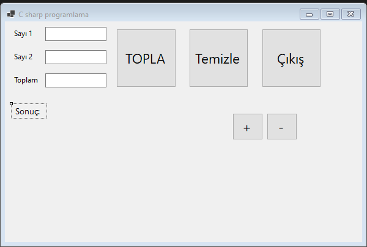

Proje dosyalarını indirmek için [tıklayınız](files/ders08_cs_form.zip).

Form1.cs
```cs
using System;
using System.Collections.Generic;
using System.ComponentModel;
using System.Data;
using System.Drawing;
using System.Linq;
using System.Text;
using System.Threading.Tasks;
using System.Windows.Forms;

namespace WinFormsApp1
{
    public partial class Form1 : Form
    {
        public Form1()
        {
            InitializeComponent();
        }

        private void button1_Click(object sender, EventArgs e)
        {
            
        }

        private void button1_Click_1(object sender, EventArgs e)
        {
            int sayi1, sayi2;
            int toplam;
            sayi1=Convert.ToInt32(textBox1.Text);
            sayi2 = Convert.ToInt32(textBox2.Text);
            toplam = sayi1 + sayi2;
            //textBox3.Text = Convert.ToString(toplam);
            textBox3.Text = ""+toplam;
            
            label4.Text = "Sonuç: "+Convert.ToString(toplam);
        }

        private void button2_Click(object sender, EventArgs e)
        {
            textBox1.Text = "";
            textBox2.Text = "";
            textBox3.Text = "";
        }

        private void button3_Click(object sender, EventArgs e)
        {
            this.Close();
        }
        float font_size = 10;
        private void button4_Click(object sender, EventArgs e)
        {
            font_size += 1;
            label4.Font = new System.Drawing.Font("Segoe UI", font_size, System.Drawing.FontStyle.Regular, System.Drawing.GraphicsUnit.Point);
        }

        private void button5_Click(object sender, EventArgs e)
        {
            font_size -= 1;
            label4.Font = new System.Drawing.Font("Segoe UI", font_size, System.Drawing.FontStyle.Regular, System.Drawing.GraphicsUnit.Point);
        }
    }
}

```