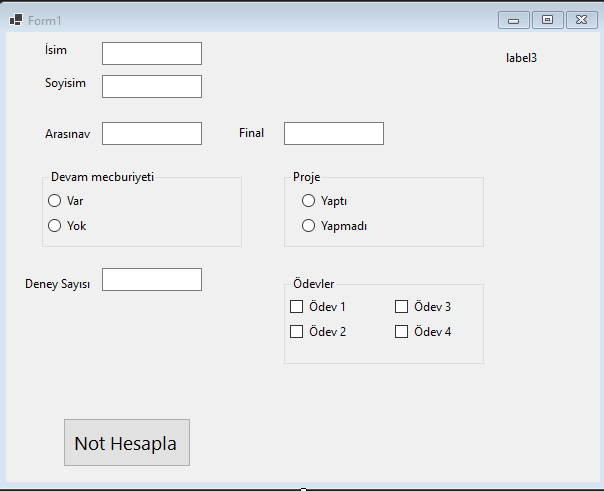

Proje dosyalarını indirmek için [tıklayınız](files/ders10_cs_form.zip).

Form1.cs
```cs
using System;
using System.Collections.Generic;
using System.ComponentModel;
using System.Data;
using System.Drawing;
using System.Linq;
using System.Text;
using System.Threading.Tasks;
using System.Windows.Forms;

namespace WinFormsApp1
{
    public partial class Form1 : Form
    {
        public Form1()
        {
            InitializeComponent();
        }

        private void button1_Click(object sender, EventArgs e)
        {
            lblMesaj.Text = "Merhaba, " + tbIsim.Text + " " + tbSoyIsim.Text;
            //arasinav %20
            //final %40
            //lab %10 5 deney
            //Proje%10
            //odevler%20

            double basari_notu;
            int arasinav, final, deney_sayisi = 0;
            double lab_notu = 0, proje_notu, odev_notu;
            arasinav = Convert.ToInt32(tbArasinav.Text);
            final = Convert.ToInt32(tbFinal.Text);
            if (rbDevamVar.Checked == true)
            {
                deney_sayisi = Convert.ToInt32(tbDeneySayisi.Text);
                lab_notu = deney_sayisi * 2;
            }
            else if (rbDevamYok.Checked == true)
            {
                lab_notu = arasinav / 10.0;
            }
            else
                MessageBox.Show("Devam kısmı işaretlenmelidir.");

            if (rbProjeYapti.Checked == true)
                proje_notu = 10;
            else if(rbProjeYapmadi.Checked == true)
                proje_notu = 0;
            else
                MessageBox.Show("Proje işaretlenmelidir.");
            odev_notu = 0;
            if (cbOdev1.Checked == true)
                odev_notu += 5;
            if (cbOdev2.Checked == true)
                odev_notu += 5;
            if (cbOdev3.Checked == true)
                odev_notu += 5;
            if (cbOdev4.Checked == true)
                odev_notu += 5;

            basari_notu = Convert.ToDouble(arasinav) * 0.2 +
                Convert.ToDouble(final) * 0.4 + odev_notu + lab_notu;

            lblMesaj.Text += "\nBaşarı notu:" + basari_notu.ToString();

        }
    }
}


```