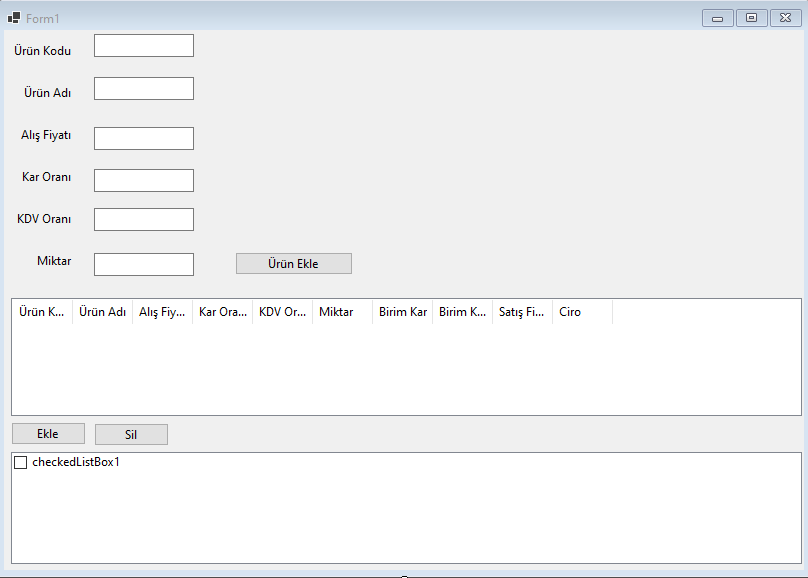

Proje dosyalarını indirmek için [tıklayınız](files/ders11_cs_form_a.zip).

Form1.cs
```cs
using System;
using System.Collections.Generic;
using System.ComponentModel;
using System.Data;
using System.Drawing;
using System.Linq;
using System.Text;
using System.Threading.Tasks;
using System.Windows.Forms;

namespace WinFormsApp1
{
    public partial class Form1 : Form
    {
        public Form1()
        {
            InitializeComponent();
        }

        private void comboBox1_SelectedIndexChanged(object sender, EventArgs e)
        {
            label5.Text = comboBox1.SelectedItem.ToString();
        }

        private void Form1_Load(object sender, EventArgs e)
        {
            comboBox2.Items.Add("İngilizce");
            comboBox2.Items.Add("Almanca");
            comboBox2.Items.Add("Rusça");
            comboBox2.Items.Add("Arapça");
        }

        private void comboBox2_SelectedIndexChanged(object sender, EventArgs e)
        {
            label6.Text = comboBox2.SelectedItem.ToString();
        }

        private void button1_Click(object sender, EventArgs e)
        {
            String veri;
            veri = textBox1.Text+ " " + textBox2.Text + " " +
                comboBox1.SelectedItem.ToString() + " " + comboBox2.SelectedItem.ToString();

            listBox1.Items.Add(veri);


        }

        private void listBox1_SelectedIndexChanged(object sender, EventArgs e)
        {
            listBox2.Items.Add(listBox1.SelectedItem.ToString());
            listBox1.Items.Remove(listBox1.SelectedItem);
            
        }

        private void listBox2_SelectedIndexChanged(object sender, EventArgs e)
        {
            listBox1.Items.Add(listBox2.SelectedItem.ToString());
            listBox2.Items.Remove(listBox2.SelectedItem);
        }
    }
}

```





Proje dosyalarını indirmek için [tıklayınız](files/ders11_cs_form_b.zip).

Form1.cs
```cs
using System;
using System.Collections.Generic;
using System.ComponentModel;
using System.Data;
using System.Drawing;
using System.Linq;
using System.Text;
using System.Threading.Tasks;
using System.Windows.Forms;

namespace WinFormsApp1
{
    public partial class Form1 : Form
    {
        public Form1()
        {
            InitializeComponent();
        }

        private void Form1_Load(object sender, EventArgs e)
        {

        }

        private void button1_Click(object sender, EventArgs e)
        {
            int i = listView1.Items.Count;
            listView1.Items.Add(textBox1.Text);
            listView1.Items[i].SubItems.Add(textBox2.Text);
            listView1.Items[i].SubItems.Add(textBox3.Text);
            listView1.Items[i].SubItems.Add(textBox4.Text);
            listView1.Items[i].SubItems.Add(textBox5.Text);
            listView1.Items[i].SubItems.Add(textBox6.Text);

            double birimkar = Convert.ToDouble(textBox3.Text) * Convert.ToDouble(textBox4.Text) / 100;
            double birimkdv = (Convert.ToDouble(textBox3.Text) + birimkar) * Convert.ToDouble(textBox5.Text) / 100;
            double satisfiyati = Convert.ToDouble(textBox3.Text) + birimkar + birimkdv;
            double ciro = satisfiyati * Convert.ToInt32(textBox6.Text);

            listView1.Items[i].SubItems.Add(Convert.ToString(birimkar));
            listView1.Items[i].SubItems.Add(Convert.ToString(birimkdv));
            listView1.Items[i].SubItems.Add(Convert.ToString(satisfiyati));
            listView1.Items[i].SubItems.Add(Convert.ToString(ciro));
        }

        private void button2_Click(object sender, EventArgs e)
        {
            string veri;
            veri = textBox1.Text + " "+ textBox2.Text + " " + textBox3.Text + " " + textBox4.Text + " " + textBox5.Text + " " + textBox6.Text;
            checkedListBox1.Items.Add(veri);
        }

        private void button3_Click(object sender, EventArgs e)
        {
            for (int i = 0; i < checkedListBox1.Items.Count; i++)
                if (checkedListBox1.GetItemChecked(i))
                    checkedListBox1.Items.RemoveAt(i);
        }
    }
}
```