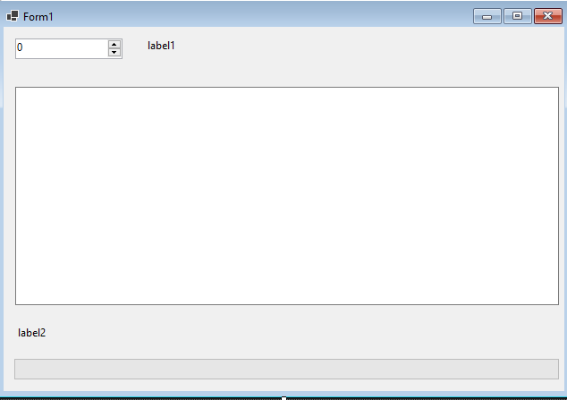
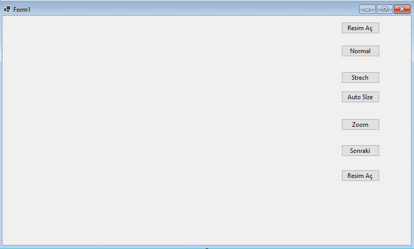

Proje dosyalarını indirmek için [tıklayınız](files/ders12_cs_form_a.zip).


```csharp
using System;
using System.Collections.Generic;
using System.ComponentModel;
using System.Data;
using System.Drawing;
using System.Linq;
using System.Text;
using System.Threading.Tasks;
using System.Windows.Forms;

namespace WinFormsApp1
{
    public partial class Form1 : Form
    {
        public Form1()
        {
            InitializeComponent();
        }

        private void button1_Click(object sender, EventArgs e)
        {
            Random rnd = new Random();
            int sayi_baslama, sayi_bitis;
            sayi_baslama = Convert.ToInt32(textBox1.Text);
            sayi_bitis = Convert.ToInt32(textBox2.Text);
            int sayi = rnd.Next(sayi_baslama, sayi_bitis);
            textBox3.Text = sayi.ToString();

            timer1.Interval = 1000;
            timer1.Enabled = true;
            label4.Text = sayi.ToString(); ;
        }

        private void timer1_Tick(object sender, EventArgs e)
        {
            int sayi;
            sayi = Convert.ToInt32(label4.Text);
            sayi--;
            if (sayi >= 0)
                label4.Text = sayi.ToString();
            else
                timer1.Enabled = false;

        }
    }
}
```




Proje dosyalarını indirmek için [tıklayınız](files/ders12_cs_form_b.zip).

```csharp
using System;
using System.Collections.Generic;
using System.ComponentModel;
using System.Data;
using System.Drawing;
using System.Linq;
using System.Text;
using System.Threading.Tasks;
using System.Windows.Forms;

namespace WinFormsApp1
{
    public partial class Form1 : Form
    {
        public Form1()
        {
            InitializeComponent();
        }

        private void numericUpDown1_ValueChanged(object sender, EventArgs e)
        {
            label1.Text = numericUpDown1.Value.ToString();
        }

        private void textBox1_TextChanged(object sender, EventArgs e)
        {
            progressBar1.Value = textBox1.TextLength;
            label2.Text = textBox1.TextLength.ToString() + "/100";
        }
    }
}

```



Proje dosyalarını indirmek için [tıklayınız](files/ders12_cs_form_c.zip).

```csharp
using System;
using System.Collections.Generic;
using System.ComponentModel;
using System.Data;
using System.Drawing;
using System.Linq;
using System.Text;
using System.Threading.Tasks;
using System.Windows.Forms;

namespace WinFormsApp1
{
    public partial class Form1 : Form
    {
        public Form1()
        {
            InitializeComponent();
        }

        private void button1_Click(object sender, EventArgs e)
        {
            Random rnd = new Random();
            int sayi_baslama, sayi_bitis;
            sayi_baslama = Convert.ToInt32(textBox1.Text);
            sayi_bitis = Convert.ToInt32(textBox2.Text);
            int sayi = rnd.Next(sayi_baslama, sayi_bitis);
            textBox3.Text = sayi.ToString();

            timer1.Interval = 1000;
            timer1.Enabled = true;
            label4.Text = sayi.ToString(); ;
        }

        private void timer1_Tick(object sender, EventArgs e)
        {
            int sayi;
            sayi = Convert.ToInt32(label4.Text);
            sayi--;
            if (sayi >= 0)
                label4.Text = sayi.ToString();
            else
                timer1.Enabled = false;

        }
    }
}
```