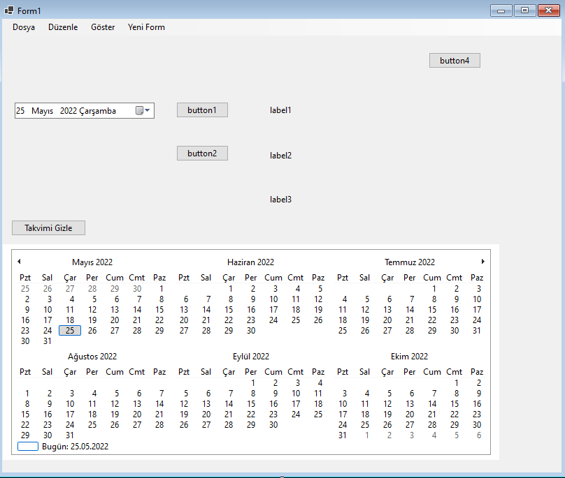
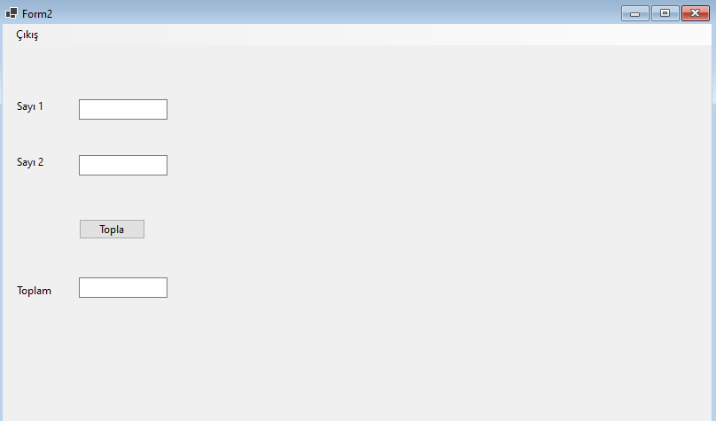

Bu çalışmada 2 form kullanılmıştır.

Proje dosyalarını indirmek için [tıklayınız](files/ders13_cs_form.zip).

### Form 1



```csharp
using System;
using System.Collections.Generic;
using System.ComponentModel;
using System.Data;
using System.Drawing;
using System.Linq;
using System.Text;
using System.Threading.Tasks;
using System.Windows.Forms;

namespace WinFormsApp1
{
    public partial class Form1 : Form
    {
        public Form1()
        {
            InitializeComponent();
        }

        private void button1_Click(object sender, EventArgs e)
        {
            label1.Text = dateTimePicker1.Text;
        }

        private void button2_Click(object sender, EventArgs e)
        {
            label2.Text = dateTimePicker1.Text;

            DateTime tarih1 = Convert.ToDateTime(label1.Text);
            DateTime tarih2 = Convert.ToDateTime(label2.Text);

            TimeSpan sonuc = tarih1 - tarih2;

            label3.Text = sonuc.ToString();

        }

        int i = 0;

        private void button3_Click(object sender, EventArgs e)
        {
            if (i % 2 == 0)
            {
                monthCalendar1.Visible = false;
                button3.Text = "Takvimi Göster";
            }
            else
            {
                monthCalendar1.Visible = true;
                button3.Text = "Takvimi Gizle";
            }
                

            i++;

        }

        private void çıkışToolStripMenuItem_Click(object sender, EventArgs e)
        {
            this.Close();
        }

        private void yeniFormToolStripMenuItem_Click(object sender, EventArgs e)
        {
            Form2 form2 = new Form2();
            form2.Visible = true;
        }

        private void button4_Click(object sender, EventArgs e)
        {
            for(int i = 0; i < 5; i++)
            {
                Form2 form2 = new Form2();
                form2.Show();
            }
            
            
        }
    }
}
```


### Form 2



```csharp
using System;
using System.Collections.Generic;
using System.ComponentModel;
using System.Data;
using System.Drawing;
using System.Text;
using System.Windows.Forms;

namespace WinFormsApp1
{
    public partial class Form2 : Form
    {
        public Form2()
        {
            InitializeComponent();
        }

        private void çıkışToolStripMenuItem_Click(object sender, EventArgs e)
        {
            this.Close();
        }

        private void button1_Click(object sender, EventArgs e)
        {
            int sayi1, sayi2, toplam;
            try
            {
                sayi1 = Convert.ToInt32(textBox1.Text);
                sayi2 = Convert.ToInt32(textBox2.Text);
                toplam = sayi1 + sayi2;
                textBox3.Text = toplam.ToString();
            }
            catch(Exception hata)
            {
                MessageBox.Show("Bir hata oluştu tekrar deneyin.\n"+hata.ToString());
                textBox1.Text = "";
                textBox2.Text = "";
                textBox3.Text = "";
            }
        }
    }
}
```
