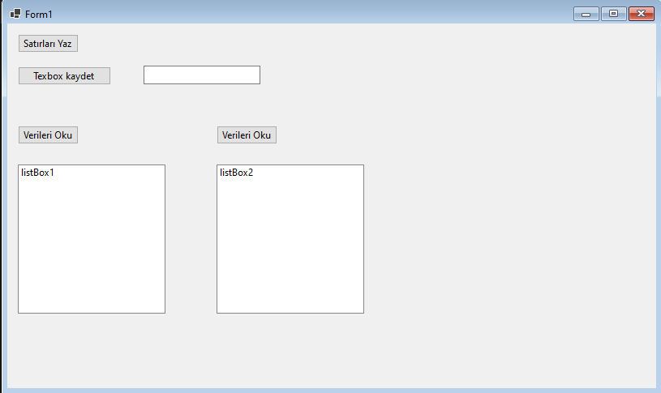

Proje dosyalarını indirmek için [tıklayınız](files/ders14_cs_form.zip).




```csharp
using System;
using System.Collections.Generic;
using System.ComponentModel;
using System.Data;
using System.Drawing;
using System.Linq;
using System.Text;
using System.Threading.Tasks;
using System.Windows.Forms;
using System.IO;

namespace WinFormsApp1
{
    public partial class Form1 : Form
    {
        public Form1()
        {
            InitializeComponent();
        }

        private void button1_Click(object sender, EventArgs e)
        {
            StreamWriter dosya = File.AppendText("veriler\\veri.txt");
            dosya.WriteLine("birinci satır");
            dosya.WriteLine("ikinci satır");
            dosya.WriteLine("üçüncüsatır");
            dosya.WriteLine("dördüncü satır");
            dosya.Close();

        }

        private void button2_Click(object sender, EventArgs e)
        {
            StreamWriter dosya = File.AppendText("veriler\\veri.txt");
            dosya.WriteLine(textBox1.Text);
            dosya.Close();

        }

        private void button3_Click(object sender, EventArgs e)
        {
            StreamReader dosya = new StreamReader("veriler\\veri.txt");
            string satir;
            while((satir=dosya.ReadLine()) != null){
                listBox1.Items.Add(satir);
            }
            dosya.Close();
        }

        private void button4_Click(object sender, EventArgs e)
        {
            string[] satirlar = File.ReadAllLines("veriler/veri.txt");
            for (int i = 0; i < satirlar.Length; i++)
                listBox2.Items.Add(satirlar[i]);
        }
    }
}
```
