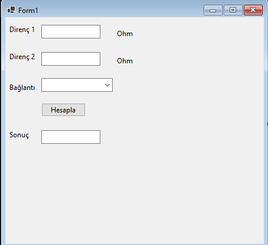
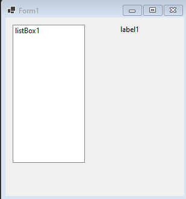

### Calisma 1

Proje dosyalarını indirmek için [tıklayınız](files/ders15_cs_form_a.zip).



```csharp
using System;
using System.Collections.Generic;
using System.ComponentModel;
using System.Data;
using System.Drawing;
using System.Linq;
using System.Text;
using System.Threading.Tasks;
using System.Windows.Forms;

namespace WinFormsApp1
{
    public partial class Form1 : Form
    {
        public Form1()
        {
            InitializeComponent();
        }

        private void button1_Click(object sender, EventArgs e)
        {
            double direnc1, direnc2, esdeger_direnc=0;
            direnc1 = Convert.ToDouble(textBox1.Text);
            direnc2 = Convert.ToDouble(textBox2.Text);
            if (comboBox1.SelectedItem.ToString() == "Seri")
                esdeger_direnc = direnc1 + direnc2;
            else if (comboBox1.SelectedItem.ToString() == "Paralel")
                esdeger_direnc = (direnc1 * direnc2)/(direnc1 + direnc2);

            textBox3.Text = esdeger_direnc.ToString();

        }
    }
}
```

### Calisma 2

Proje dosyalarını indirmek için [tıklayınız](files/ders15_cs_form_b.zip).



```csharp
using System;
using System.Collections.Generic;
using System.ComponentModel;
using System.Data;
using System.Drawing;
using System.Linq;
using System.Text;
using System.Threading.Tasks;
using System.Windows.Forms;

namespace WinFormsApp1
{
    public partial class Form1 : Form
    {
        public Form1()
        {
            InitializeComponent();
        }

        private void timer1_Tick(object sender, EventArgs e)
        {    
            Random rnd = new Random();
            int sayi = rnd.Next(100);
            listBox1.Items.Add(sayi.ToString());
        }

        private void listBox1_SelectedIndexChanged(object sender, EventArgs e)
        {
            timer1.Enabled = false;
            int eb, i;
            if (listBox1.Items.Count == 0)
            {
                timer1.Enabled = false;
                MessageBox.Show("Tebrikler, kazandiz");
            }
            else
            {
                eb = Convert.ToInt32(listBox1.Items[0]);

                if (listBox1.Items.Count > 0)
                {
                    for (i = 0; i < listBox1.Items.Count; i++)
                    {
                        if (Convert.ToInt32(listBox1.Items[i]) > eb)
                            eb = Convert.ToInt32(listBox1.Items[i]);
                    }
                }
                label1.Text = eb.ToString();
                
                if (listBox1.SelectedItem.ToString() == eb.ToString())
                {
                    //Bu kodda hata veriyor?
                    //listBox1.Items.RemoveAt(listBox1.SelectedIndex);
                    MessageBox.Show("secim doğru");
                }
                timer1.Enabled = true;
            }
        }
    }
}

```