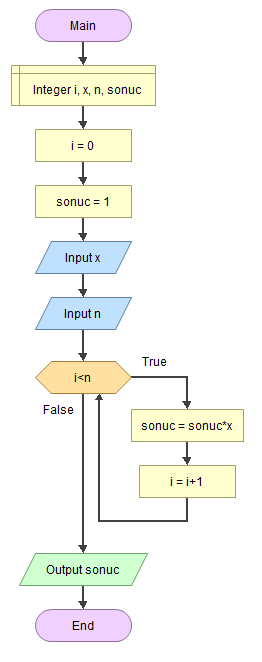

# EEM-119 Algoritma ve Programlama I Dersi

## 2022-2023 Güz Dönemi

### Akış diyagramı örnekleri

- 1'den n'ye kadar sayıların toplamı   

- x üssü n (xn)  işlemi

- n! (faktöriyel) işlemi

- Bir tam sayının kaç basamaklı olduğunu bulma

- Bir tam sayının basamaklarındaki rakamların toplamı

