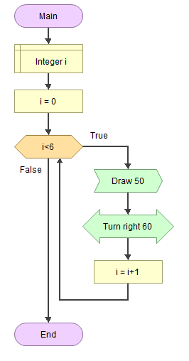
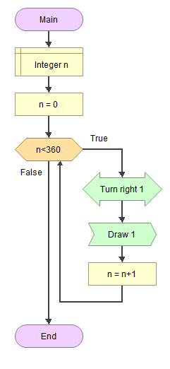

# EEM-119 Algoritma ve Programlama I Dersi

## 2022-2023 Güz Dönemi Ders 3

### Akış diyagramı örnekleri

- Girilen 10 sayının en küçük, en büyük, ortalama ve çarpımı

- Toplama işlemi ile çarpım   

- Çıkarma işlemi ile bölme işleminde bölüm ve kalan   

- iki sayının en büyük ortak bölenini bulma   

-    Bir sayının asal olup olmadığını bulma

- 1000'e kadar asal sayılar

- n. fibonacci sayısı (n>3 olmalı)   

- Çarpım tablosu

- Çizim örnek 1   

    

Programın çıktısı    

-    Çizim örnek 2   

   

Programın çıktısı    

-    Çizim örnek 3    

   

Programın çıktısı   

-    Çizim örnek 4 versiyon 1   

Çizim örnek 4 versiyon 2

Programın çıktısı   

