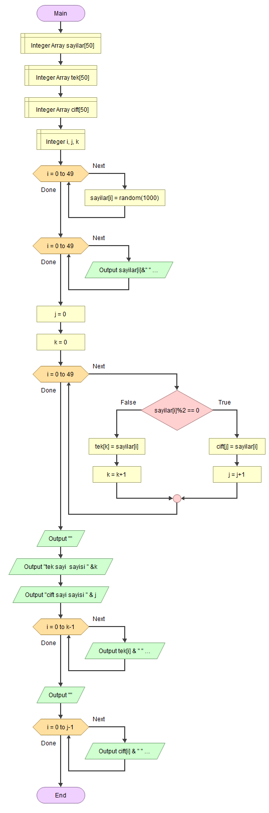

# EEM-119 Algoritma ve Programlama I Dersi

## 2022-2023 Güz Dönemi Ders 4

### Akış diyagramı diziler örnekleri

- Dizi elemanlarına değer atama ve bu değerleri yazdırma

- Dizi elemanlarının değerlerini tersten yazdırma

- Dizi elemanlarının toplamı

- Dizi elemanlarının toplamı

- Dizi elemanlarına rastgele sayı atama, tek ve çift sayı olanların sayısını bulma,  başka dizilere atama

- Araya dizi elemanı ekleme

### Akış diyagramı fonksiyon örnekleri

- Merhaba yazan fonksiyon

- Klavyeden değer alıp toplayan ve döndüren fonksiyon

- \* ile n boyutlu kare şekli oluşturma (fonksiyonsuz)

- \* ile n boyutlu üçgen şekli oluşturma (fonksiyonsuz)

- \* ile n boyutlu üçgen şekli oluşturma (fonksiyonlu)

- İki sayının toplamını bulan ve döndüren fonksiyon 

- Faktöriyel hesabı yapan ve döndüren fonksiyon 

