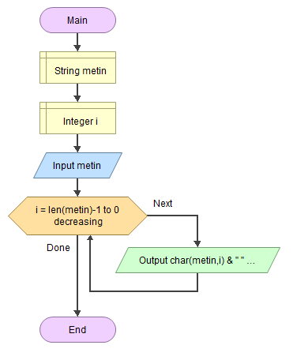
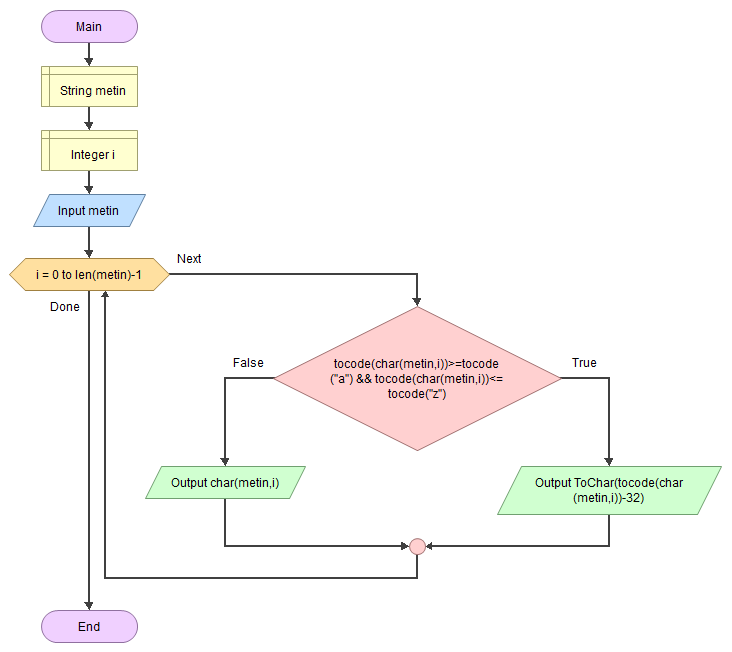

# EEM-119 Algoritma ve Programlama I Dersi

## 2022-2023 Güz Dönemi Ders 5

### Akış diyagramı diziler örnekleri

- String karakterlerini tek tek yazdırma

- String karakterlerinin çift indekste olanları yazdırma

- Stringi ters yazdırma

<!-- - aciklama

 -->

- Küçük harften oluşan stringi büyük harfe çevirme

- Stringteki küçük harfleri büyük harfe çevirme

