# [EEM-119 Algoritma ve Programlama I Dersi](../)

### Akış diyagramı ve Sözde Kod

- Klavyeden girilen iki tam sayıdan büyük olanı yazdıran program.

```
1. BAŞLA
2. GİR a,b
3. EĞER a>b İSE GİT 6
4. YAZ b
5. GİT 7
6. YAZ a
7. BİTİR
```

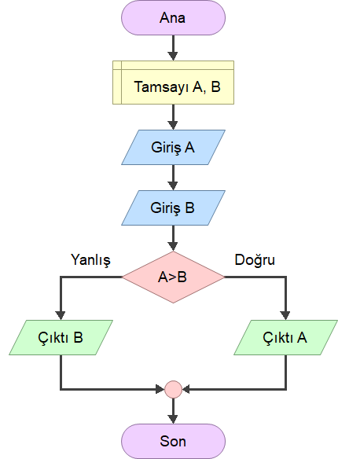


- Klavyeden girilen üç tam sayıdan büyük olanı yazdıran program. (v1)

```
1.  BAŞLA
2.  GİR a,b,c
3.  EĞER a>b İSE GİT 9
4.  EĞER b>c İSE GİT 7
5.  YAZ c
6.  GİT 12
7.  YAZ b
8.  GİT 12
9.  EĞER a>c GİT 11
10. GİT 5
11. YAZ a
12. BİTİR
```

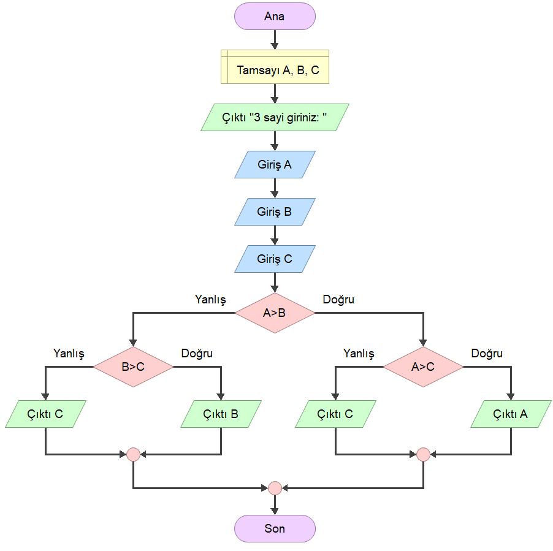

- Klavyeden girilen üç tam sayıdan büyük olanı yazdıran program. (v2)

```
1.  BAŞLA
2.  GİR a,b,c
3.  eb=a
4.  EĞER b>eb İSE GİT 8
5.  EĞER c>eb İSE GİT 10
6.  YAZ eb
7.  GİT 12
8.  eb=b
9.  GİT 5
10. eb=c
11. GİT 6
12. BİTİR
```

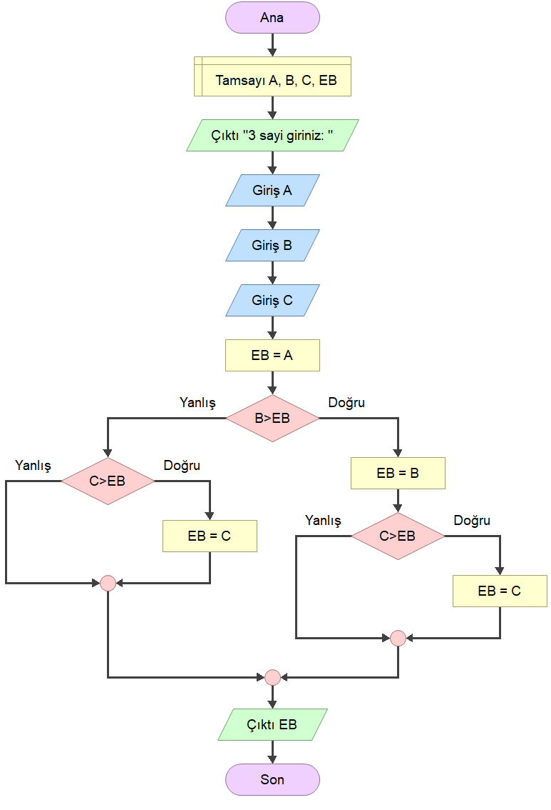

- 1'den 10'a kadar (dahil) sayılara ekrana yazdıran program

```
1.  BAŞLA
2.  sayac=0
3.  EĞER sayac<10 İSE GİT 5
4.  GİT 8
5.  sayac = sayac +1
6.  YAZ sayac
7.  GİT 3
8.  BİTİR

```
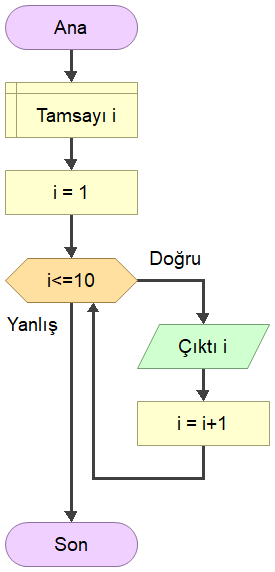


- A'dan B'ye n azalan sayıları ekrana yazdıran program

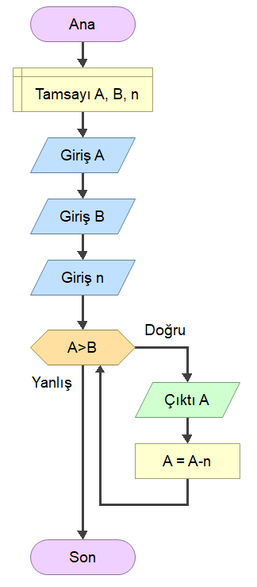


- 1'den A'ya kadar sayıların toplamı   

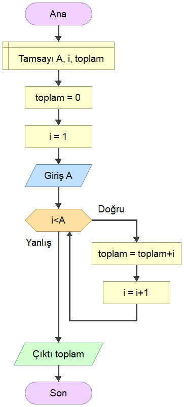


- x üssü n (x<sup>n</sup>)  işlemi

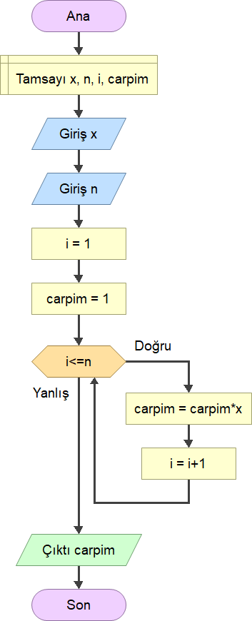


- n! (faktöriyel) işlemi

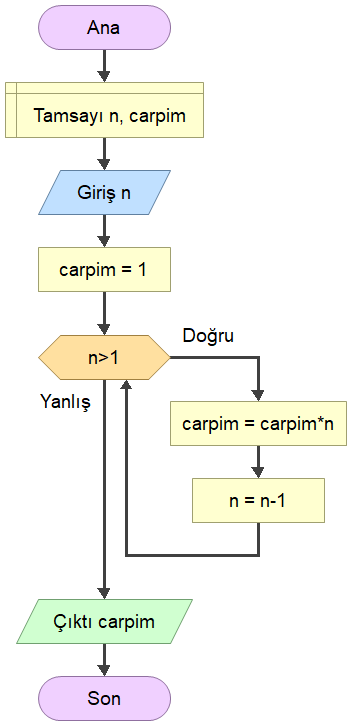

- Bir tam sayının kaç basamaklı olduğunu bulma

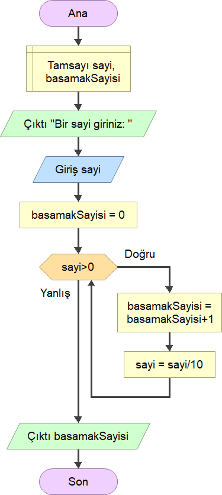


- Bir tam sayının basamaklarındaki rakamların toplamı

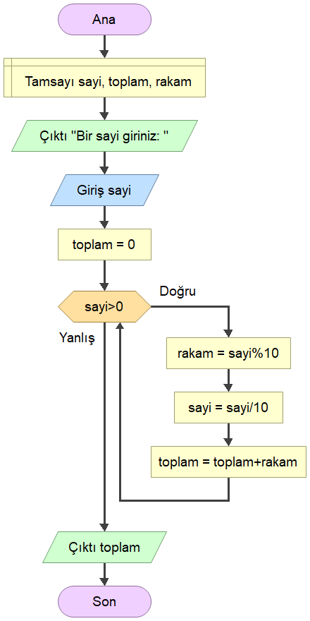


- Klavyeden girilen 10 sayının toplamı

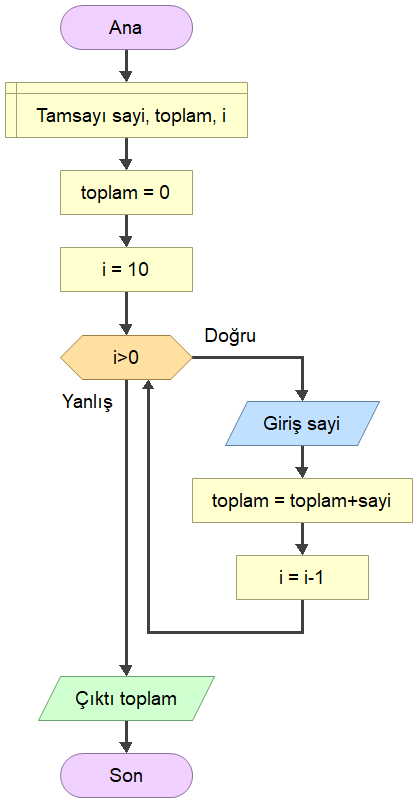


- Girilen 5 sayı arasından en büyüğü bulma v1

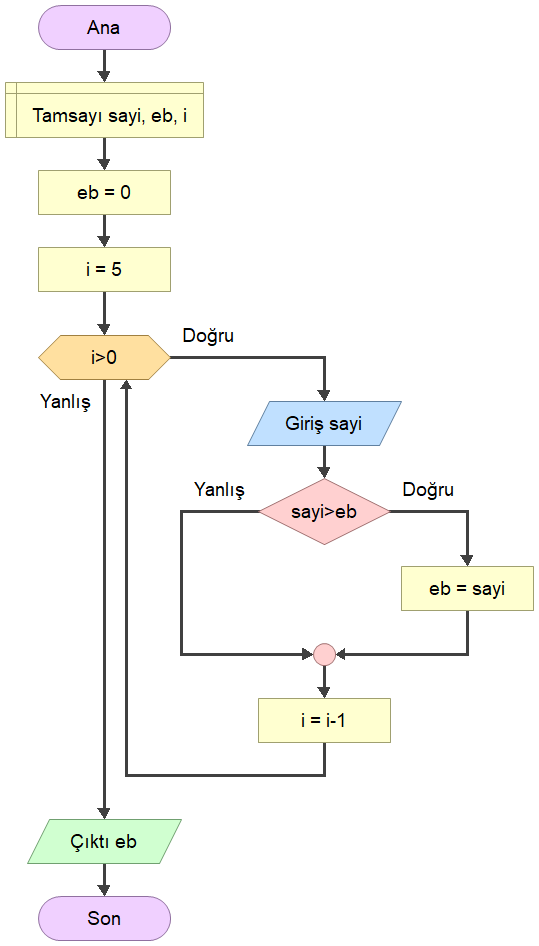


- Girilen 5 sayı arasından en büyüğü bulma v2

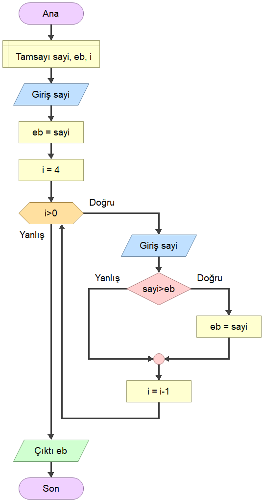


- Bir tam sayının tam bölenlerini bulma

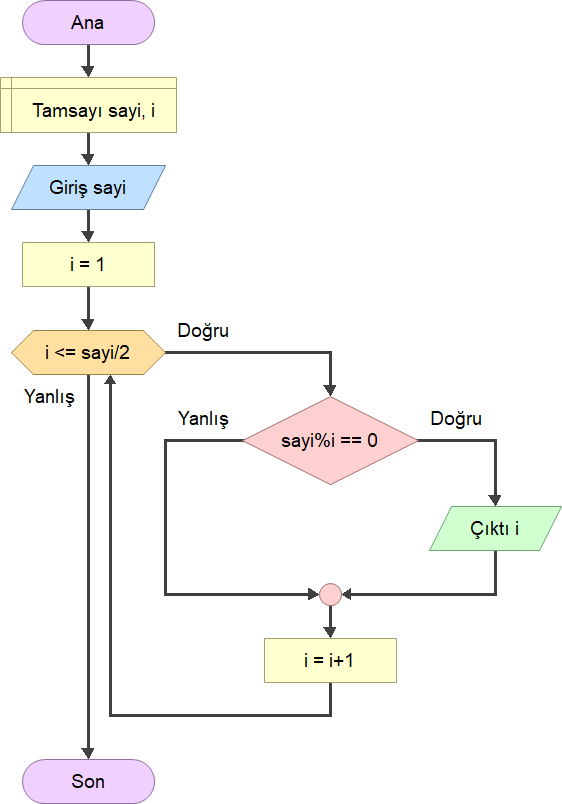


- Girilen 5 sayı arasından en büyüğü ev en küçüğü bulma

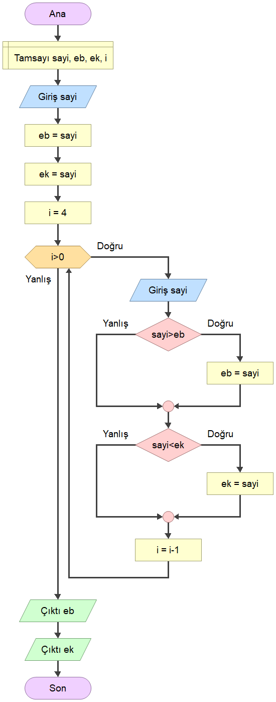


- Negatif sayı girilene kadar girilen sayıların toplam ve ortalamasını bulma

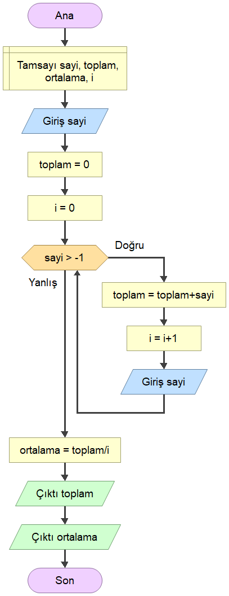


- Çarpma operatörü kullanmadan toplama ile çarpma işleminin sonucunu bulma


- Bölme ve mod operatörü kullanmadan çıkarma ile bölme işlemi sonucunda bölüm ve kalan bulma

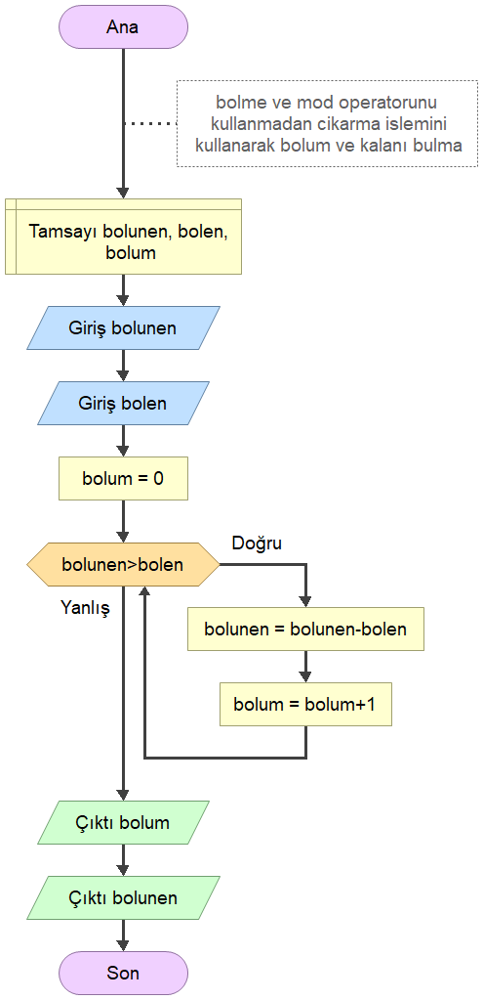


- İki sayının en büyük ortak bölenini bulma

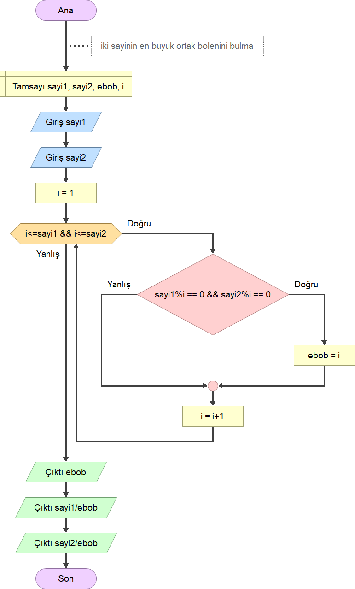


- Sayının asal olduğunu bulan program v1

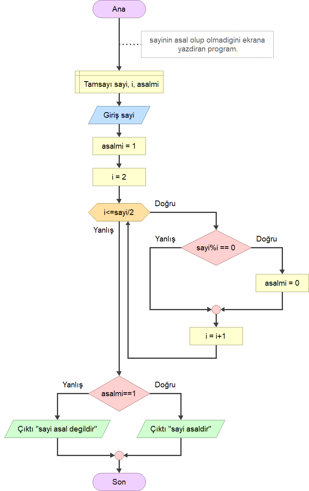


- Sayının asal olduğunu bulan program v2

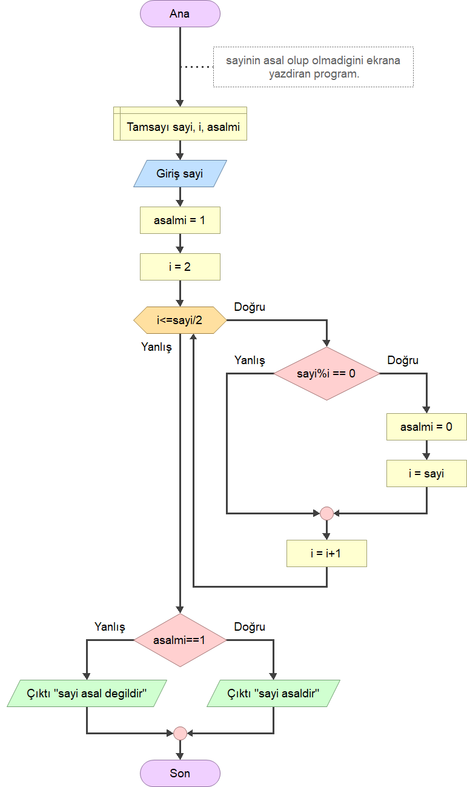


- Bir tam sayının basamaklarındaki rakamların toplamı


Yeni

- 1'den büyük girilen bir sayıdan küçük ve eşit asal sayıları yazdıran program

- Girilen bir sayıdan küçük Fibonacci sayılarını ekrana yazdıran program

- Çarpım tablosu

- 


