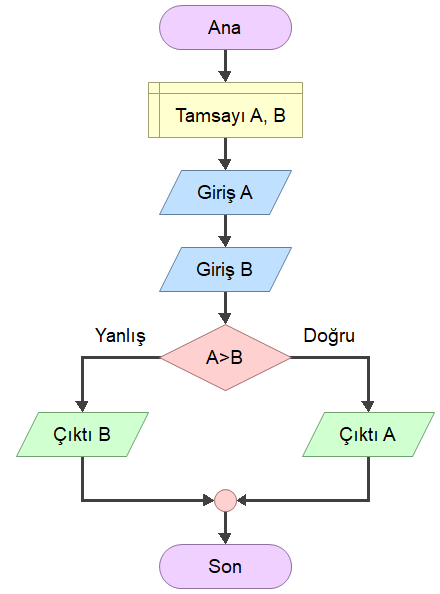
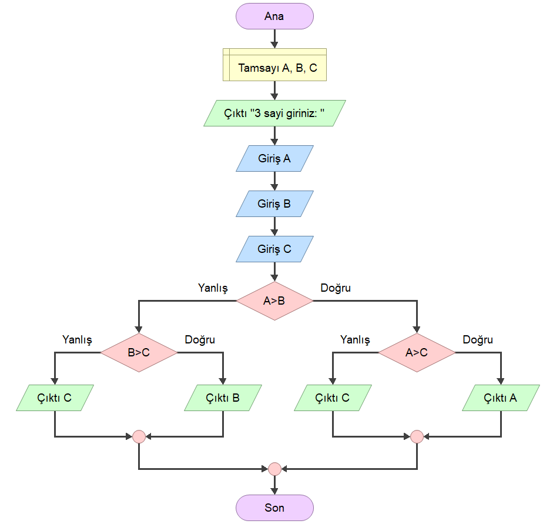
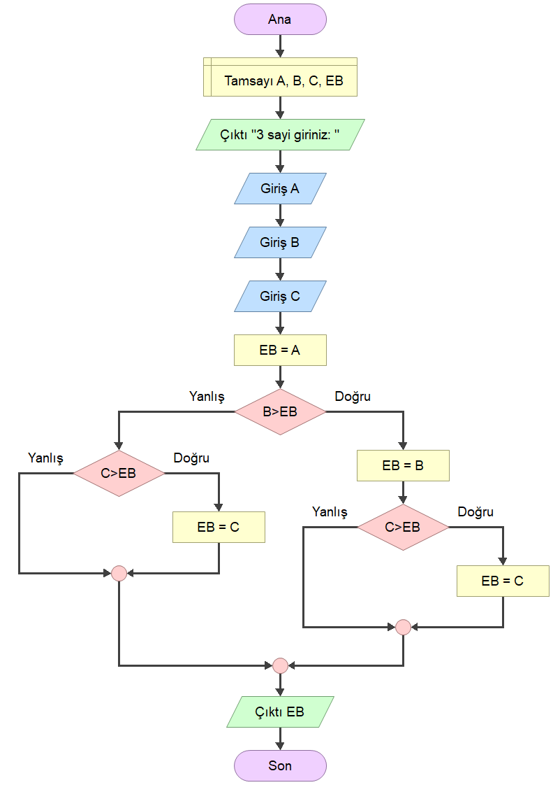
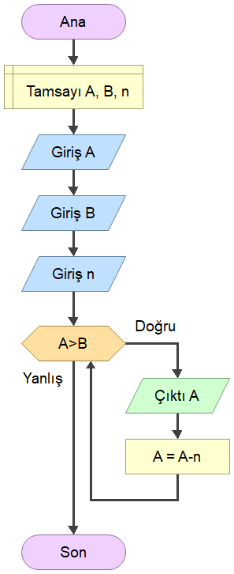
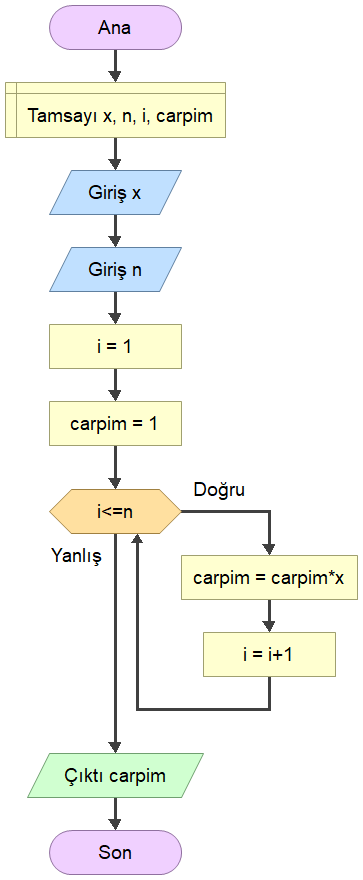

# EEM-119 Algoritma ve Programlama I Dersi

### Akış diyagramı ve Sözde Kod

- Klavyeden girilen iki tam sayıdan büyük olanı yazdıran program.

```
1. BAŞLA
2. GİR a,b
3. EĞER a>b İSE GİT 6
4. YAZ b
5. GİT 7
6. YAZ a
7. BİTİR
```




- Klavyeden girilen üç tam sayıdan büyük olanı yazdıran program. (v1)

```
1.  BAŞLA
2.  GİR a,b,c
3.  EĞER a>b İSE GİT 9
4.  EĞER b>c İSE GİT 7
5.  YAZ c
6.  GİT 12
7.  YAZ b
8.  GİT 12
9.  EĞER a>c GİT 11
10. GİT 5
11. YAZ a
12. BİTİR
```



- Klavyeden girilen üç tam sayıdan büyük olanı yazdıran program. (v2)

```
1.  BAŞLA
2.  GİR a,b,c
3.  eb=a
4.  EĞER b>eb İSE GİT 8
5.  EĞER c>eb İSE GİT 10
6.  YAZ eb
7.  GİT 12
8.  eb=b
9.  GİT 5
10. eb=c
11. GİT 6
12. BİTİR
```



- 1'den 10'a kadar (dahil) sayılara ekrana yazdıran program

```
1.  BAŞLA
2.  sayac=0
3.  EĞER sayac<10 İSE GİT 5
4.  GİT 8
5.  sayac = sayac +1
6.  YAZ sayac
7.  GİT 3
8.  BİTİR

```


- A'dan B'ye n azalan sayıları ekrana yazdıran program




- 1'den A'ya kadar sayıların toplamı   


- x üssü n (x<sup>n</sup>)  işlemi




- n! (faktöriyel) işlemi


<!-- - Bir tam sayının kaç basamaklı olduğunu bulma


- Bir tam sayının basamaklarındaki rakamların toplamı

 -->