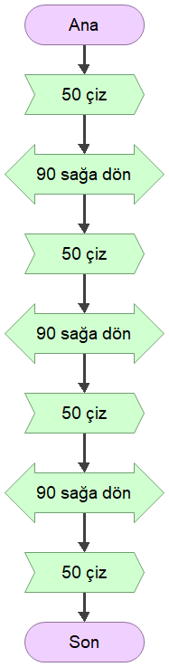
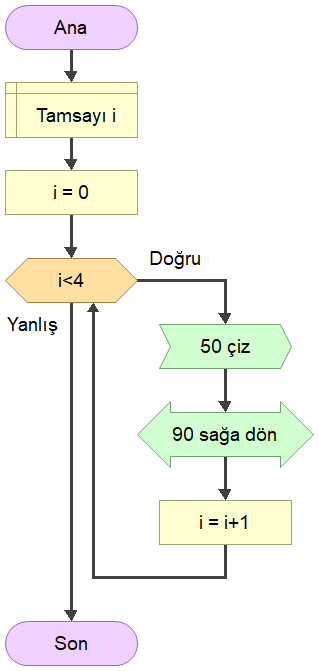
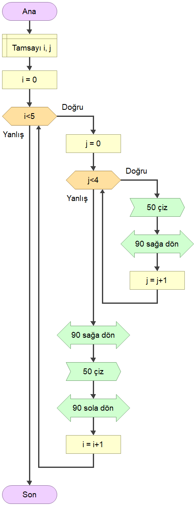
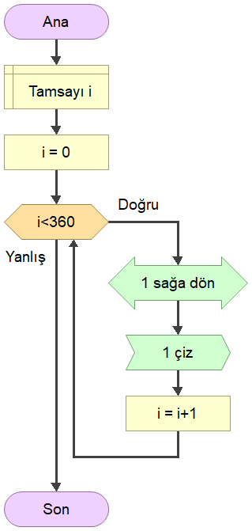
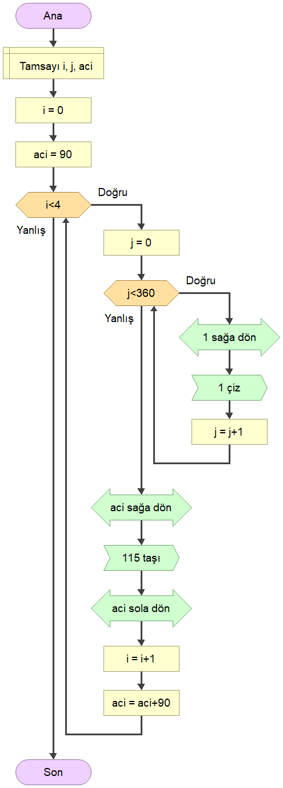

# [EEM-119 Algoritma ve Programlama I Dersi](../)

### Akış diyagramı çizdirme çalışmaları

- Kare v1

- Kare v2

- Altıgen

- 5 tane yan yana kare

- Daire

- 4 Tane daire

- Yıldız

- İç içe kare (veya kare şeklinde sarmal)

