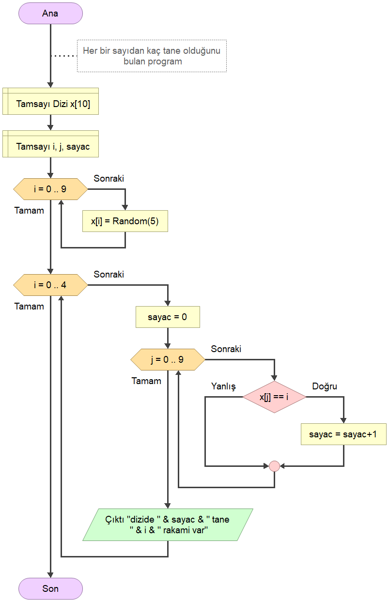

# [EEM-119 Algoritma ve Programlama I Dersi](../)

### For döngüsü ve Diziler

- while döngüsü ile 10'a kadar saydırma

- for döngüsü ile 10'a kadar saydırma

- Diziye 10 değer atama ve bu değerleri atama sonrası yazdırma

- Dizinin elemanları for döngüsü ile tersten yazdırma

- Dizinin elemanlarının toplamını bulma

- Dizinin en büyük elemanını bulma

- Rastgele (random) fonksiyonu ile diziye eleman atama ve en büyük elemanı bulma

- Rastgele (random) fonksiyonu ile diziye eleman atama ve en küçük elemanı bulma

- en küçük sayının indeksini bulma

- En küçük değerlerin indekslerini bulma

- Dizide tek ve çift sayılarının kaçar tane olduğunu bulma

- İki dizinin elemanlarını toplamını 3. diziye atama

- Dizide bir indekse yeni bir veri eklemeden önce dizinin elemanlarını kaydırma

- Dizide sayılardan kaçar tane var

- Diziye birbirinden farklı sayıları ekleme

- Dizinin elemanlarını küçükten büyüğe sıralama

