# [EEM-119 Algoritma ve Programlama I Dersi](../)

### Fonksiyonlar
- yaz() fonksiyonu ile ekrana Merhaba yazdırma.

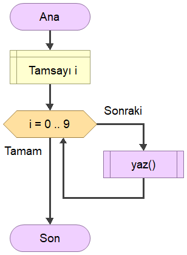

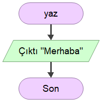

- okuVeTopla fonksiyonu ile klavyeden okunan verileri toplayan ve döndüren fonksiyon.

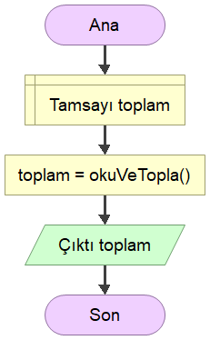

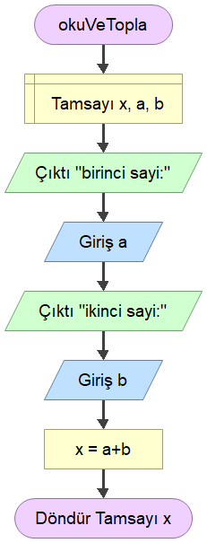

- \* ile kare çizdirme v1

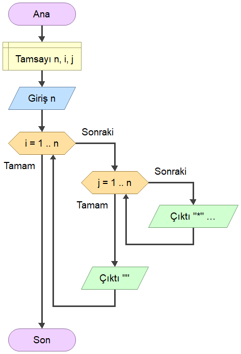

- \* ile kare çizdirme v2 (fonksiyonlu)

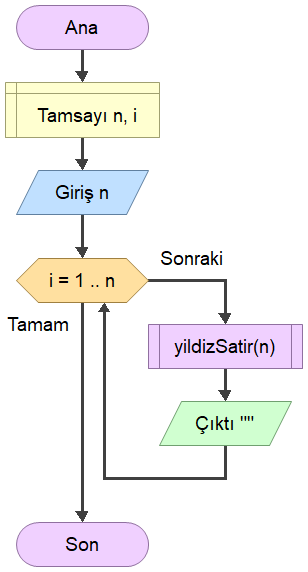

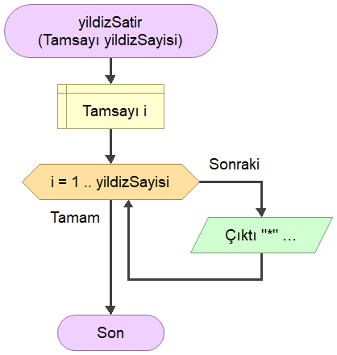

- topla fonksiyonu ile iki sayının parametrelerden toplanması ve döndürülmesi

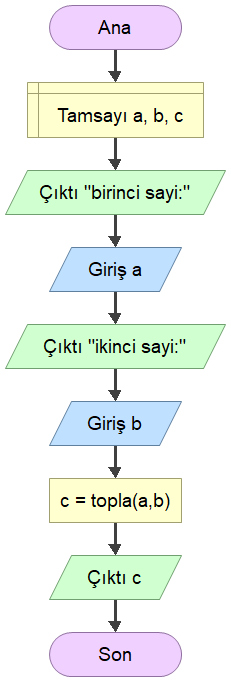

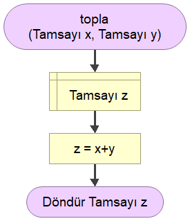

- faktöriyel fonksiyonu ile faktoriyel programı

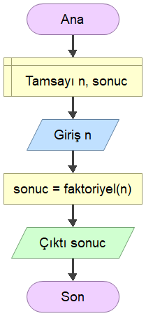

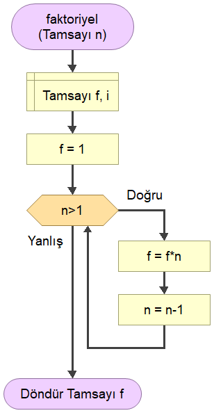