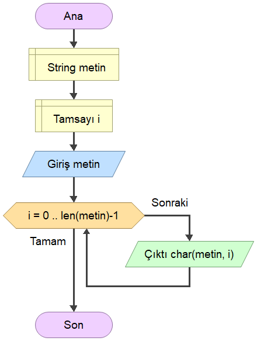
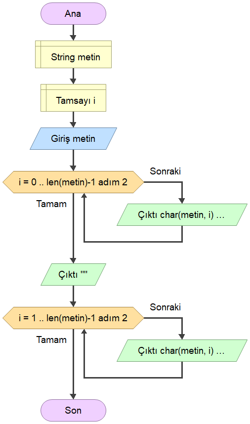
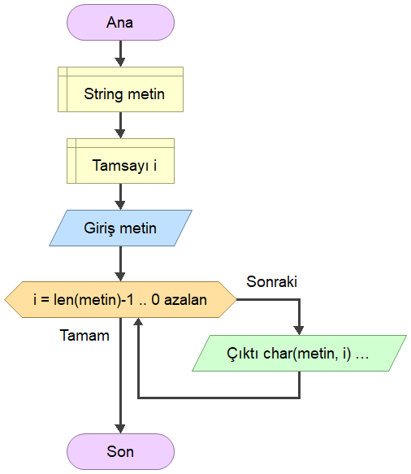
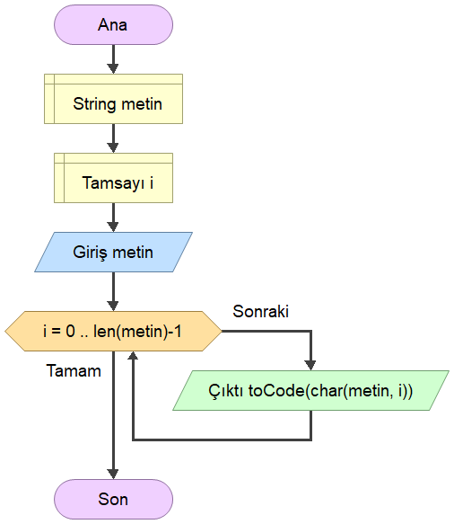
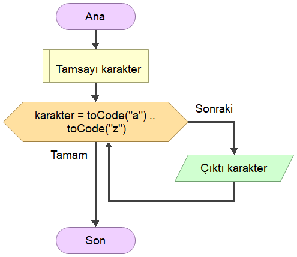
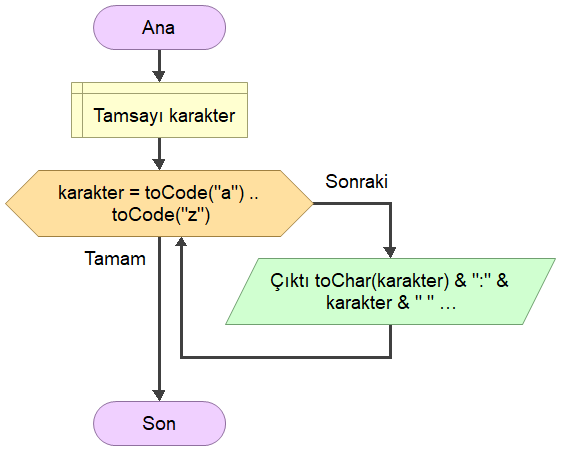
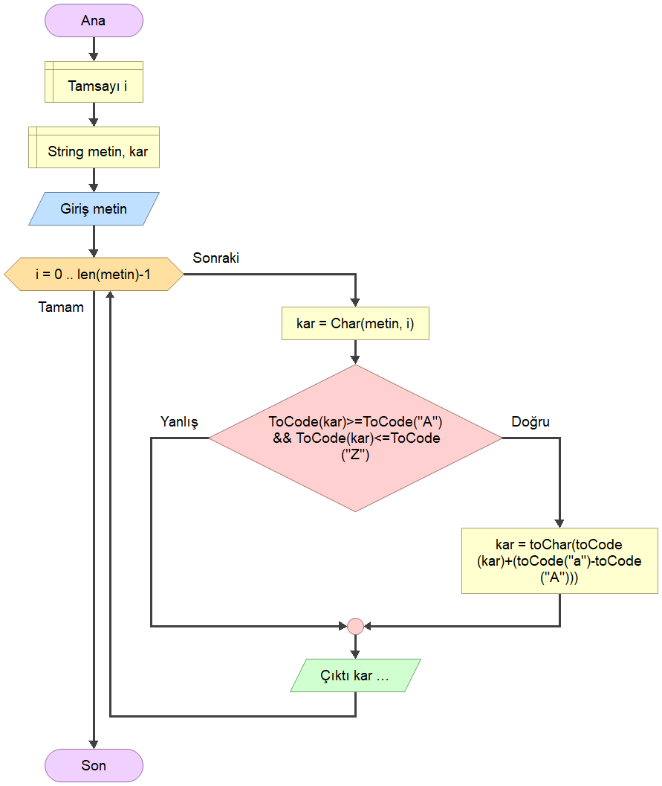

# [EEM-119 Algoritma ve Programlama I Dersi](../)

Bu derste kullanılan fonksiyonları dokümantasyonu için:   
<http://www.flowgorithm.org/documentation/intrinsic-functions.html>

### Stringler (karakter dizileri)
- Stringdeki karakterleri teker teker yazdırma

- Stringdeki çift ve tek indeksteki karakterleri yazdırma

- Stringi tersten yazdırma

- Karakterlerin ASCII kodlarını  yazdırma

- a-z arasındaki karakterlerin ASCII kodlarını yazdırma

- a-z arasındaki karakterleri ve ASCII kodlarını yazdırma

- Girilen bir metindeki büyük harfleri küçük harfe çevirerek metni yazdırma

