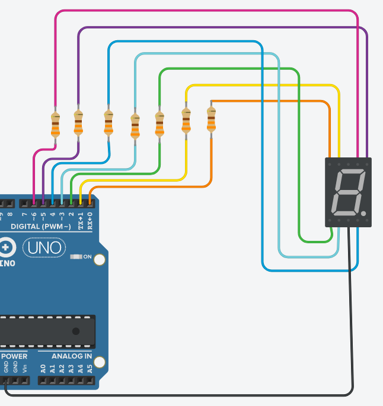
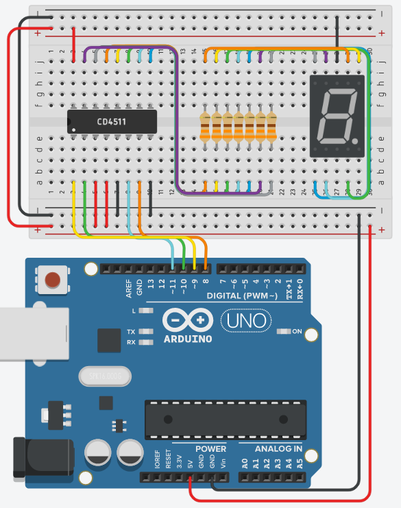
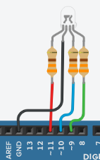

# [EEM-120 Algoritma ve Programlama II Dersi](../)


### 7 segmentli gösterge



```C++
int sayilar[]={126,48,109,121,51,91,95,112,127,123};
int sayac=0;
void setup() {
  for(int pin=0;pin<=6;pin++)
    pinMode(pin, OUTPUT);
}
void loop() {
  int sayi;
  sayi=sayilar[sayac];
  for(int pin=0;pin<=6;pin++)
    digitalWrite(pin,bitRead(sayi, pin));
  sayac++;
  if(sayac==10)
    sayac=0;
  delay(1000);
}
```

```C++
int sayilar[]={126,48,109,121,51,91,95,112,127,123};
int sayac=0;
void setup() {
  for(int pin=0;pin<=6;pin++)
    pinMode(pin, OUTPUT);
}
void loop() {
  int sayi;
  sayi=sayilar[sayac%10];
  for(int pin=0;pin<=6;pin++)
    digitalWrite(pin,bitRead(sayi, pin));
  sayac++;  
  delay(1000);
}
```

### BCD to 7 segment decoder entegresi ile 7 segmentli gösterge

CD4511 datasheeti indirmek için [tıklayınız](files/04/CD4511_datasheet.pdf).



```C++
int sayac=0;
void setup() {
  for(int pin=8;pin<14;pin++)
    pinMode(pin,OUTPUT);
}
void loop() {
  for(int i=0;i<4;i++)
    digitalWrite(i+8,bitRead(sayac%10, i));
  delay(1000);
  sayac++;
}
```


### 8-Bit seri input seri/paralel output kaydırma yazmacı

74HC595 datasheeti indirmek için [tıklayınız](files/05/74HC595_datasheet.pdf).


```C++
int cikis_clk = 6;
int kaydirma_clk = 7;
int dataPin = 5;
int i=0;
void setup() 
{
  pinMode(cikis_clk, OUTPUT);
  pinMode(dataPin, OUTPUT);  
  pinMode(kaydirma_clk, OUTPUT);
}
int sayac=0;
int basamak;
void loop() 
{ 
  digitalWrite(cikis_clk, LOW);
  for(int i=7;i>=0;i--){
    digitalWrite(kaydirma_clk,LOW);
    basamak=bitRead(sayac,i);
    digitalWrite(dataPin,basamak);
    digitalWrite(kaydirma_clk,HIGH);
  }
  digitalWrite(cikis_clk, HIGH);

  sayac++;
  delay(1000);

}
```


```C++
int cikis_clk = 6;
int kaydirma_clk = 7;
int dataPin = 5;
int i=0;
void setup() 
{
  pinMode(cikis_clk, OUTPUT);
  pinMode(dataPin, OUTPUT);  
  pinMode(kaydirma_clk, OUTPUT);
}
int sayac=1;
int basamak;
void loop() 
{ 
  digitalWrite(cikis_clk, LOW);
  for(int i=7;i>=0;i--){
    digitalWrite(kaydirma_clk,LOW);
    basamak=bitRead(sayac,i);
    digitalWrite(dataPin,basamak);
    digitalWrite(kaydirma_clk,HIGH);
  }
  digitalWrite(cikis_clk, HIGH);
  sayac=sayac*2;
  if(sayac==256)
    sayac=1;
  delay(1000);
}
```


```C++
int cikis_clk = 6;
int kaydirma_clk = 7;
int dataPin = 5;
int i=0; 
void setup() 
{
  pinMode(cikis_clk, OUTPUT);
  pinMode(dataPin, OUTPUT);  
  pinMode(kaydirma_clk, OUTPUT);
}
byte sayac=0;
void loop() 
{
  digitalWrite(cikis_clk, LOW);
  shiftOut(dataPin, kaydirma_clk, MSBFIRST, sayac);
  digitalWrite(cikis_clk, HIGH); 
  sayac++;
  delay(1000);
}
```

```C++
int cikis_clk = 6;
int kaydirma_clk = 7;
int dataPin = 5;
int i=0;
void setup() 
{
  pinMode(cikis_clk, OUTPUT);
  pinMode(dataPin, OUTPUT);  
  pinMode(kaydirma_clk, OUTPUT);
}
byte sayac=0;
int yon = 1;
int veri;
void loop() 
{
  digitalWrite(cikis_clk, LOW);
  shiftOut(dataPin, kaydirma_clk, MSBFIRST, 1<<sayac);
  digitalWrite(cikis_clk, HIGH); 
  if (sayac==7)
    yon=-1;
  else if(sayac==0)
    yon=1; 
  sayac=sayac+yon;
  delay(1000);
}
```


### RGB LED uygulamaları



```C++
void setup()
{
  pinMode(9, OUTPUT);
  pinMode(10, OUTPUT);
  pinMode(11, OUTPUT);
}
int sayac=0;
void loop()
{
  for(int i=0;i<3;i++)
    digitalWrite(9+i,bitRead(sayac,i));    
  delay(1000); 
  sayac++;
}
```

```C++
void setup()
{
  pinMode(9, OUTPUT);
  pinMode(10, OUTPUT);
  pinMode(11, OUTPUT);
}
int sayac=0;
void loop()
{
  sayac=random(8);
  for(int i=0;i<3;i++)
    digitalWrite(9+i,bitRead(sayac,i));    
  delay(1000);   
}
```

### LCD display kullanımı


```C++
#include <LiquidCrystal.h>
const int rs = 2, en = 3, d4 = 4, d5 = 5, d6 = 6, d7 = 7;
LiquidCrystal lcd(rs, en, d4, d5, d6, d7);
void setup() {
  lcd.begin(16, 2);
  lcd.print("hello, world!");
}
void loop() {
  lcd.setCursor(0, 1);
  lcd.print(millis() / 1000);
  delay(100);
}
```

```C++
#include <LiquidCrystal.h>
const int rs = 2, en = 3, d4 = 4, d5 = 5, d6 = 6, d7 = 7;
LiquidCrystal lcd(rs, en, d4, d5, d6, d7);
void setup() {
  lcd.begin(16, 2);
}
void loop() {
  lcd.print(millis() / 1000);
  delay(100);
}
```

```C++
#include <LiquidCrystal.h>
const int rs = 2, en = 3, d4 = 4, d5 = 5, d6 = 6, d7 = 7;
LiquidCrystal lcd(rs, en, d4, d5, d6, d7);
void setup() {
  lcd.begin(16, 2);
}
void loop() {  
  lcd.setCursor(0, 1);
  lcd.print("Zaman: ");  
  if(millis() / 100 < 10)
    lcd.setCursor(9, 1);  
  else if(millis() / 100 < 100)
    lcd.setCursor(8, 1);
  else if(millis() / 100 < 1000)
    lcd.setCursor(7, 1);
  lcd.print(millis() / 100);
    delay(50);
}
```


