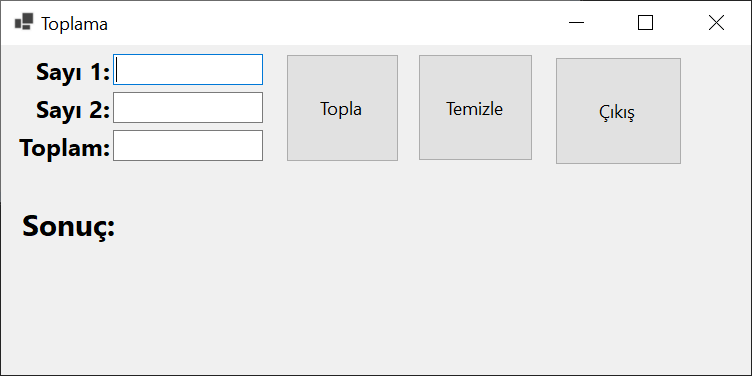
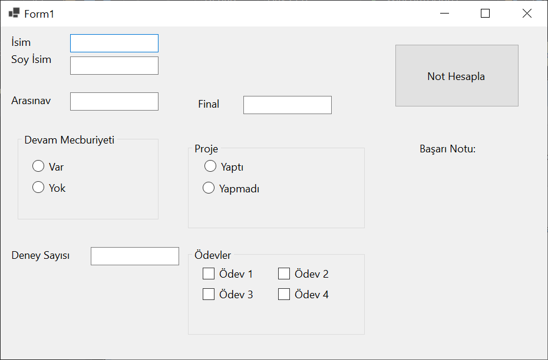

# EEM-241 İleri Düzey Programlama

## 2024-2025 Güz Dönemi


### Ders 3 - C# form uygulamaları




```cs
using System;
using System.Collections.Generic;
using System.ComponentModel;
using System.Data;
using System.Drawing;
using System.Linq;
using System.Text;
using System.Threading.Tasks;
using System.Windows.Forms;

namespace WinFormsApp1
{
    public partial class Form1 : Form
    {
        public Form1()
        {
            InitializeComponent();
        }

        private void buttonTopla_Click(object sender, EventArgs e)
        {
            double sayi1, sayi2;
            double toplam;
            sayi1 = Convert.ToDouble(textBoxSayi1.Text);
            sayi2 = Convert.ToDouble(textBoxSayi2.Text);
            toplam = sayi1 + sayi2;
            textBoxToplam.Text = Convert.ToString(toplam);
            labelSonuc.Text = "Sonuç: " + textBoxToplam.Text;
        }

        private void buttonTemizle_Click(object sender, EventArgs e)
        {
            textBoxSayi1.Text = "";
            textBoxSayi2.Text = "";
            textBoxToplam.Text = "";
            labelSonuc.Text = "Sonuç: ";
        }

        private void buttonCikis_Click(object sender, EventArgs e)
        {
            this.Close();
        }   
    }
}

```




```cs
using System;
using System.Collections.Generic;
using System.ComponentModel;
using System.Data;
using System.Drawing;
using System.Linq;
using System.Text;
using System.Threading.Tasks;
using System.Windows.Forms;

namespace WinFormsApp1
{
    public partial class Form1 : Form
    {
        public Form1()
        {
            InitializeComponent();
        }

        private void button1_Click(object sender, EventArgs e)
        {
            int arasinav, final, yilici;
            int basari_notu;
            int deney_sayisi=0;
            int lab_notu = 0, proje_notu = 0, odev_notu = 0;

            arasinav = Convert.ToInt32(textBoxAraSinav.Text);
            final = Convert.ToInt32(textBoxFinal.Text);
            

            if (radioButtonDevamVar.Checked == true)
            {
                deney_sayisi = Convert.ToInt32(textBoxDeneySayisi.Text);
                lab_notu = deney_sayisi * 5;
            }
            else if (radioButtonDevamYok.Checked == true)
            {
                lab_notu = arasinav / 2;
            }
            else
            {
                MessageBox.Show("Devamsizlik durumunu işaretleyiniz");
            }

            if (radioButtonProjeYapti.Checked == true)
            {
                proje_notu = 20;
            }
            else if (radioButtonProjeYapmadi.Checked == true)
            {
                proje_notu = 0;
            }
            else
            {
                MessageBox.Show("Proje durumunu işaretleyiniz");
            }
            if (checkBoxOdev1.Checked == true)
                odev_notu += 5;

            if (checkBoxOdev2.Checked == true)
                odev_notu += 5;

            if (checkBoxOdev3.Checked == true)
                odev_notu += 5;

            if (checkBoxOdev4.Checked == true)
                odev_notu += 5;

            yilici = arasinav + lab_notu + proje_notu + odev_notu;
            basari_notu = final / 2 + yilici / 2;

            labelBasariNotu.Text = textBoxIsım.Text + " " + textBoxSoyIsım.Text +  Convert.ToString(basari_notu);

        }
    }
}
```

