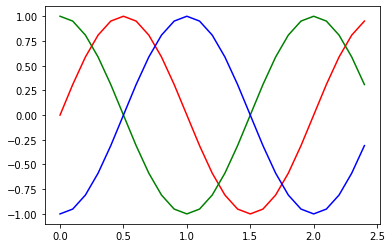
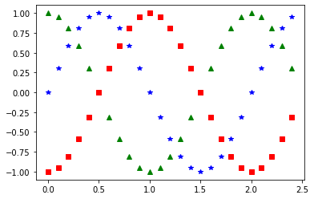
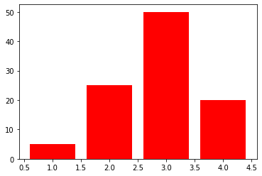

# EEM-241 İleri Düzey Programlama

## 2024-2025 Güz Dönemi


### Ders 11 - Matplotlib

- http://www.matplotlib.org
```
 pip install matplotlib
```


```python
 from  matplotlib import pyplot as plt
```


```python
x=list(range(1,11))
y=[i**2 for i in x]
print(y)

plt.plot(x,y)
plt.show()
```

<pre>
    [1, 2, 3, 4, 5, 6, 7, 8, 9, 10]
    [1, 4, 9, 16, 25, 36, 49, 64, 81, 100]
</pre>
    


    

[grafik](files/output_2_1.png)

    


```python
x=list(range(0,101))
x1=[i/10 for i in x]
y=[i**2 for i in x1]
plt.plot(x1,y)
plt.show()
```


    

[grafik](files/output_3_0.png)
    


```python
x=list(range(-100,101))

x1=[]
for i in x:
    x1.append(i/10)

y=[]
for i in x1:
    y.append(i**2)

plt.plot(x1,y)
plt.show()
```


    

[grafik](files/output_4_0.png)
    


```python
import math
ust_sinir=int(10*(3*math.pi))

x=list(range(0,ust_sinir+1))
x1=[i/10 for i in x]
sin=[math.sin(i) for i in x1]
cos=[math.cos(i) for i in x1]

plt.title("Sinüs ve Cosinüs Fonksiyonları")
plt.xlabel("x degerleri")
plt.ylabel("y degerleri")

#plt.plot(x1, sin, color="red")
#plt.plot(x1, cos, color="blue")
plt.plot(x1,sin, x1,cos)

plt.show()
```


    

[grafik](files/output_5_0.png)
    


```python
import math
x=[]
y1=[]
y2=[]
for i in range(100):
    x.append(i/(4*math.pi))
    y1.append(math.sin(i/(4*math.pi)))
    y2.append(math.sin(i/(4*math.pi)+(math.pi/3)))
    
plt.plot(x,y1,color="r")
plt.plot(x,y2,color="m")
plt.show()
```


    

[grafik](files/output_6_0.png)
    


```python
import math

t=range(100)

x=[(2*math.pi*i)/len(t) for i in t]
y=[math.sin(val) for val in x]

plt.plot(x,y)
plt.show()
```


    

[grafik](files/output_7_0.png)
    


```python
import math

x=[i/100 for i in range(1000)]

y1=[math.sin(i) for i in x]
y2=[math.sin(i+math.pi/3) for i in x]

plt.title("Sinüs Fonksiyonu")
plt.xlabel("x")
plt.ylabel("Sin(x)")
plt.plot(x,y1,x,y2)
plt.show()
```


    

[grafik](files/output_8_0.png)
    


```python
plt.plot([1,2,3,4],[1,4,9,16],"ob")
plt.show()
```


    

[grafik](files/output_9_0.png)
    


```python
plt.plot([1,2,3,4],[1,4,9,16], "ro")
plt.show()
```


    

[grafik](files/output_10_0.png)
    


```python
x=[0,5,0,20]
print(type(x))
plt.axis(x)
plt.title("Kareler", fontsize=16, fontname="Times New Roman", color="Blue")
plt.xlabel("sayılar")
plt.ylabel("kareleri")
plt.text(0.99,10,". (1,10) noktası")
plt.plot([1,2,3,4],[1,4,9,16], "ro")
plt.grid(linestyle='dotted')
#plt.grid(True)
plt.show()
```

    <class 'list'>
    


    

[grafik](files/output_11_1.png)
    


```python
import math
import numpy as np
t=np.arange(0,2.5,0.1)
print(t)
y1=np.sin(math.pi*t)
y2=np.sin(math.pi*t + math.pi/2)
y3=np.sin(math.pi*t - math.pi/2)

plt.plot(t,y1,t,y2,t,y3)
plt.show()

plt.plot(t,y1,"r",t,y2,"g",t,y3,"b")
plt.show()

plt.plot(t,y1,"b")
plt.plot(t,y2,"g")
plt.plot(t,y3,"r")
lbl=["a","b","c"]
plt.legend(lbl)
plt.show()
```

<pre>
    [0.  0.1 0.2 0.3 0.4 0.5 0.6 0.7 0.8 0.9 1.  1.1 1.2 1.3 1.4 1.5 1.6 1.7
     1.8 1.9 2.  2.1 2.2 2.3 2.4]
</pre>
    


    

[grafik](files/output_12_1.png)
    


    

[grafik](files/output_12_2.png)
    


    

[grafik](files/output_12_3.png)
    


```python
plt.plot(t,y1,"b*",t,y2,"g^",t,y3,"rs")
plt.show()
```


    

[grafik](files/output_13_0.png)
    


```python
plt.plot(t,y1,"b--",t,y2,"g",t,y3,"y-.")
plt.show()
```


    

[grafik](files/output_14_0.png)
    


```python
import numpy as np
x = np.linspace(0, 5, 11)
y = x ** 2
```


```python
import numpy as np
import matplotlib.pyplot as plt


## plt.subplot fonksiyonuna 3 haneli bir sayı input olarak girilir.
## birinci rakam dikey olarak kaç parçaya bölüneceğini belirtir.
## ikinci rakam yatay olarak kaç parçaya bölüneceğini belirtir.
## üçüncü rakam ise hangi alt çizim üzerinde çalışılıyor olduğunu belirtir.

plt.subplot(321)
plt.plot(t,y1,"b-.")
plt.subplot(322)
plt.plot(t,y1,"r--")
plt.subplot(323)
plt.plot(t,y1,"m-")
plt.subplot(324)
plt.plot(t,y1,"b-.")
plt.subplot(325)
plt.plot(t,y1,"r--")
plt.subplot(326)
plt.plot(t,y1,"m-")

plt.plot()
plt.show()
```


    

[grafik](files/output_16_1.png)
    


```python
import random
x=[]
for i in range(100):
    x.append(random.randint(1,100))   

y=[]
for i in range(100):
    y.append(random.randint(1,100))

plt.plot(x,y,"ro")
plt.show()
```


    

[grafik](files/output_18_0.png)
    


```python
d=[5,25,50,20]
plt.bar(range(1,len(d)+1),d,color="r")
plt.show()
```


    

[grafik](files/output_19_0.png)
    


```python
d=[5,25,50,20]
plt.bar(range(len(d)),d,color="g", width=0.5)
plt.show()
```


    

[grafik](files/output_20_0.png)
    


```python
y1=range(1,30,5)
y2=[i+2 for i in y1]
y3=[i+3 for i in y1]
print(list(y1))
print(y2)
print(y3)

x1=[3,6,9,12,15,18]
x2=[i+0.25 for i in x1 ]
x3=[i-0.25 for i in x1 ]
plt.bar(x1,y1, color="b", width=0.25)
plt.bar(x2,y2,color="g", width=0.25)
plt.bar(x3,y3,color="r", width=0.25)
plt.show()
```

<pre>
    [1, 6, 11, 16, 21, 26]
    [3, 8, 13, 18, 23, 28]
    [4, 9, 14, 19, 24, 29]
</pre>
    


    

[grafik](files/output_21_1.png)