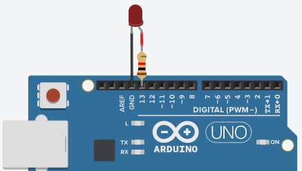

# EEM-251 İleri Düzey Programlama

## 2022-2023 Güz Dönemi Ders 1

### Arduino LED yakma Söndürme (Blink) Programı



```C++
void setup()
{
  pinMode(13, OUTPUT);
}

void loop()
{
  digitalWrite(13, HIGH);
  delay(500);
  digitalWrite(13, LOW);
  delay(500); 
}
```

