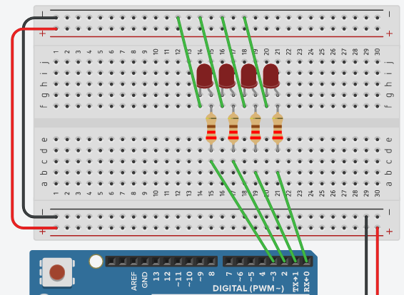
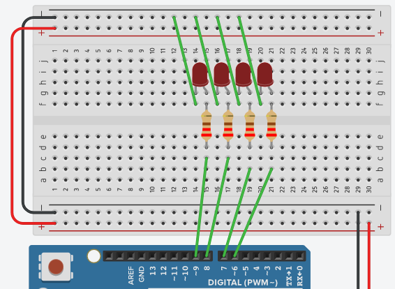
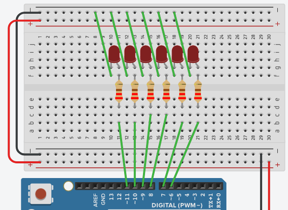
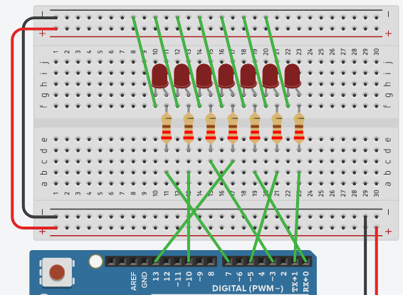
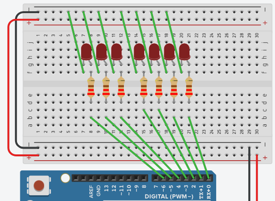

# EEM-251 İleri Düzey Programlama

## 2022-2023 Güz Dönemi

### Arduino sıralı LED yakma Söndürme 



```C++
void setup()
{
  pinMode(0, OUTPUT);
  pinMode(1, OUTPUT);
  pinMode(2, OUTPUT);
  pinMode(3, OUTPUT);
}
void loop()
{
  digitalWrite(0, HIGH);
  digitalWrite(1, HIGH);
  digitalWrite(2, HIGH);
  digitalWrite(3, HIGH);
  delay(1000); 
  digitalWrite(0, LOW);
  digitalWrite(1, LOW);
  digitalWrite(2, LOW);
  digitalWrite(3, LOW);
  delay(1000); 
}
```


```C++

void setup()
{
  pinMode(0, OUTPUT);
  pinMode(1, OUTPUT);
  pinMode(2, OUTPUT);
  pinMode(3, OUTPUT);
}
void loop()
{
  digitalWrite(0, HIGH);
  delay(1000);
  digitalWrite(0, LOW);
  delay(1000);
  
  digitalWrite(1, HIGH);
  delay(1000);
  digitalWrite(1, LOW);
  delay(1000);
  
  digitalWrite(2, HIGH);
  delay(1000);
  digitalWrite(2, LOW);
  delay(1000);
  
  digitalWrite(3, HIGH);
  delay(1000);
  digitalWrite(3, LOW);
  delay(1000); 
}
```

```C++
void setup()
{
	for(int i=0;i<4;i++)
		pinMode(i, OUTPUT);  
}
void loop()
{
	for(int i=0;i<4;i++){
	  digitalWrite(i, HIGH);
	  delay(1000);
	  digitalWrite(i, LOW);
	  delay(1000);
	}
}
```


```C++
void setup()
{
	for(int i=0;i<4;i++)
		pinMode(i, OUTPUT);  
}
void loop()
{
	for(int i=3;i>=0;i--){
	  digitalWrite(i, HIGH);
	  delay(1000);
	  digitalWrite(i, LOW);
	  delay(1000);
	}  
}
```


```C++
void setup()
{
	for(int i=0;i<4;i++)
		pinMode(i, OUTPUT);  
}
 
void loop()
{
	for(int i=3;i>=0;i--){
	  digitalWrite(i, HIGH);
	  delay(1000);
	  digitalWrite(i, LOW);
	} 
}
```


```C++
void setup()
{
	for(int i=0;i<4;i++)
		pinMode(i, OUTPUT);  
}
 
void loop()
{
	for(int i=3;i>=0;i--){
		digitalWrite(i, HIGH);
		delay(1000);
		digitalWrite(i, LOW);
	}
	
	for(int i=0;i<4;i++){
		digitalWrite(i, HIGH);
		delay(1000);
		digitalWrite(i, LOW);
	} 
}
```


```C++
void setup()
{
	for(int i=0;i<4;i++)
		pinMode(i, OUTPUT);  
}
 
void loop()
{
	for(int i=3;i>=0;i--){
		digitalWrite(i, HIGH);
		delay(1000);
		digitalWrite(i, LOW);
	}
	
	for(int i=1;i<3;i++){
		digitalWrite(i, HIGH);
		delay(1000);
		digitalWrite(i, LOW);
	} 
}
```


```C++
void setup()
{
	for(int i=0;i<4;i++)
		pinMode(i, OUTPUT);  
} 
void loop()
{
	int sure=500;
	for(int i=3;i>=0;i--){
		digitalWrite(i, HIGH);
		delay(sure);
		digitalWrite(i, LOW);
	}	
	for(int i=1;i<3;i++){
		digitalWrite(i, HIGH);
		delay(sure);
		digitalWrite(i, LOW);
	} 
}
```



```C++
void setup()
{
	for(int i=6;i<10;i++)
		pinMode(i, OUTPUT);  
}
void loop()
{
	int sure=500;
	for(int i=9;i>=6;i--){
		digitalWrite(i, HIGH);
		delay(sure);
		digitalWrite(i, LOW);
	}
	for(int i=7;i<9;i++){
		digitalWrite(i, HIGH);
		delay(sure);
		digitalWrite(i, LOW);
	}  
}
```



```C++
void setup()
{
	for(int i=6;i<12;i++)
		pinMode(i, OUTPUT);  
}
void loop()
{
	int sure=500;
	int j=11;
	for(int i=6;i<12;i++){
		digitalWrite(i, HIGH);
		digitalWrite(j, HIGH);
		delay(sure);
		digitalWrite(i, LOW);
		digitalWrite(j, LOW);
		j--;
	} 
}
```


```C++
void setup()
{
	for(int i=6;i<12;i++)
		pinMode(i, OUTPUT);  
}
void loop()
{
	int sure=500;
	for(int i=6,j=11;i<12;i++,j--){
		digitalWrite(i, HIGH);
		digitalWrite(j, HIGH);
		delay(sure);
		digitalWrite(i, LOW);
		digitalWrite(j, LOW);		
	} 
}
```


```C++
void setup()
{
	for(int i=6;i<12;i++)
		pinMode(i, OUTPUT);  
}
void loop()
{
	int sure=500;
	for(int i=6;i<12;i++){
		digitalWrite(i, HIGH);
		digitalWrite(17-i, HIGH);
		delay(sure);
		digitalWrite(i, LOW);
		digitalWrite(17-i, LOW);	
	}  
}
```

### Karışık sırada LED yakma söndürme, random fonksiyonu
```C++
void setup()
{
	for(int i=6;i<12;i++)
		pinMode(i, OUTPUT);  
}
void loop()
{
	long rastgele;
	int sure=500;
		rastgele=random(6,12);
		digitalWrite(rastgele, HIGH);		
		delay(sure);
		digitalWrite(rastgele, LOW); 
}
```

### Pin tanımlamasında dizi kullanımı

```C++
int pinler[]={1,5,0,13,3,10,7};
void setup()
{
	for(int i=0;i<7;i++)
		pinMode(pinler[i], OUTPUT);  
}
void loop()
{
	long rastgele;
	int sure=500;
		rastgele=random(7);
		digitalWrite(pinler[rastgele], HIGH);
		
		delay(sure);
		digitalWrite(pinler[rastgele], LOW); 
}
```


```C++
int pinler[]={1,5,0,13,3,10,7};
void setup()
{
	for(int i=0;i<7;i++)
		pinMode(pinler[i], OUTPUT);  
}
void loop()
{
	for(int i=0;i<7;i++)
		digitalWrite(pinler[i], HIGH);
		delay(500);
		digitalWrite(pinler[i], LOW);
}
```


```C++
int pinler[]={1,5,0,13,3,10,7};
void setup()
{
	for(int i=0;i<7;i++)
		pinMode(pinler[i], OUTPUT);  
}
 
void loop()
{
	for(int i=0;i<7;i++){
		digitalWrite(pinler[i], HIGH);
		delay(500);
		digitalWrite(pinler[i], LOW);
	}
  
}
```

### BitRead komutu ikili sayıcı




```C++
int sayac=0;

void setup()
{
	for(int i=0;i<7;i++)
		pinMode(i, OUTPUT);  
} 
void loop()
{
	int bit_deger;
	for(int n=0;n<7;n++){
		bit_deger=bitRead(sayac, n);
		digitalWrite(n, bit_deger);
	} 
	sayac++;
	if(sayac==128)
		sayac=0;
}
```


```C++
int sayac=0;

void setup()
{
	for(int i=0;i<7;i++)
		pinMode(i, OUTPUT);  
}
void loop()
{
	int bit_deger;
	for(int n=0;n<7;n++){
		bit_deger=bitRead(sayac, n);
		digitalWrite(n, bit_deger);
	} 
	sayac++;
	if(sayac==128)
		sayac=0;
	
	delay(300);
}
```