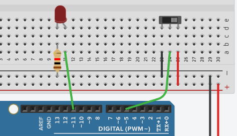
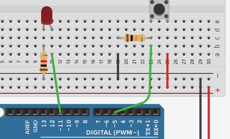
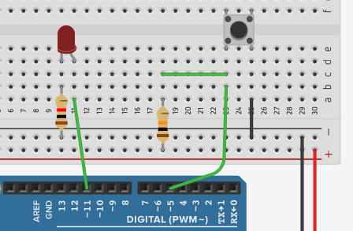
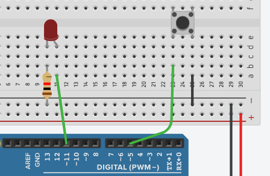
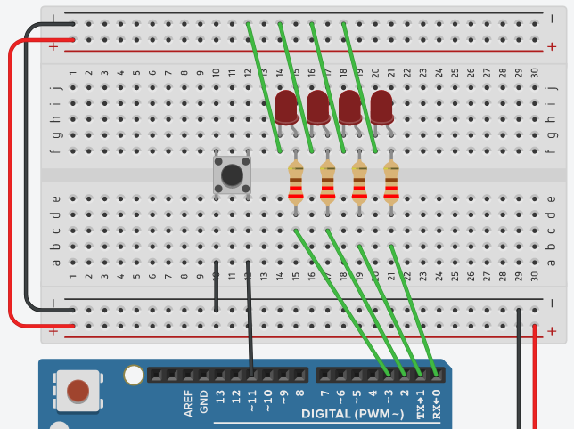
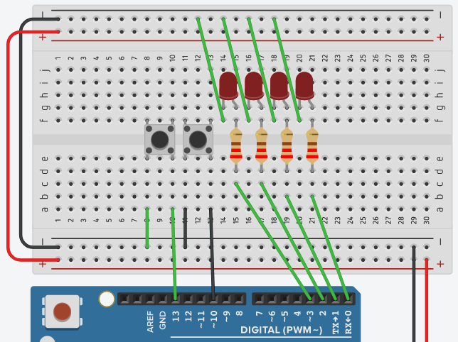
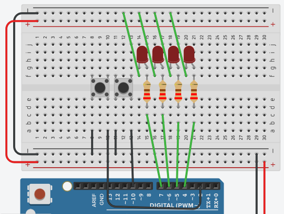
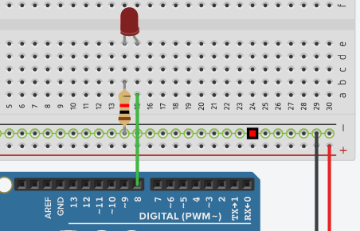
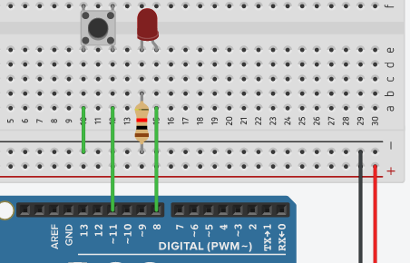
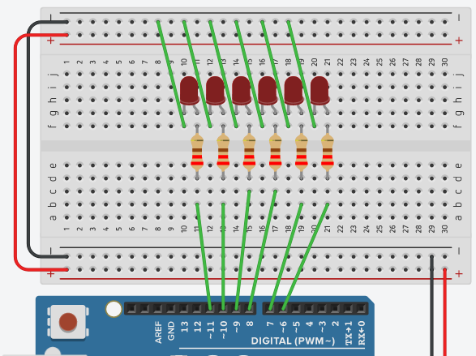

# EEM-251 İleri Düzey Programlama

## 2022-2023 Güz Dönemi

### Arduino sürgülü buton



```C++
void setup()
{
  pinMode(5, INPUT);
  pinMode(11, OUTPUT);
}

void loop()
{
  if(digitalRead(5) == HIGH){
  digitalWrite(11, HIGH);
  delay(1000); 
  digitalWrite(11, LOW);
  delay(1000);
  }
}
```
### Arduino pull-down direnci ile  buton kullanımı



```C++
void setup()
{
  pinMode(5, INPUT);
  pinMode(11, OUTPUT);
}

void loop()
{
  if(digitalRead(5) == HIGH){
  digitalWrite(11, HIGH);
  delay(1000); 
  digitalWrite(11, LOW);
  delay(1000);
  }
}
```
### Arduino pull-up direnci ile  buton kullanımı



```C++
void setup()
{
  pinMode(5, INPUT);
  pinMode(11, OUTPUT);
}

void loop()
{
  if(digitalRead(5) == LOW){
  digitalWrite(11, HIGH);
  delay(1000); 
  digitalWrite(11, LOW);
  delay(1000);
  }
}
```

### Arduino dahili pull-up direnci ile  buton uygulamaları



```C++
void setup()
{
  pinMode(5, INPUT_PULLUP);
  pinMode(11, OUTPUT);
}
void loop()
{
  if(digitalRead(5) == HIGH){
  digitalWrite(11, HIGH);
  delay(1000); 
  digitalWrite(11, LOW);
  delay(1000);
  }
}
```



```C++
void setup()
{
  for(int i=0;i<4;i++)
    pinMode(i, OUTPUT);  
  pinMode(11, INPUT_PULLUP);  
}
 
void loop()
{
  if(digitalRead(11)==LOW){
  for(int i=0; i<4; i++){
    digitalWrite(i, HIGH);
    delay(1000);
    digitalWrite(i, LOW);
  }
  }else{
    for(int i=3; i>=0; i--){
    digitalWrite(i, HIGH);
    delay(1000);
    digitalWrite(i, LOW);
  } 
  } 
}
```




```C++

void setup()
{
  for(int i=0;i<4;i++)
    pinMode(i, OUTPUT);  
  pinMode(10, INPUT_PULLUP);
  pinMode(13, INPUT_PULLUP); 
}
int sure=1000;
void loop()
{
  if(digitalRead(13)==LOW){
    sure=sure-100;
  }
  if(sure<100)
    sure=1000;
  if(digitalRead(10)==LOW){
  for(int i=0; i<4; i++){
    digitalWrite(i, HIGH);
    delay(sure);
    digitalWrite(i, LOW);
  }
  }else{
    for(int i=3; i>=0; i--){
    digitalWrite(i, HIGH);
    delay(sure);
    digitalWrite(i, LOW);
  } 
  } 
}
```

### Arduino kesme kullanımı




```C++
void setup()
{
  for(int i=4;i<8;i++)
    pinMode(i, OUTPUT);  
  pinMode(10, INPUT_PULLUP);
  pinMode(2, INPUT_PULLUP);
  attachInterrupt(digitalPinToInterrupt(2), degistir, FALLING);
}
int sure=500;
int artis=100;
void loop()
{
  
  
  if(digitalRead(10)==LOW){
  for(int i=4; i<8; i++){
    digitalWrite(i, HIGH);
    delay(sure);
    digitalWrite(i, LOW);
  }
  }else{
    for(int i=7; i>=4; i--){
    digitalWrite(i, HIGH);
    delay(sure);
    digitalWrite(i, LOW);
  }
    
  }
}

void degistir(){
  sure=sure-artis;
  if(sure<100 || sure>500)
    artis = -artis;
  
}
```
### milis fonksiyonu ile gecikme elde etme



```C++
unsigned long onceki;
void setup()
{
  pinMode(8, OUTPUT);
  onceki=millis();//100
}

int durum=LOW;
void loop()
{
  if(millis()-onceki>1000){
    digitalWrite(8, durum);
    onceki=millis();//1200
    if(durum==LOW)
      durum=HIGH;
    else
      durum=LOW;
    
  }
  //delay(100);
}
```
### milis mükerrer buton basılmasını engelleme




```C++
unsigned long onceki;
unsigned long onceki_buton;

void setup()
{
  pinMode(8, OUTPUT);
  pinMode(11, INPUT_PULLUP);
  
  onceki=millis();
}

int durum=LOW;
int sure=500;
void loop()
{
  if(millis()-onceki>sure){
    digitalWrite(8, durum);
    onceki=millis();
    if(durum==LOW)
      durum=HIGH;
    else
      durum=LOW;
    
  }

  if(digitalRead(11)==LOW && millis()-onceki_buton>500){
    sure=sure-100;
    onceki_buton=millis()
  }
  if(sure<100)
    sure=500;
}
```

### milis fonksiyonu ile rastgele süre




```C++
unsigned long onceki;
void setup()
{
  for(int i=6;i<12;i++)
    pinMode(i, OUTPUT);
    onceki=millis();  
}
int durum=0; 
void loop()
{
  long rastgele_pin, rastgele_sure;
    rastgele_pin=random(6,12);
    rastgele_sure=random(200,500);

    if(millis()-onceki>rastgele_sure){
      digitalWrite(rastgele_pin, (++durum)%2);
      onceki=millis();
    } 
}
```


```C++
unsigned long onceki;
void setup()
{
  for(int i=6;i<12;i++)
    pinMode(i, OUTPUT);
    onceki=millis();
    rastgele_sure=random(200,500);
    rastgele_pin=random(6,12);  
}
int durum=0,i=0;
void loop()
{
  
    if(i%2==0){
    rastgele_sure=random(200,500);
    rastgele_pin=random(6,12);
    }

    if(millis()-onceki>rastgele_sure){
      
      digitalWrite(rastgele_pin, ++durum%2); 
      onceki=millis();
      i++;
    } 
}
```


