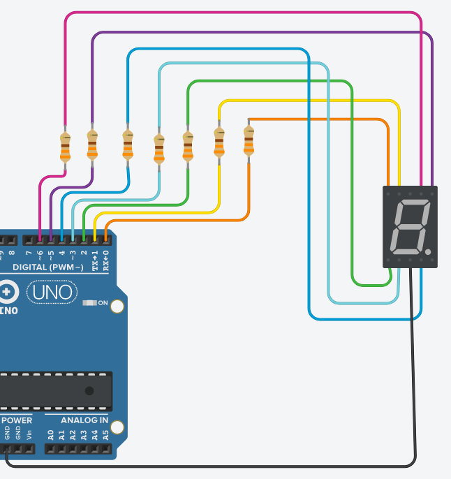
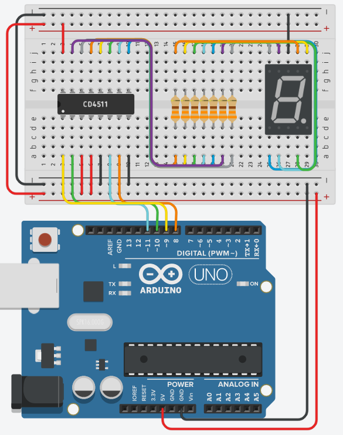

# EEM-251 İleri Düzey Programlama

## 2022-2023 Güz Dönemi

### Yazılımla debounce


```C++
int bounce_suresi=50;
int onceki_karasiz_durum=LOW;
int onceki_karali_durum=LOW;
int onceki_durum=LOW;
int son_degisim=LOW;
int simdiki_durum;

void setup()
{
  pinMode(6, INPUT_PULLUP);
}
long son_degisim_ms=0;
void loop()
{
  simdiki_durum=digitalRead(6);

  if(simdiki_durum != onceki_karasiz_durum){
    son_degisim=millis();
    onceki_karasiz_durum=simdiki_durum;
  }

  if(millis()-son_degisim>bounce_suresi){
    if(onceki_karali_durum==HIGH && simdiki_durum=LOW  )
    //butona el cekildi
    else if(onceki_karali_durum==LOW && simdiki_durum=HIGH)
    //butona basıldı 

    onceki_kararli_durum=simdiki_durum;
  }
}
```


### 7 segmentli gösterge



```C++
int sayilar[]={126,48,109,121,51,91,95,112,127,123};

int sayac=0;
void setup() {
  for(int pin=0;pin<=6;pin++)
    pinMode(pin, OUTPUT);
}

void loop() {
  int sayi;
  sayi=sayilar[sayac];
  for(int pin=0;pin<=6;pin++)
    digitalWrite(pin,bitRead(sayi, pin));
  sayac++;
  if(sayac==10)
    sayac=0;
  delay(1000);
}
```


```C++
int sayilar[]={126,48,109,121,51,91,95,112,127,123};

int sayac=0;
void setup() {
  for(int pin=0;pin<=6;pin++)
    pinMode(pin, OUTPUT);
}

void loop() {
  int sayi;
  sayi=sayilar[sayac%10];
  for(int pin=0;pin<=6;pin++)
    digitalWrite(pin,bitRead(sayi, pin));
  sayac++;
  
  delay(1000);
}
```

### BCD to 7 segment decoder entegresi ile 7 segmentli gösterge



```C++
int sayac=0;

void setup() {
  for(int pin=8;pin<14;pin++)
    pinMode(pin,OUTPUT);
}

void loop() {
  for(int i=0;i<4;i++)
    digitalWrite(i+8,bitRead(sayac%10, i));
  delay(1000);
  sayac++;
}
```

