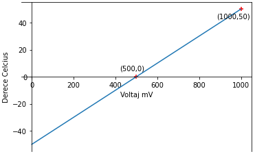

# EEM-251 İleri Düzey Programlama

## 2022-2023 Güz Dönemi Ders 6

### Analog okuma


```C++
void setup(){
  pinMode(A3, INPUT);
}
void loop()
{
  int adc_degeri;
  float analog;
   adc_degeri= analogRead(A3);
   analog=(adc_degeri/1023.)*5;
  
  delay(100);
}
```


Fotoresistör değeri 1.5k ise led yansın.

```C++
void setup(){
  pinMode(A2, INPUT);
  pinMode(6, OUTPUT);
}
void loop()
{
  int adc_degeri;
  float analog;
   adc_degeri= analogRead(A2);
   analog=(adc_degeri/1023.0)*5;

   if(analog>=3){
    digitalWrite(6,HIGH);
   }else{
    digitalWrite(6,LOW);
   }
  
  delay(100);
}
```

Fotoresistör değeri artarken 1.5k olduğunda led yansın.   
Fotoresistör değeri azalırken 1.2k olduğunda led sönsün.   

```C++
void setup(){
  pinMode(A2, INPUT);
  pinMode(6, OUTPUT);
}
int aydinliktan_karanliga=1;
void loop()
{
  int adc_degeri;
  float analog;
   adc_degeri= analogRead(A2);
   analog=(adc_degeri/1023.0)*5;

   if(analog>=3 && aydinliktan_karanliga==1 ){
    digitalWrite(6,HIGH);
    aydinliktan_karanliga=0;
   }
   if(analog<=2.17 && aydinliktan_karanliga==0){
    digitalWrite(6,LOW);
    aydinliktan_karanliga=1;
   }
  
 
  delay(100);
}
```


   

   

verilen grafiğin fonksiyonu:  
derece=analog/10.0-50;

```C++
void setup(){
  pinMode(A4, INPUT);
}

void loop()
{
  float derece;
  int adc_degeri;
  float analog;
   adc_degeri= analogRead(A4);
   analog=(adc_degeri/1023.0)*5*1000;

   derece=analog/10.0-50;
  
 
  delay(100);
}
```


```C++
void setup(){
  pinMode(A4, INPUT);
}

void loop()
{
  float derece;
  int adc_degeri;
  float analog;
   adc_degeri= analogRead(A4);
   analog=(adc_degeri/1023.0)*5*1000;

   derece=map(analog,500,1000,0,50);
  
 
  delay(100);
}
```


```C++

```


```C++

```


```C++

```


```C++

```


```C++

```