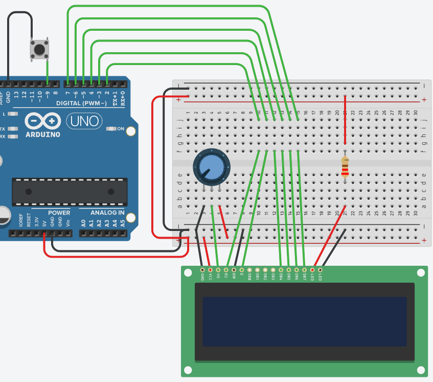
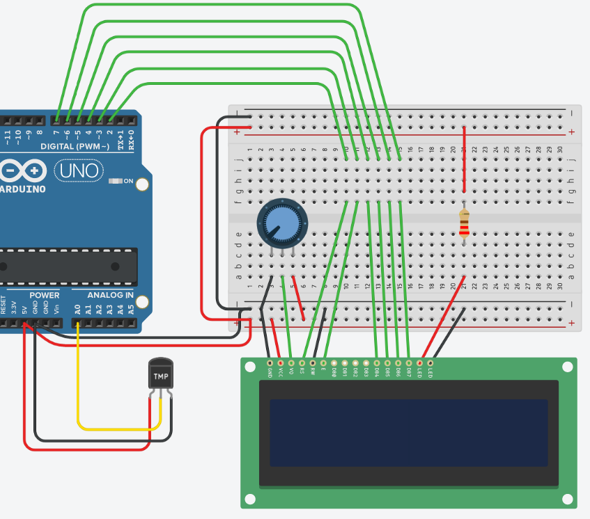
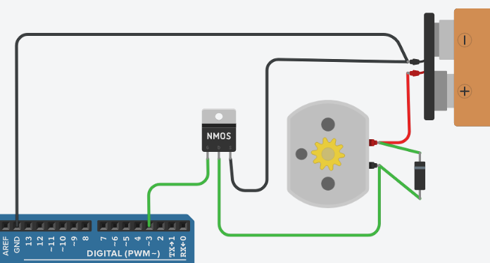
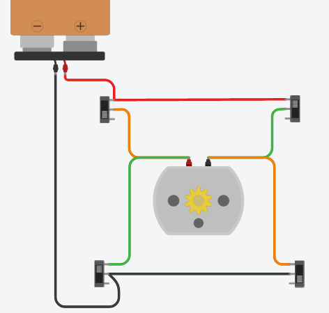
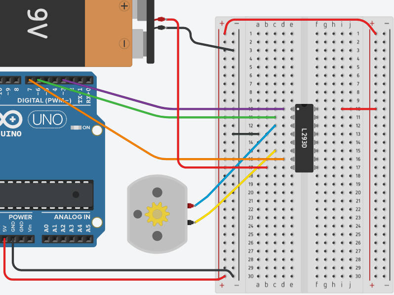
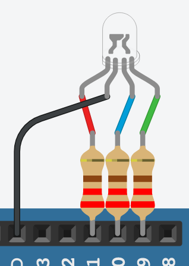
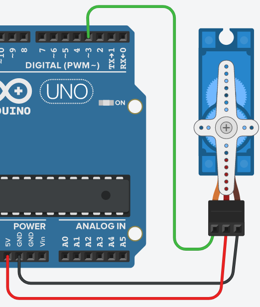
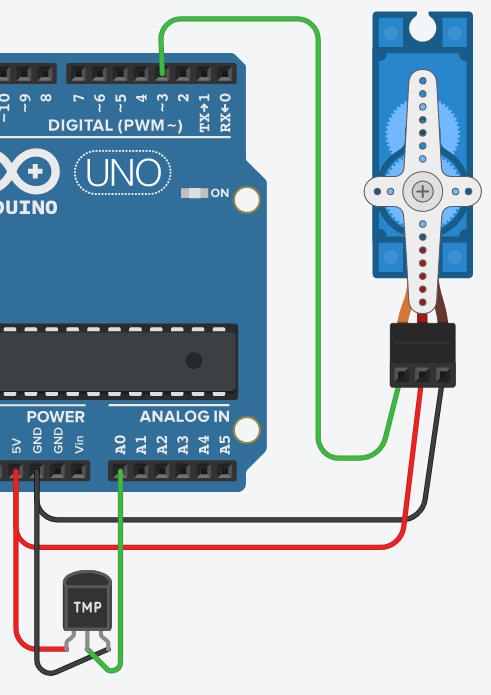
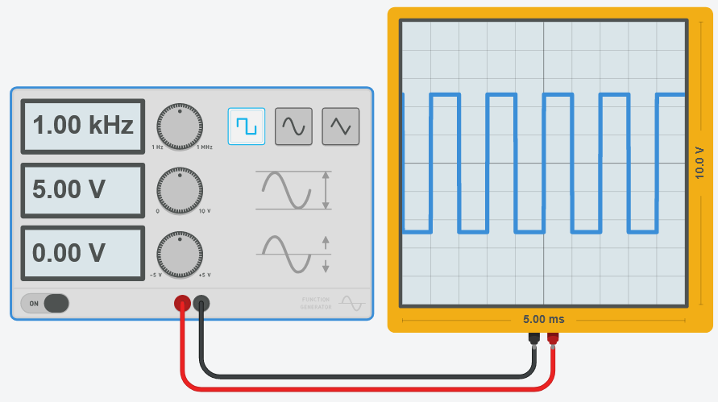
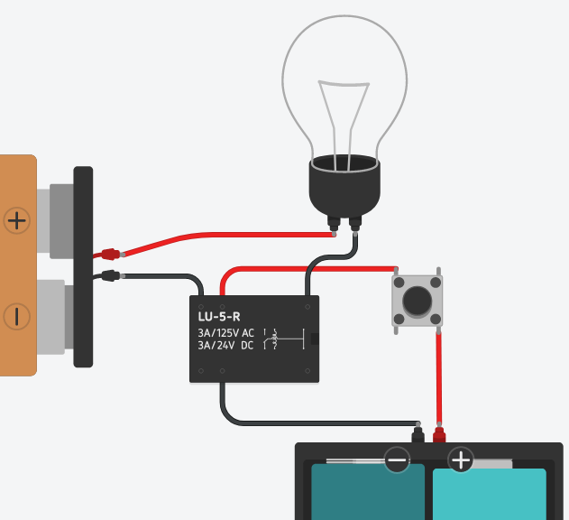

# EEM-251 İleri Düzey Programlama

## 2022-2023 Güz Dönemi Ders 7

### LCD uygulamaları


LCD ile butona basma sayısını gösterme



```C++
#include <LiquidCrystal.h>
const int rs = 2, en = 3, d4 = 4, d5 = 5, d6 = 6, d7 = 7;
LiquidCrystal lcd(rs, en, d4, d5, d6, d7);
void setup() { 
  lcd.begin(16, 2);
  lcd.print("BUTON SAYACI");
  pinMode(9, INPUT_PULLUP); 
}
int sayac=0;
long onceki=0;
void loop() { 
  lcd.setCursor(0, 1);
  if(digitalRead(9)==LOW && millis()-onceki>500){
    sayac++;
    lcd.print(sayac);
    onceki=millis();
  }
  delay(50);
}
```

LCD ile sıcaklık gösterme



```C++
#include <LiquidCrystal.h>
const int rs = 2, en = 3, d4 = 4, d5 = 5, d6 = 6, d7 = 7;
LiquidCrystal lcd(rs, en, d4, d5, d6, d7);
void setup() {  
  lcd.begin(16, 2); 
}
int adc_okuma,sicaklik,basamak_sayisi,onceki_basamak=0;
void loop() {
  lcd.setCursor(0, 0);
  lcd.print("Sicaklik:");
  lcd.setCursor(0, 1);
  adc_okuma=analogRead(A0);
  sicaklik=map(adc_okuma,  102,205,0,50);
  lcd.print(sicaklik);
  delay(100);
  basamak_sayisi=0;
  if (sicaklik<0){
    basamak_sayisi++;
    sicaklik=abs(sicaklik);
  }
  while(sicaklik>0){
    sicaklik=sicaklik/10;
    basamak_sayisi++;
  }
  if(basamak_sayisi!=onceki_basamak){
    lcd.clear();
    onceki_basamak=basamak_sayisi;
  } 
}
```

### Motor sürme

Transistör ile DC motor sürme



```C++
void setup()
{
  pinMode(3, OUTPUT);  
}
int i=255;
void loop()
{
  analogWrite(3,i);
  delay(1000); 
  if(i>30)
    i=i-10;
}
```

### H körüsü





```C++
void setup()
{
  pinMode(7, OUTPUT); // giris 1
  pinMode(6, OUTPUT); // giris 2
  pinMode(3, OUTPUT); // etkinlestirme
  digitalWrite(3, HIGH);
}
int i=255;
void loop()
{
  digitalWrite(7, HIGH);
  digitalWrite(6, LOW);
  //diger tarafa dondurmek icin
  //digitalWrite(7, LOW);
  //digitalWrite(6, HIGH);
  delay(2000);
  //pwm sinyali ile hizi ayarlamak için
  analogWrite(3,i);
  if(i>30)
    i=i-10;
}
```

### RGB LED PWM örnekleri



Arduino ile renk tonlarini sırayla görme


```C++
void setup() { 
  pinMode(9, OUTPUT);
  pinMode(10, OUTPUT);
  pinMode(11, OUTPUT);
}

void loop() {
  for(int i=0;i<256;i=i+20)
    for(int j=0;j<256;j=j+20)
    for(int k=0;k<256;k=k+20){ 
        analogWrite(9,random(i));
        analogWrite(10,random(j));
        analogWrite(11,random(k));
        delay(100);
  }
}
```

Arduino ile rastgele renk tonlarini  görme

```C++
void setup() { 
  pinMode(9, OUTPUT);
  pinMode(10, OUTPUT);
  pinMode(11, OUTPUT);
}
void loop() {
	analogWrite(9,random(256));
	analogWrite(10,random(256));
	analogWrite(11,random(256));
	delay(1000);
}
```

### Servo motor




```C++
#include <Servo.h>
Servo myservo;  
void setup() {
  myservo.attach(3);
}
void loop() {
    for(int i=0;i<=180;i++){
      myservo.write(i);
      delay(30);
    }
    for(int i=180;i>=0;i=i-5){
      myservo.write(i);
      delay(30);
    }  
}
```


0 derece sıcaklık servonun 0 derece açısına   
40 derece sıcaklık servonun 180 derece açısına   
karşılık gelecek şekilde servo ile sıcaklık göstergesi



```C++
#include <Servo.h>
Servo myservo;  
void setup() {
  myservo.attach(3);  // attaches the servo on pin 9 to the servo object
}
int adc_degeri,sicaklik,aci;
void loop() {
  adc_degeri=analogRead(A0);
    sicaklik=map(adc_degeri,102,205,0,50);
    aci=map(sicaklik,0,40,0,180);
     myservo.write(aci);
     delay(100);   
}
```

### Osiloskop kullanımı



### Röle kullanımı

