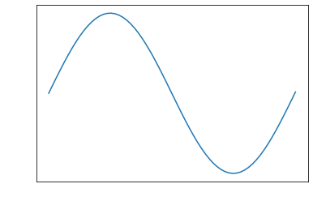
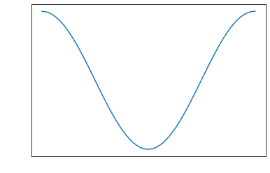
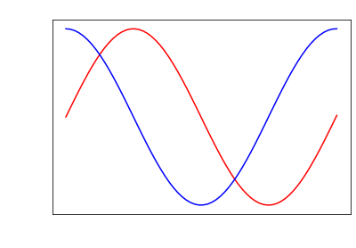
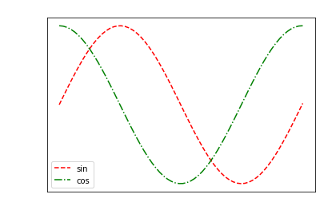
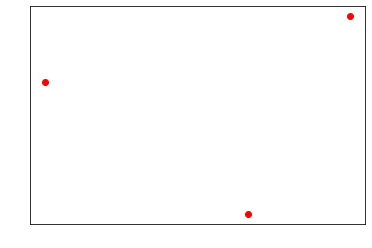
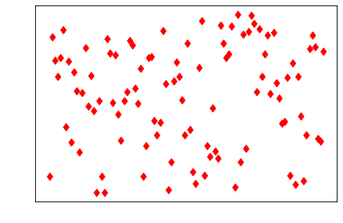

# EEM-251 İleri Düzey Programlama

## 2022-2023 Güz Dönemi Ders 13

### Python programlama

### Global değişkenler


```python
a=10
def f1():
    print(a)
def f2():
    print(a)    
f1()  
f2()
```
<pre>
    10
    10
</pre>


```python
a=10
def f(a):
    print(a)
    
f(5)
print(a)
```

<pre>
    5
    10
</pre>


```python
a=10
def f():
    a=20
    print(a)    
f()
print(a)
```
<pre>
    20
    10
</pre>


```python
a=10
def f():
    global a
    a=20
    print(a)   
f()
print(a)
```
<pre>
    20
    20
</pre>


### karmaşık sayılar 


```python
a=2+3j
type(a)
```

<pre>
    complex
</pre>


```python
a=2+3j
b=4+5j
a+b,a-b,a*b,a/b
```


<pre>
    ((6+8j), (-2-2j), (-7+22j), (0.5609756097560976+0.0487804878048781j))
</pre>	


```python
dir(a)
```

<pre>
    [...,
     'conjugate',
     'imag',
     'real']
</pre>


```python
a
```


<pre>
    (2+3j)
</pre>	


```python
a.conjugate(),  a.real,a.imag
```


<pre>
    ((2-3j), 2.0, 3.0)
</pre>	


```python
a=3+4j
r=abs(a)
r
```


<pre>
    5.0
</pre>	


```python
import cmath
dir(cmath)
```


<pre>
    [...,
     'phase',
     'pi',
     'polar',
     'rect',
     ...]
</pre>


```python
help(cmath.phase)
```
<pre>
    Help on built-in function phase in module cmath:
    phase(z, /)
        Return argument, also known as the phase angle, of a complex.
</pre>
    


```python
help(cmath.polar)
```
<pre>
    Help on built-in function polar in module cmath:
    polar(z, /)
        Convert a complex from rectangular coordinates to polar coordinates.  
        r is the distance from 0 and phi the phase angle.
</pre>
    


```python
help(cmath.rect)
```
<pre>
    Help on built-in function rect in module cmath:
    rect(r, phi, /)
        Convert from polar coordinates to rectangular coordinates.
</pre>    
    


```python
a
```


<pre>
    (3+4j)
</pre>	


```python
r=abs(a)
r
```


<pre>
    5.0
</pre>	


```python
radyan=cmath.phase(a)
radyan
```


<pre>
    0.9272952180016122
</pre>	


```python
derece=(radyan/cmath.pi)*180
derece
```


<pre>
    53.13010235415597
</pre>	


```python
kutupsal=cmath.polar(a)
r=kutupsal[0]
aci=kutupsal[1]
```

```python
z=cmath.rect(r,aci)
z
```


<pre>
    (3.0000000000000004+3.9999999999999996j)
</pre>	


```python
type(z)
```


<pre>
    complex
</pre>	


```python
def kutupsala_cevir(karmasik_sayi):
    r,phi_rad=cmath.polar(karmasik_sayi)
    phi_derece=(phi_rad/cmath.pi)*180
    return (r, phi_derece)
z=kutupsala_cevir(a)
z
```


<pre>
    (5.0, 53.13010235415597)
</pre>	


```python
def kartezyene_cevir(r,phi_derece):
    phi_radyan=(phi_derece/180)*cmath.pi
    return cmath.rect(r,phi_radyan)
kartezyene_cevir(z[0],z[1])
```


<pre>
    (3.0000000000000004+3.9999999999999996j)
</pre>	


```python
# 5+j2+(10 faz 75) isleminin sonucunu hem kartezyen 
# hem de kutupsal formda bulalim
z=5+2j+kartezyene_cevir(10,75)
z
```


<pre>
    (7.588190451025207+11.659258262890683j)
</pre>	


```python
kutupsala_cevir(z)
```


<pre>
    (13.91110842319241, 56.94273008662673)
</pre>	


### matplotlib


```python
from matplotlib import pyplot as plt 
```


```python
sayilar=list(range(0,10))
kareleri=[i**2 for i in sayilar]
plt.plot(sayilar, kareleri)
plt.show()
```


    

    


```python
sayilar=[i/10 for i in range(0,100)]
kareleri=[i**2 for i in sayilar]
plt.plot(sayilar, kareleri)
plt.show()
```


    

    


```python
from math import sin, cos
```


```python
x=[i/10 for i in range(0,2*32)]
sinx=[sin(i) for i in x]
cosx=[cos(i) for i in x]
plt.plot(x,sinx)
plt.plot(x,cosx)
plt.show()
```


    

    


```python
x=[i/10 for i in range(0,2*32)]
sinx=[sin(i) for i in x]
cosx=[cos(i) for i in x]
plt.plot(x,sinx)
plt.show()
plt.plot(x,cosx)
plt.show()
```

    

    
    

    


```python
x=[i/10 for i in range(0,2*32)]
sinx=[sin(i) for i in x]
cosx=[cos(i) for i in x]
plt.title("sin ve cos sinyalleri")
plt.xlabel("x")
plt.ylabel("sin(x), cos(x)")
plt.plot(x,sinx)
plt.plot(x,cosx)
plt.show()
```


    

    


```python
x=[i/10 for i in range(0,2*32)]
sinx=[sin(i) for i in x]
cosx=[cos(i) for i in x]
plt.title("sin ve cos sinyalleri")
plt.xlabel("x")
plt.ylabel("sin(x), cos(x)")
plt.plot(x,sinx, color="red")
plt.plot(x,cosx, color="blue")
plt.show()
```


    

    


```python
x=[i/10 for i in range(0,2*32)]
sinx=[sin(i) for i in x]
cosx=[cos(i) for i in x]
plt.title("sin ve cos sinyalleri")
plt.xlabel("x")
plt.ylabel("sin(x), cos(x)")
plt.plot(x,sinx, "--r", label="sin")
plt.plot(x,cosx, "-.g", label="cos")
plt.legend()
plt.show()
```


    

    

```python
karmasik_sayilar=[2+3j, 5+4j,4+1j]
reel=[i.real for i in karmasik_sayilar]
imag=[i.imag for i in karmasik_sayilar]
plt.plot(reel, imag,"or")
plt.show()
```

    

    


```python
import random
sayilar=[random.randint(0,1000) for i in range(100)]
plt.plot(sayilar, ".r")
plt.show()
```


    

    


```python
import random
sayilar=[random.randint(0,1000) for i in range(100)]
plt.plot(sayilar, "dr")
plt.show()
```


    

    


```python
import random
sayilar=[random.randint(0,1000) for i in range(100)]
plt.plot(sayilar, "^y")
plt.show()
```


    

    


### Dosya okuma ve dosyaya yazma


Program dosyası ile aynı dizinde a.txt dosyası mevcuttur. Bu dosya okunmaktadır.


```python
f=open("a.txt","r",encoding="utf8")
icerik=f.read()
f.close()
```


```python
len(icerik)
```

<pre>
    20921
</pre>	


```python
icerik.count("\n")
```

<pre>
    321
</pre>	


```python
icerik.count(" ")
```


<pre>
    3024
</pre>	


```python
rakam_sayisi=0
for i in range(ord("0"),ord("9")+1):
    rakam_sayisi+=icerik.count(chr(i))
rakam_sayisi
```


<pre>
    378
</pre>	


```python
f=open("x.txt","w",encoding="utf8")
for sayac in range(1000):
    f.write(f"sayaç değeri: {sayac}\n")
f.close()
```


```python
f=open("x.txt","a",encoding="utf8")
for sayac in range(1000):
    f.write(f"sayaç değeri: {sayac}\n")
f.close()
```


```python
f=open("veriler.txt","w",encoding="utf8")
for i in range(5):
    ders=input("ders: ")
    ders_notu=input("arasinav: ")
    f.write(f"{ders}: {ders_notu}\n")
f.close()
```
<pre>
    ders:  tarih
    arasinav:  60
    ders:  devre
    arasinav:  40
    ders:  programlama
    arasinav:  20
    ders:  mikro
    arasinav:  10
    ders:  elektronik
    arasinav:  15
</pre>


```python
f=open("veriler.txt","r",encoding="utf8")
veriler=f.read()
f.close()
```


```python
satirlar_lst=veriler.strip().split("\n")
satirlar_lst
```


<pre>
    ['tarih: 60', 'devre: 40', 'programlama: 20', 'mikro: 10', 'elektronik: 15']
</pre>	


```python
notlar=[int(i.split(":")[1].strip()) for i in satirlar_lst]
notlar
```

<pre>
    [60, 40, 20, 10, 15]
</pre>	


```python
sum(notlar)/len(notlar)
```

<pre>
    29.0
</pre>	
