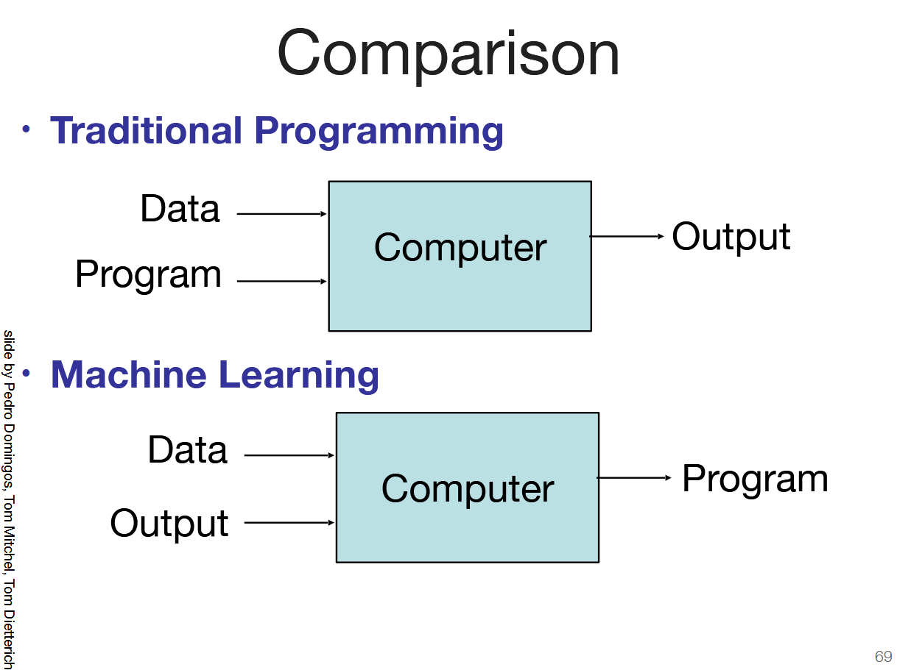
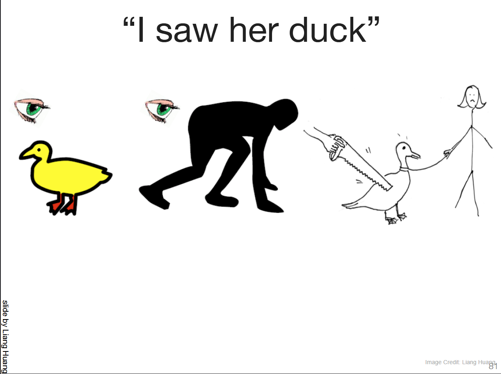
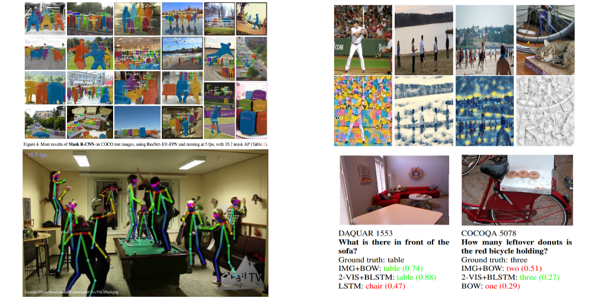
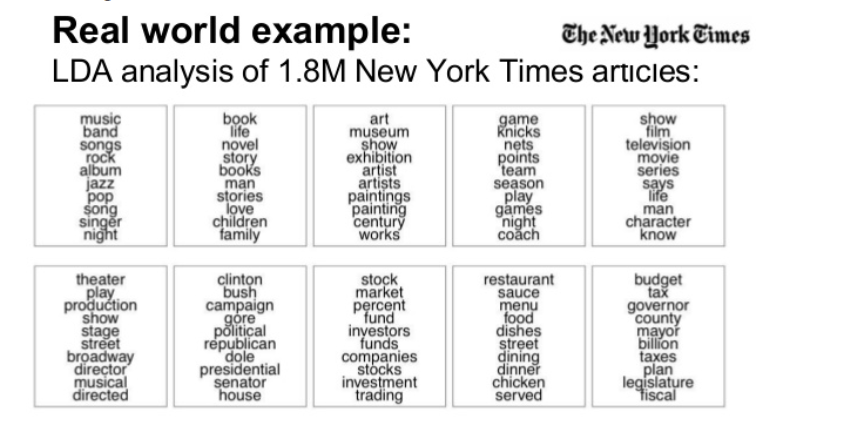
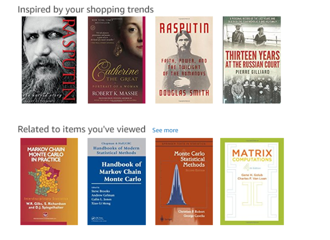
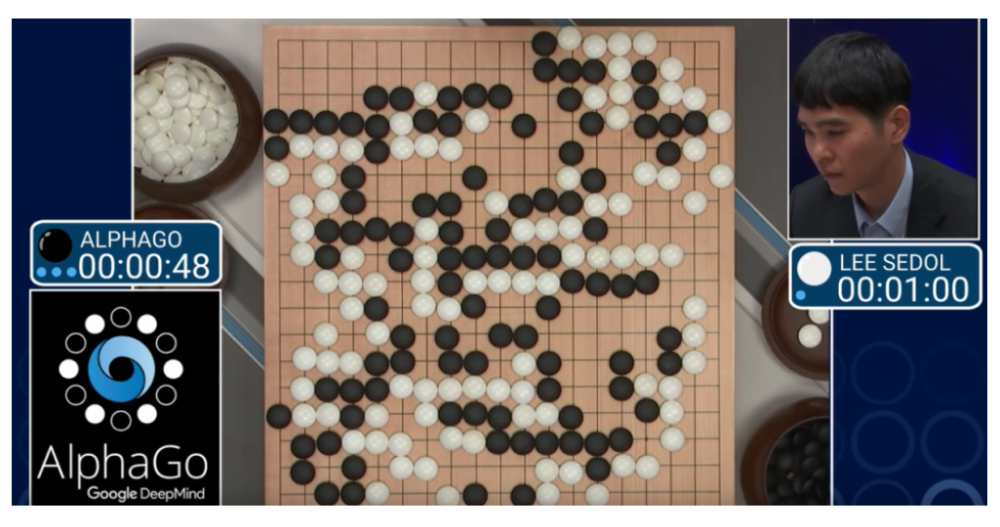

# EEM-272 Makine Öğrenmesine Giriş

## 2024-2025 Bahar Dönemi

Not: Bu sayfada görüntüler bulunmaktadır ancak bu goruntuler asenturk.github.io sitesi üzerinden gösterilmiyor.   
Dolaysıyla sayfanın orjinal hali için [tıklayınız](https://github.com/asenturk/asenturk.github.io/blob/main/eem272/dersler/01.md).

## 
**EEM-272 Makine Öğrenmesine Giriş**
### 
Ali Şentürk
### 
 alisenturk@isparta.edu.tr
### 
 asenturk.github.io

### 
 Ders Hakkında

**Amaçlar**
- Makine öğrenimindeki birçok kavram ve algoritmaya genel bir kavrama sağlamak
- Yapılacak çalışmaları bilimsel makale şeklinde ifade etmek.
  - Giriş, literatür taraması, referans kullanımı, yöntem, bulgular, sonuç...

**Gereksinimler**
- Python programlama
  - Numpy, Matplotlib, OpenCV
- Algoritma mantığı, veri yapıları.
- Temel olasılık ve istatistik.
- Temel lineer cebir ve kalkülüs

### Kaynaklar
- Python
  - https://www.w3schools.com/python/
  - https://asenturk.github.io/eem241/
- OpenCV
  - https://docs.opencv.org/4.x/d6/d00/tutorial_py_root.html
- scikit-learn
  - https://scikit-learn.org/stable/ 
- Tensorflow
  - https://www.tensorflow.org/tutorials?hl=tr
- Keras
  - https://keras.io/examples/
- Pytorch
  - https://pytorch.org/tutorials/ 

### Yaklaşık Takvim:
- 1\. hafta Ders içeriği ve genel bilgilendirme (Ekle/Çıkar)
- 4\. hafta konu teklifi
- 6\. hafta Konu Belirleme ve Proje önerisi
- 8\. hafta Proje giriş ve literatür taraması
- 9-11. haftalar yapılan çalışmaların ilerleyişinin teslimi
-  12\. hafta Program ve makalenin teslimi
-  13-14\. haftalar sunumlar
-  **Ders esnasında ilerleyen haftalarda kesin takvim duyurulacak.**
*Tum odevler turnitin üzerinden alınacak*
### Proje
- 1 veya 2 kişi
- Gerçek bir probleme çözüm olacak şekilde güncel bir konu üzerinde çalışma
- Kodlamada yapay zeka dahil Her tür kaynaktan faydalanılabilir. Ancak kullanılan her tür kodlamanın ne için kullanıldığının farkında olmanız gerekiyor.
- Tüm çalışmalarda Tkinter kütüphanesi ile GUİ yapılacaktır.

### Veri Setleri
- https://www.kaggle.com/datasets
- https://datasetsearch.research.google.com/
- https://github.com/awesomedata/awesome-public-datasets

- Kendi veri setinizin kullanmanız daha iyi olacaktır.

### Makine Öğrenmesi Geliştirme Ortamı
- Google Colab
- Kaggle
### GUI Geliştirme Ortamı
- Yerel Bilgisayar

### Öğrenme Nedir

- Çalışarak, uygulayarak, öğretilerek veya deneyimleyerek
  - bilgi veya beceri kazanma faaliyeti veya süreci

### Makine Öğrenmesi Nedir?

- Tom Mitchell
  - A computer program is said to learn from experience E with respect to some class of tasks T and performance measure P, if its performance
at tasks in T, as measured by P, improves with experience E.
    - at some task (T)
    - with experience (E)
    - improve their performance (P)

- Arthur Samuel
  - Field of study that gives computers
the ability to learn without being explicitly programmed
- Kevin Murphy
  - algorithms that automatically detect patterns in data
  - use the uncovered patterns to predict future data or other outcomes of interest

### Neden Makine Öğrenmesi

- Birçok problem için doğru davranışı elle programlamak zordur:
  - İnsanları ve nesneleri tanımak
  - İnsan konuşmasını anlamak

- Makine öğrenimi yaklaşımı: Bir algoritma programlayarak verilerden veya deneyimden otomatik olarak öğrenmesini sağlamak.

- Neden öğrenen bir algoritma kullanmak isteyebilirsiniz?

  - Bir çözümü elle kodlamak zor olabilir (örn. görme, konuşma)
  - Sistem, değişen bir ortama uyum sağlamalıdır (örn. spam tespiti)
  - Sistem, insan programcılardan daha iyi performans göstermelidir
  - Gizlilik/adillik sağlanmalıdır (örn. arama sonuçlarını sıralama)

### Neden Makine Öğrenmesi
- Algoritma ve kütüphaneler
  - Birçok temel etkili ve verimli algoritma ve kütüphane mevcut.
- Veri
    - Büyük miktarda çevrimiçi veri mevcuttur.
- Bilgisayar
    - Büyük miktarda hesaplama kaynağı
mevcut.

### Neden makine öğrenmesi zordur?

### Makine Öğrenmesi Türleri  

Makine öğrenmesi üç ana türe ayrılır:  

#### **1. Gözetimli Öğrenme (Supervised Learning)**  
- Giriş ve çıkış verileri etiketlidir.  
- Model, girişlere karşılık gelen doğru çıkışları öğrenir.  

#### **Örnekler:**  
- E-posta spam tespiti (Spam veya değil)  
- El yazısı rakam tanıma  
- Hastalık teşhisi

#### **2. Gözetimsiz Öğrenme (Unsupervised Learning)**  
- Veriler etiketsizdir, model kendiliğinden veri içindeki desenleri keşfeder.  

#### **Örnekler:**  
- Müşteri segmentasyonu  
- Anomali tespiti (Sahtekarlık algılama)  
- Konu modelleme (Belgeleri konu başlıklarına ayırma)  

#### **3. Pekiştirmeli Öğrenme (Reinforcement Learning)**  
- Bir ajan, çevreyle etkileşime girerek ödüller ve cezalar aracılığıyla öğrenir.  

#### **Örnekler:**  
- Oyun oynayan yapay zeka (Satranç, Go, Atari)  
- Otonom araçlar  
- Robotik sistemler  

### Bunlara ek olarak bazı alt türler ve özel öğrenme yöntemleri de vardır:  

- **Yarı Gözetimli Öğrenme (Semi-Supervised Learning):**  
  Az miktarda etiketli ve bol miktarda etiketsiz veri kullanır.  
- **Kendiliğinden Öğrenme (Self-Supervised Learning):**  
  Model, veriden kendi kendine etiketler oluşturarak öğrenir.  
- **Çevrimdışı ve Çevrimiçi Öğrenme (Offline & Online Learning):**  
  Model, tüm veriyi önceden öğrenebilir (çevrimdışı) veya yeni veriler geldikçe güncellenebilir (çevrimiçi).  

Makine öğrenmesi türleri, problemin doğasına ve veri yapısına bağlı olarak seçilir.

### Örnekler
#### **Bilgisayarlı Görü (Computer Vision) Projeleri**  

Makine öğrenmesi, bilgisayarlı görü alanında birçok farklı görev için kullanılmaktadır.  

- **Nesne Tespiti (Object Detection)**  
  Bir görüntüdeki belirli nesneleri tanıma ve yerini belirleme işlemidir.  
  - **Örnek:** Kamera ile güvenlik izleme, otonom araçlarda yaya ve araç tespiti  

- **Anlamsal Bölütleme (Semantic Segmentation)**  
  Görüntüyü piksellerine kadar analiz ederek her piksele bir sınıf etiketi atama işlemidir.  
  - **Örnek:** Medikal görüntülerde organ tespiti, yol haritalarında yol çizgilerinin tanımlanması  

- **Poz Tahmini (Pose Estimation)**  
  İnsanların vücut pozisyonlarını ve hareketlerini tahmin etmek için kullanılır.  
  - **Örnek:** Spor analitiği, artırılmış gerçeklik (AR) uygulamaları  

- **Görüntü Sınıflandırma (Image Classification)**  
  Görüntüleri, içeriklerine göre sınıflandırma işlemidir.  
  - **Örnek:** El yazısı rakamları tanıma, hayvan türlerini sınıflandırma  

- **Yüz Tanıma (Facial Recognition)**  
  Bir kişinin yüzünü tanıyarak kimliğini doğrulamak veya tanımak için kullanılan teknolojidir.  
  - **Örnek:** Akıllı telefonlarda yüz tanıma ile ekran kilidi açma, güvenlik sistemlerinde yüz tanıma  

- **Görüntü Süper Çözünürlük (Image Super-Resolution)**  
  Düşük çözünürlüklü görüntüleri daha yüksek çözünürlüğe çıkarmak için makine öğrenmesi kullanılır.  
  - **Örnek:** ESRGAN (Enhanced Super-Resolution Generative Adversarial Networks)  

- **Tıbbi Görüntü Analizi (Medical Image Analysis)**  
  Radyoloji, patoloji gibi alanlarda hastalık tespiti için derin öğrenme kullanılır.  
  - **Örnek:** Beyin tümörü tespiti, COVID-19 akciğer taramaları  

- **Otonom Araç Algılaması (Autonomous Driving Perception)**  
  LiDAR ve kamera verileriyle yayaları, araçları ve trafik işaretlerini tespit etmek için kullanılır.  

#### **Konuşma İşleme (Speech Processing) Projeleri** 

Makine öğrenmesi, konuşma işleme alanında birçok farklı görev için kullanılmaktadır.  

 - **Konuşmadan Metne Dönüştürme (Speech-to-Text)**  
  Konuşmayı yazılı metne dönüştürme işlemidir.  
  - **Örnek:** Siri, Google Assistant, transkript oluşturma  

- **Kişisel Asistanlar (Personal Assistants)**  
  Kullanıcının sesli komutlarına yanıt veren yapay zeka tabanlı uygulamalardır.  
  - **Örnek:** Amazon Alexa, Google Assistant, Apple Siri  

- **Konuşmacı Tanımlama (Speaker Identification)**  
  Konuşmayı yapan kişiyi tanıma işlemidir.  
  - **Örnek:** Çağrı merkezlerinde müşteri doğrulama, sesli biyometrik kimlik doğrulama   

- **Duygu Analizi (Speech Emotion Recognition)**  
  Konuşma sırasında duyguların belirlenmesi için ses dalgaları ve ton analizi kullanılır.  
  - **Örnek:** Müşteri hizmetlerinde duygu analizi, çağrı merkezi geri bildirimi  

- **Ses Klonlama (Voice Cloning)**  
  Bir kişinin sesini örneklerden öğrenerek benzer bir yapay ses üretmek için kullanılır.  
  - **Örnek:** Deepfake ses teknolojileri, özelleştirilmiş metinden konuşmaya sistemleri  

- **Gürültü Giderme ve Ses İyileştirme (Noise Reduction & Speech Enhancement)**  
  Gürültülü ortamlarda kaydedilmiş konuşmaları temizlemek ve anlaşılırlığını artırmak için kullanılır.  
  - **Örnek:** Telefon görüşmelerinde arka plan gürültüsünü azaltma, işitme cihazları  

- **Aksan ve Dil Tanıma (Accent & Language Identification)**  
  Kullanıcının konuşma stilinden aksanını veya konuştuğu dili otomatik olarak belirleme.  
  - **Örnek:** Çok dilli sesli asistanlar, çağrı merkezi yönlendirme sistemleri  

### **Doğal Dil İşleme (Natural Language Processing - NLP) Projeleri**  

Makine öğrenmesi, doğal dil işleme (NLP) alanında birçok farklı görev için kullanılmaktadır.  

 
- **Makine Çevirisi (Machine Translation)**  
  Metinleri bir dilden başka bir dile çevirme işlemidir.  
  - **Örnek:** Google Translate, DeepL  

- **Duygu Analizi (Sentiment Analysis)**  
  Metinlerdeki duygusal tonu belirleyerek olumlu, olumsuz veya nötr olarak sınıflandırma işlemidir.  
  - **Örnek:** Sosyal medya yorumları, müşteri geri bildirimleri analizi  

- **Konu Modelleme (Topic Modeling)**  
  Büyük metin koleksiyonlarındaki ana temaları veya konuları keşfetmeye yönelik bir tekniktir.  
  - **Örnek:** Haber makalelerindeki ana konuları bulma, müşteri yorumlarından temalar çıkarma  

- **Spam Filtreleme (Spam Filtering)**  
  E-posta veya mesajlar içindeki istenmeyen veya zararlı içerikleri tespit etme işlemidir.  
  - **Örnek:** Gmail’in spam filtresi, çevrimiçi platformlarda reklam/spam mesajlarını engelleme  

- **Adlandırılmış Varlık Tanıma (Named Entity Recognition - NER)**  
  Metin içerisindeki kişi, kuruluş, yer gibi özel isimleri tespit etmek için kullanılır.  
  - **Örnek:** Haber metinlerinde önemli varlıkları belirleme, hukuk ve finans dokümanları analizi  

- **Metin Özetleme (Text Summarization)**  
  Uzun metinleri anlamını koruyarak daha kısa özetler haline getirmek için kullanılır.  
  - **Örnek:** Haber özetleme, otomatik rapor oluşturma, akademik makale özetleri  

- **Soru Cevaplama Sistemleri (Question Answering - QA)**  
  Belirli bir bağlamdan sorulara doğru yanıtlar üretmek için kullanılır.  
  - **Örnek:** Akıllı asistanlar (Google Assistant, Siri), bilgi tabanlı arama sistemleri  

- **Otomatik Metin Üretimi (Text Generation)**  
  Dil modelleri kullanarak doğal ve anlamlı metinler üretmek için kullanılır.  
  - **Örnek:** Chatbotlar, içerik üretimi, yaratıcı yazarlık destek sistemleri  

- **Plagiarizm Tespiti ve Metin Doğrulama (Plagiarism Detection & Text Verification)**  
  Metinlerin özgünlüğünü kontrol etmek ve sahte bilgileri tespit etmek için kullanılır.  
  - **Örnek:** Akademik intihal kontrolü, yanlış bilgi (fake news) tespiti  

- **Dil Modeli İnce Ayarı (Fine-Tuning Large Language Models)**  
  Belirli bir sektöre veya konuya özel dil modelleri oluşturmak için büyük ölçekli dil modellerinin ince ayarlanması.  
  - **Örnek:** Hukuk, tıp, finans gibi alanlara özel metin analiz sistemleri  

### **E-Ticaret ve Öneri Sistemleri (E-Commerce & Recommender Systems) Projeleri**  

Makine öğrenmesi, e-ticaret ve öneri sistemleri alanında birçok farklı görev için kullanılmaktadır.  

- **Ürün Öneri Sistemleri (Product Recommendation Systems)**  
  Kullanıcının geçmiş davranışlarına veya tercihlerine göre ürünler önermek için kullanılan sistemlerdir.  
  - **Örnek:** Amazon'un kişisel ürün önerileri, eBay'in ürün tavsiyeleri  

- **Film ve İçerik Önerme (Movie & Content Recommendation)**  
  Kullanıcıların önceki izleme alışkanlıklarına göre yeni film veya dizi önerileri sunan sistemlerdir.  
  - **Örnek:** Netflix, YouTube, Spotify içerik öneri algoritmaları  

- **Kişiselleştirilmiş Alışveriş Deneyimi (Personalized Shopping Experience)**  
  Kullanıcının alışveriş geçmişine ve tercihine dayalı olarak özelleştirilmiş bir alışveriş deneyimi yaratır.  
  - **Örnek:** E-ticaret sitelerinin gibi markaların kişiselleştirilmiş alışveriş önerileri  

- **Dinamik Fiyatlandırma (Dynamic Pricing)**  
  Ürün fiyatlarını piyasa talebine, stok seviyelerine ve rakip fiyatlarına göre otomatik olarak ayarlayan sistemler.  
  - **Örnek:** Havayolu biletleri, otel rezervasyonları, e-ticaret siteleri  

- **Sahtekarlık Tespiti (Fraud Detection)**  
  Dolandırıcılık, sahte incelemeler ve hileli işlemleri tespit etmek için anomali algılama yöntemleri kullanılır.  
  - **Örnek:** Kredi kartı dolandırıcılığı, sahte kullanıcı hesapları, spam incelemeler  

- **Arama Motoru Optimizasyonu ve Ürün Keşfi (Search Engine Optimization & Product Discovery)**  
  Kullanıcıların aradıkları ürünleri daha hızlı bulabilmeleri için gelişmiş arama motorları ve öneri algoritmaları geliştirme.  
  - **Örnek:** Amazon, eBay, Trendyol gibi platformlardaki gelişmiş ürün arama sistemleri  

- **Stok Yönetimi ve Talep Tahmini (Inventory Management & Demand Forecasting)**  
  Stok seviyelerini optimize etmek ve talebi tahmin etmek için veri analitiği ve makine öğrenmesi kullanılır.  
  - **Örnek:** Tedarik zinciri optimizasyonu, perakende mağazalar için otomatik stok yenileme  

- **Müşteri Segmentasyonu ve Hedefli Reklamcılık (Customer Segmentation & Targeted Advertising)**  
  Kullanıcı davranışlarını analiz ederek farklı müşteri gruplarına özel reklamlar ve kampanyalar oluşturma.  
  - **Örnek:** Google Ads, Facebook reklam algoritmaları, Amazon’un kişiselleştirilmiş pazarlama kampanyaları  

- **Görsel Arama ve Ürün Tanıma (Visual Search & Product Recognition)**  
  Kullanıcıların fotoğraf çekerek veya bir görsel yükleyerek benzer ürünleri bulmasını sağlayan sistemler.  
  - **Örnek:** Pinterest Lens, Google Lens, moda ve mobilya alışveriş sitelerinde görsel tabanlı ürün arama  

- **Müşteri Geri Bildirimi Analizi (Customer Feedback Analysis)**  
  Müşteri yorumlarını ve geri bildirimlerini analiz ederek ürün veya hizmet iyileştirmeleri için içgörüler sağlama.  
  - **Örnek:** Otomatik duygu analizi, müşteri şikayetlerinin sınıflandırılması, chatbot destek sistemleri  

# Playing Games

### Standart Program vs Klasik Makine Öğrenmesi vs Derin Öğrenme
- doğru davranışı manuel olarak programlama
- örneklerden öğrenen bir program yazma: öznitelikler manuel olarak tasarlanır.
- Özniteliklerin de öğrenilmesini içerir.

### Kaynaklar
- https://web.cs.hacettepe.edu.tr/~erkut/ain311.f22/slides/l1-intro.pdf
- https://www.cs.toronto.edu/~rgrosse/courses/csc311_f21/lectures/lec01.pdf
- https://file.notion.so/f/f/e09557bf-95d6-4197-8bad-8e4abaa3d8d0/af98fb69-776f-42f3-a1b2-e39560f9574b/w01_1_introductions_slides.pdf?table=block&id=174946d7-006c-807b-8a77-cd8f43179c13&spaceId=e09557bf-95d6-4197-8bad-8e4abaa3d8d0&expirationTimestamp=1739736000000&signature=i2JMoJeNpvsSwZojvTa0Ibce0B489eMzJkc1RRF7mSM&downloadName=w01_1_introductions_slides.pdf
