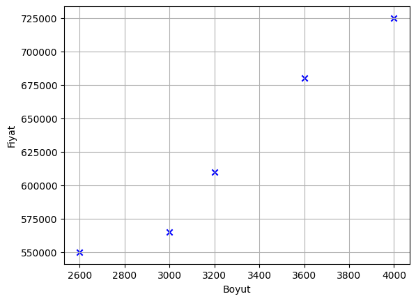
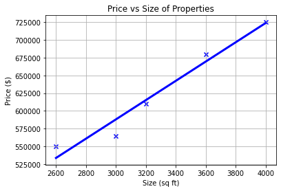

# EEM-272 Makine Öğrenmesine Giriş

## 2025-2026 Bahar Dönemi


# Ders 2

[Slaytı için tıklayınız.](./slides/C1_W1.pdf)   
[Video  ders (ingilizce).](https://www.youtube.com/watch?v=vStJoetOxJg&list=PLkDaE6sCZn6FNC6YRfRQc_FbeQrF8BwGI)


# Univariate (Tek değişkenli) Lineer (Doğrusal) Regresyon


```python
import matplotlib.pyplot as plt
import numpy as np
```


```python
sizes=np.array([2600, 3000, 3200, 3600, 4000]).reshape((-1,1))
prices =np.array([550000, 565000, 610000, 680000, 725000]).reshape((-1,1))
sizes.shape, prices.shape
```


<pre>
    ((5, 1), (5, 1))
</pre>


```python
plt.scatter(sizes, prices, marker='x', color='b')

plt.xlabel('Boyut')
plt.ylabel('Fiyat')

plt.grid(True)
plt.show()
```


    

    


## Lineer regresyon


```python
from sklearn import linear_model
```


```python
#model
reg = linear_model.LinearRegression()

# modeli verilerle eğitme
reg.fit(sizes,prices)
```


```python
reg.predict([[3300]])
```


<pre>
    array([[628715.75342466]])
</pre>


```python
# theta_0 değeri
reg.intercept_
```


<pre>
    array([180616.43835616])
</pre>


```python
# theta_1 değeri
reg.coef_
```


<pre>
    array([[135.78767123]])
</pre>


```python
theta_0 = reg.intercept_[0]
theta_1 = reg.coef_[0,0]

```


```python
# dolayısıyla tahmin fomulu
f=theta_0+theta_1*sizes
```


```python
f=theta_0+theta_1*3300
f
```


<pre>
    628715.7534246575
</pre>


```python
# tum veri setini tahmin etmek için
prices_pred = reg.predict(sizes)
```


```python
from sklearn.metrics import mean_squared_error, mean_absolute_percentage_error
print("Ortalama kare hatası: ", mean_squared_error(prices, prices_pred))
print("Ortalama mutlak yüzde  hatası: ", mean_absolute_percentage_error(prices, prices_pred))
```

<pre>
    Ortalama kare hatası:  186815068.4931509
    Ortalama mutlak yüzde  hatası:  0.019201242020345188
</pre>
    


```python
plt.scatter(sizes, prices, marker='x', color='b')

plt.xlabel('Size (sq ft)')
plt.ylabel('Price ($)')
plt.title('Price vs Size of Properties')
plt.plot(sizes, prices_pred, color='blue', linewidth=3)
plt.grid(True)
plt.show()
```


    

    


