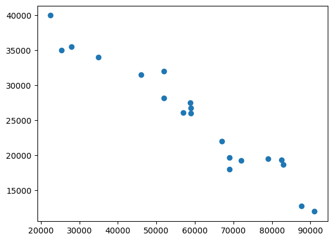
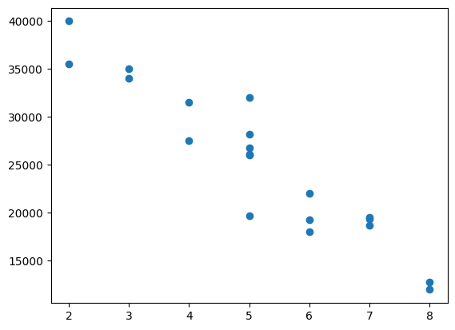

### Train Test Split


```python
import pandas as pd
import matplotlib.pyplot as plt
```

Veri dosyasını indirmek için [tıklayınız](./images/03a_carprices.csv).


```python
df = pd.read_csv("03a_carprices.csv")
df.head()
```


<div>
<style scoped>
    .dataframe tbody tr th:only-of-type {
        vertical-align: middle;
    }

    .dataframe tbody tr th {
        vertical-align: top;
    }

    .dataframe thead th {
        text-align: right;
    }
</style>
<table border="1" class="dataframe">
  <thead>
    <tr style="text-align: right;">
      <th></th>
      <th>Mileage</th>
      <th>Age(yrs)</th>
      <th>Sell Price($)</th>
    </tr>
  </thead>
  <tbody>
    <tr>
      <th>0</th>
      <td>69000</td>
      <td>6</td>
      <td>18000</td>
    </tr>
    <tr>
      <th>1</th>
      <td>35000</td>
      <td>3</td>
      <td>34000</td>
    </tr>
    <tr>
      <th>2</th>
      <td>57000</td>
      <td>5</td>
      <td>26100</td>
    </tr>
    <tr>
      <th>3</th>
      <td>22500</td>
      <td>2</td>
      <td>40000</td>
    </tr>
    <tr>
      <th>4</th>
      <td>46000</td>
      <td>4</td>
      <td>31500</td>
    </tr>
  </tbody>
</table>
</div>


```python
data=df.to_numpy()
```


```python
data[:3]
```


    array([[69000,     6, 18000],
           [35000,     3, 34000],
           [57000,     5, 26100]], dtype=int64)


```python
milage=data[:,0]
age=data[:,1]
price=data[:,2]
```


```python
plt.scatter(milage,price)
plt.show()
```


    

    


```python
plt.scatter(age,price)
plt.show()
```


    

    


```python
X = data[:,0:2]
y = data[:,2]
```


```python
from sklearn.model_selection import train_test_split
X_train, X_test, y_train, y_test = train_test_split(X,y,test_size=0.3) 
```


```python
X_train.shape, y_train.shape
```


    ((14, 2), (14,))


```python
X_test.shape, y_test.shape
```


    ((6, 2), (6,))


### Linear regression


```python
from sklearn.linear_model import LinearRegression
reg = LinearRegression()
reg.fit(X_train, y_train)
```


```python
X_test
```


    array([[82450,     7],
           [25400,     3],
           [69000,     5],
           [87600,     8],
           [46000,     4],
           [91000,     8]], dtype=int64)


```python
reg.predict(X_test)
```


    array([17224.19150145, 38357.0955021 , 21908.68515977, 15496.47763339,
           30601.10592035, 14169.86679672])


```python
y_test
```


    array([19400, 35000, 19700, 12800, 31500, 12000], dtype=int64)


```python
# R2 score
reg.score(X_test, y_test)
```


    0.9260837288108493


**random_state argümanı ile her defasında aynı bölme işlemi sağlanabilir.**


```python
X_train, X_test, y_train, y_test = train_test_split(X,y,test_size=0.3,random_state=10)
X_test
```


    array([[72000,     6],
           [83000,     7],
           [59000,     5],
           [52000,     5],
           [22500,     2],
           [87600,     8]], dtype=int64)


###Kaynak:
    
- https://www.youtube.com/watch?v=gmvvaobm7eQ&list=PLeo1K3hjS3uvCeTYTeyfe0-rN5r8zn9rw	
- https://github.com/codebasics/py/tree/master/ML           


