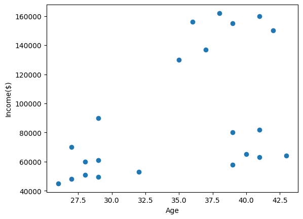
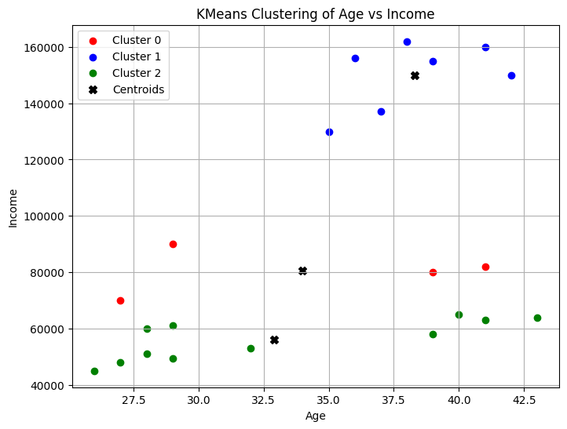
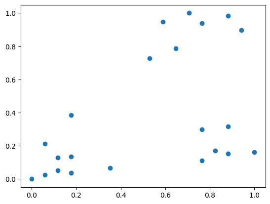
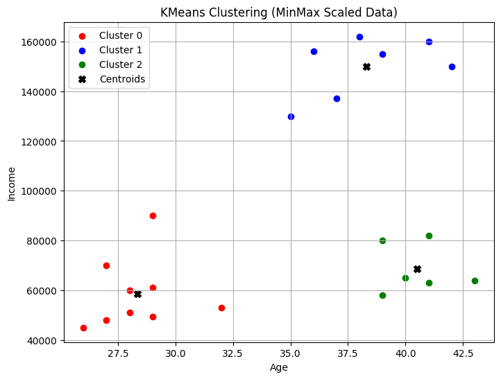

### Kümeleme


```python
import pandas as pd
from matplotlib import pyplot as plt
import numpy as np
```

Veri dosyasını indirmek için [tıklayınız](./images/03c_income.csv).

```python
df = pd.read_csv("03c_income.csv")
df.head()
```


<div>
<style scoped>
    .dataframe tbody tr th:only-of-type {
        vertical-align: middle;
    }

    .dataframe tbody tr th {
        vertical-align: top;
    }

    .dataframe thead th {
        text-align: right;
    }
</style>
<table border="1" class="dataframe">
  <thead>
    <tr style="text-align: right;">
      <th></th>
      <th>Name</th>
      <th>Age</th>
      <th>Income($)</th>
    </tr>
  </thead>
  <tbody>
    <tr>
      <th>0</th>
      <td>Rob</td>
      <td>27</td>
      <td>70000</td>
    </tr>
    <tr>
      <th>1</th>
      <td>Michael</td>
      <td>29</td>
      <td>90000</td>
    </tr>
    <tr>
      <th>2</th>
      <td>Mohan</td>
      <td>29</td>
      <td>61000</td>
    </tr>
    <tr>
      <th>3</th>
      <td>Ismail</td>
      <td>28</td>
      <td>60000</td>
    </tr>
    <tr>
      <th>4</th>
      <td>Kory</td>
      <td>42</td>
      <td>150000</td>
    </tr>
  </tbody>
</table>
</div>


```python
data=df.to_numpy()
```


```python
age=data[:,1].astype(np.int64)
income=data[:,2].astype(np.int64)
```


```python
data=data[:,1:].astype(np.int64)
```


```python
plt.scatter(age,income)
plt.xlabel('Age')
plt.ylabel('Income($)')
plt.show()
```


    

    


```python
from sklearn.cluster import KMeans
```


```python
km = KMeans(n_clusters=3)
y_predicted = km.fit_predict(data)
y_predicted
```

    C:\anaconda3\envs\lsp\lib\site-packages\sklearn\cluster\_kmeans.py:1416: FutureWarning: The default value of `n_init` will change from 10 to 'auto' in 1.4. Set the value of `n_init` explicitly to suppress the warning
      super()._check_params_vs_input(X, default_n_init=10)
    C:\anaconda3\envs\lsp\lib\site-packages\sklearn\cluster\_kmeans.py:1440: UserWarning: KMeans is known to have a memory leak on Windows with MKL, when there are less chunks than available threads. You can avoid it by setting the environment variable OMP_NUM_THREADS=1.
      warnings.warn(
    


    array([0, 0, 2, 2, 1, 1, 1, 1, 1, 1, 1, 2, 2, 2, 2, 2, 2, 2, 2, 0, 0, 2])


```python
age
```


    array([27, 29, 29, 28, 42, 39, 41, 38, 36, 35, 37, 26, 27, 28, 29, 32, 40,
           41, 43, 39, 41, 39], dtype=int64)


```python
income
```


    array([ 70000,  90000,  61000,  60000, 150000, 155000, 160000, 162000,
           156000, 130000, 137000,  45000,  48000,  51000,  49500,  53000,
            65000,  63000,  64000,  80000,  82000,  58000], dtype=int64)


```python
centers=km.cluster_centers_
centers
```


    array([[3.40000000e+01, 8.05000000e+04],
           [3.82857143e+01, 1.50000000e+05],
           [3.29090909e+01, 5.61363636e+04]])


```python
labels = km.labels_
```


```python
labels
```


    array([0, 0, 2, 2, 1, 1, 1, 1, 1, 1, 1, 2, 2, 2, 2, 2, 2, 2, 2, 0, 0, 2])


```python
plt.figure(figsize=(8, 6))
colors = ['red', 'blue', 'green']
for i in range(3):
    plt.scatter(data[labels == i, 0], data[labels == i, 1], c=colors[i], label=f'Cluster {i}')

# Küme Merkezlerini Çizdirme
plt.scatter(centers[:, 0], centers[:, 1], c='black', marker='X', s=50, label='Centroids')

plt.xlabel('Age')
plt.ylabel('Income')
plt.title('KMeans Clustering of Age vs Income')
plt.legend()
plt.grid()
plt.show()

```


    

    


### Normalizasyon, verilerin ölçeklendirilmesi


```python
from sklearn.preprocessing import MinMaxScaler
```


```python
data.shape
```


    (22, 2)


```python
scaler = MinMaxScaler()
# Veriyi ölçekle
data_scaled = scaler.fit_transform(data)
# scaler.inverse_transform(data_scaled)
```


```python
plt.scatter(data_scaled[:,0],data_scaled[:,1])
plt.show()
```


    

    


```python
kmeans = KMeans(n_clusters=3)
kmeans.fit(data_scaled)
```


```python
labels = kmeans.labels_
```


```python
centers = scaler.inverse_transform(kmeans.cluster_centers_)
```


```python
plt.figure(figsize=(8, 6))
colors = ['red', 'blue', 'green']
for i in range(3):
    plt.scatter(data[labels == i, 0], data[labels == i, 1], c=colors[i], label=f'Cluster {i}')
    
    
plt.scatter(centers[:, 0], centers[:, 1], c='black', marker='X', s=50, label='Centroids')

plt.xlabel('Age')
plt.ylabel('Income')
plt.title('KMeans Clustering (MinMax Scaled Data)')
plt.legend()
plt.grid()
plt.show()
```


    

    


###Kaynak:
    
- https://www.youtube.com/watch?v=gmvvaobm7eQ&list=PLeo1K3hjS3uvCeTYTeyfe0-rN5r8zn9rw	
- https://github.com/codebasics/py/tree/master/ML

