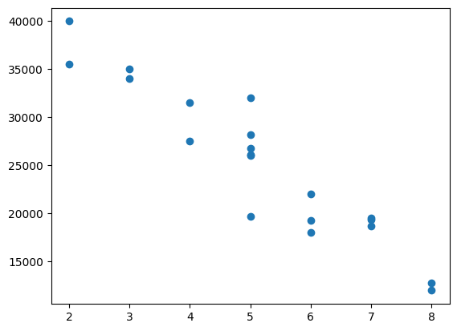

### Train Test Split


```python
import pandas as pd
import matplotlib.pyplot as plt
```

Veri dosyasını indirmek için [tıklayınız](./images/03a_carprices.csv).


```python
df = pd.read_csv("03a_carprices.csv")
df.head()
```


<div>
<style scoped>
    .dataframe tbody tr th:only-of-type {
        vertical-align: middle;
    }

    .dataframe tbody tr th {
        vertical-align: top;
    }

    .dataframe thead th {
        text-align: right;
    }
</style>
<table border="1" class="dataframe">
  <thead>
    <tr style="text-align: right;">
      <th></th>
      <th>Mileage</th>
      <th>Age(yrs)</th>
      <th>Sell Price($)</th>
    </tr>
  </thead>
  <tbody>
    <tr>
      <th>0</th>
      <td>69000</td>
      <td>6</td>
      <td>18000</td>
    </tr>
    <tr>
      <th>1</th>
      <td>35000</td>
      <td>3</td>
      <td>34000</td>
    </tr>
    <tr>
      <th>2</th>
      <td>57000</td>
      <td>5</td>
      <td>26100</td>
    </tr>
    <tr>
      <th>3</th>
      <td>22500</td>
      <td>2</td>
      <td>40000</td>
    </tr>
    <tr>
      <th>4</th>
      <td>46000</td>
      <td>4</td>
      <td>31500</td>
    </tr>
  </tbody>
</table>
</div>


```python
data=df.to_numpy()
```


```python
data[:3]
```


    array([[69000,     6, 18000],
           [35000,     3, 34000],
           [57000,     5, 26100]], dtype=int64)


```python
milage=data[:,0]
age=data[:,1]
price=data[:,2]
```


```python
plt.scatter(milage,price)
plt.show()
```


    

    


```python
plt.scatter(age,price)
plt.show()
```


    

    


```python
X = data[:,0:2]
y = data[:,2]
```


```python
from sklearn.model_selection import train_test_split
X_train, X_test, y_train, y_test = train_test_split(X,y,test_size=0.3) 
```


```python
X_train.shape, y_train.shape
```


    ((14, 2), (14,))


```python
X_test.shape, y_test.shape
```


    ((6, 2), (6,))


### Linear regression


```python
from sklearn.linear_model import LinearRegression
reg = LinearRegression()
reg.fit(X_train, y_train)
```


```python
X_test
```


    array([[82450,     7],
           [25400,     3],
           [69000,     5],
           [87600,     8],
           [46000,     4],
           [91000,     8]], dtype=int64)


```python
reg.predict(X_test)
```


    array([17224.19150145, 38357.0955021 , 21908.68515977, 15496.47763339,
           30601.10592035, 14169.86679672])


```python
y_test
```


    array([19400, 35000, 19700, 12800, 31500, 12000], dtype=int64)


```python
# R2 score
reg.score(X_test, y_test)
```


    0.9260837288108493


$R^2$ metriği 1'e ne kadar yakınsa model o kadar iyi sonuç vermiş demektir.

$$R^2 = 1 - \frac{\sum_{i=1}^{n} (y_i - \hat{y}_i)^2}{\sum_{i=1}^{n} (y_i - \bar{y})^2}$$

$y_i$: gerçek değerler   
$\hat{y}_i$: tahminler  
$\bar{y}$: gerçek değerlerin ortalaması


```python
from sklearn.metrics import r2_score, mean_absolute_error, mean_squared_error, mean_absolute_percentage_error
```
asenturk.github.io sitesinde formüller doğru gösterilmiyor.    
Formüllerin doğru gösterildiği sayfa için [tıklayınız](https://github.com/asenturk/asenturk.github.io/blob/main/eem272/dersler/04.md).   
$$
\mathrm{MAE} =
\frac{1}{n}
\sum_{i=1}^{n}
\left| y_i - \hat{y}_i \right|
$$
   
$$ 
\mathrm{MSE} =
\frac{1}{n}
\sum_{i=1}^{n}
\left( y_i - \hat{y}_i \right)^2
$$


$$
\mathrm{MAPE} =
\frac{1}{n}
\sum_{i=1}^{n}
\left|
\frac{y_i - \hat{y}_i}{y_i}
\right|
$$


```python
# Tahminler
y_train_pred = reg.predict(X_train)
y_test_pred = reg.predict(X_test)

# --- TRAIN PERFORMANSI ---
print("TRAIN PERFORMANSI")
print("R2:", r2_score(y_train, y_train_pred))
print("MAE:", mean_absolute_error(y_train, y_train_pred))
print("MSE:", mean_squared_error(y_train, y_train_pred))
print("MAPE:", mean_absolute_percentage_error(y_train, y_train_pred))


print("\n----------------------\n")

# --- TEST PERFORMANSI ---
print("TEST PERFORMANSI")
print("R2:", r2_score(y_test, y_test_pred))
print("MAE:", mean_absolute_error(y_test, y_test_pred))
print("MSE:", mean_squared_error(y_test, y_test_pred))
print("MAPE:", mean_absolute_percentage_error(y_test, y_test_pred))
```

    TRAIN PERFORMANSI
    R2: 0.9358120111765775
    MAE: 1436.3758569034203
    MSE: 3060470.2075112266
    MAPE: 0.0669296461160506
    
    ----------------------
    
    TEST PERFORMANSI
    R2: 0.9341950255861509
    MAE: 2071.1044298593897
    MSE: 5462347.541766587
    MAPE: 0.09107989849074923
    


**random_state argümanı ile her defasında aynı bölme işlemi sağlanabilir.**


```python
X_train, X_test, y_train, y_test = train_test_split(X,y,test_size=0.3,random_state=10)
X_test
```


```python
X_train, X_test, y_train, y_test = train_test_split(X,y,test_size=0.3,random_state=10)
X_test
```


    array([[72000,     6],
           [83000,     7],
           [59000,     5],
           [52000,     5],
           [22500,     2],
           [87600,     8]], dtype=int64)


```python
reg = LinearRegression()
reg.fit(X_train, y_train)

# Tahminler
y_train_pred = reg.predict(X_train)
y_test_pred = reg.predict(X_test)
```


```python
# --- TRAIN PERFORMANSI ---
print("TRAIN PERFORMANSI")
print("R2:", r2_score(y_train, y_train_pred))
print("MAE:", mean_absolute_error(y_train, y_train_pred))
print("MSE:", mean_squared_error(y_train, y_train_pred))
print("MAPE:", mean_absolute_percentage_error(y_train, y_train_pred))

print("\n----------------------\n")

# --- TEST PERFORMANSI ---
print("TEST PERFORMANSI")
print("R2:", r2_score(y_test, y_test_pred))
print("MAE:", mean_absolute_error(y_test, y_test_pred))
print("MSE:", mean_squared_error(y_test, y_test_pred))
print("MAPE:", mean_absolute_percentage_error(y_test, y_test_pred))
```

    TRAIN PERFORMANSI
    R2: 0.9384897023666824
    MAE: 1443.9521363065562
    MSE: 2932798.438034618
    MAPE: 0.06829052176926063
    
    ----------------------
    
    TEST PERFORMANSI
    R2: 0.9212422483776329
    MAE: 2285.4999884929643
    MSE: 6537533.291388397
    MAPE: 0.0978060876864723
    


# Ölçeklendirme


```python
from sklearn.preprocessing import StandardScaler, MinMaxScaler
```

*StandardScaler*

asenturk.github.io sitesinde formüller doğru gösterilmiyor.    
Formüllerin doğru gösterildiği sayfa için [tıklayınız](https://github.com/asenturk/asenturk.github.io/blob/main/eem272/dersler/04.md).   

$$x' = \frac{x - \mu}{\sigma}$$

μ: verinin ortalaması   
σ: verinin standart sapması   
Anlamı: Bu değer ortalamadan kaç standart sapma uzaklıkta?


*MinMaxScaler*
$$x' = \frac{x - x_{\min}}{x_{\max} - x_{\min}}$$

Veri 0-1 arasına yerlerşir.


```python
# Train-test split
X_train, X_test, y_train, y_test = train_test_split(
    X, y, test_size=0.3, random_state=10
)
```


```python
# --------- ÖLÇEKLENDİRME (SADECE TRAIN'E FIT) ---------
scaler = StandardScaler()

X_train_scaled = scaler.fit_transform(X_train)   # fit + transform
X_test_scaled = scaler.transform(X_test)         # SADECE transform
```


```python
# --------- MODEL ---------
reg = LinearRegression()
reg.fit(X_train_scaled, y_train)
```


```python
# --------- TAHMİNLER ---------
y_train_pred = reg.predict(X_train_scaled)
y_test_pred = reg.predict(X_test_scaled)
```


```python
# --------- TRAIN PERFORMANSI ---------
print("TRAIN PERFORMANSI")
print("R2:", r2_score(y_train, y_train_pred))
print("MAE:", mean_absolute_error(y_train, y_train_pred))
print("MSE:", mean_squared_error(y_train, y_train_pred))
print("MAPE:", mean_absolute_percentage_error(y_train, y_train_pred))

print("\n----------------------\n")

# --------- TEST PERFORMANSI ---------
print("TEST PERFORMANSI")
print("R2:", r2_score(y_test, y_test_pred))
print("MAE:", mean_absolute_error(y_test, y_test_pred))
print("MSE:", mean_squared_error(y_test, y_test_pred))
print("MAPE:", mean_absolute_percentage_error(y_test, y_test_pred))
```

    TRAIN PERFORMANSI
    R2: 0.9384897023666824
    MAE: 1443.9521363065564
    MSE: 2932798.4380346197
    MAPE: 0.06829052176926066
    
    ----------------------
    
    TEST PERFORMANSI
    R2: 0.921242248377633
    MAE: 2285.499988492963
    MSE: 6537533.291388389
    MAPE: 0.09780608768647225
    


### Kaynak:
    
- https://www.youtube.com/watch?v=gmvvaobm7eQ&list=PLeo1K3hjS3uvCeTYTeyfe0-rN5r8zn9rw	
- https://github.com/codebasics/py/tree/master/ML           


