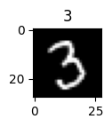
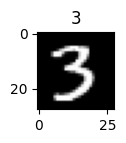

```python
import tensorflow as tf
from tensorflow import keras
import numpy as np
import matplotlib.pyplot as plt
```


```python
dir(keras.datasets)
```


    ['__builtins__',
     '__cached__',
     '__doc__',
     '__file__',
     '__loader__',
     '__name__',
     '__package__',
     '__path__',
     '__spec__',
     'boston_housing',
     'california_housing',
     'cifar10',
     'cifar100',
     'fashion_mnist',
     'imdb',
     'mnist',
     'reuters']


```python
from keras.datasets import mnist
```


```python
(x_train, y_train), (x_test, y_test) = mnist.load_data()
x_train.shape, y_train.shape, x_test.shape, y_test.shape
```


    ((60000, 28, 28), (60000,), (10000, 28, 28), (10000,))


```python
digit_no = 30000
plt.figure(figsize=(1,1))
plt.imshow(x_train[digit_no], cmap="gray")
plt.title(y_train[digit_no])
plt.show()
```


    

    


```python
# normalize: 0,255 -> 0,1
x_train, x_test = x_train / 255.0, x_test / 255.0
```


```python
from tensorflow.keras.utils import to_categorical
```


```python
train_labels = to_categorical(y_train)
test_labels = to_categorical(y_test)
```


```python
train_labels.shape
```


    (60000, 10)


```python
y_train[0]
```


    5


```python
train_labels[0]
```


    array([0., 0., 0., 0., 0., 1., 0., 0., 0., 0.], dtype=float32)


x_train=x_train.reshape((-1,28,28))
x_test=x_test.reshape((-1,28,28))

```python
# model
model = keras.models.Sequential([
    keras.layers.Flatten(input_shape=(28,28,1)),
    keras.layers.Dense(128, activation='relu'),
    keras.layers.Dense(10, activation= 'softmax'),
])
model.summary()
```

    Model: "sequential_5"
    _________________________________________________________________
     Layer (type)                Output Shape              Param #   
    =================================================================
     flatten_5 (Flatten)         (None, 784)               0         
                                                                     
     dense_10 (Dense)            (None, 128)               100480    
                                                                     
     dense_11 (Dense)            (None, 10)                1290      
                                                                     
    =================================================================
    Total params: 101,770
    Trainable params: 101,770
    Non-trainable params: 0
    _________________________________________________________________
    


```python
model.compile(optimizer = 'adam',
             loss = 'categorical_crossentropy',
             metrics = ['accuracy'])
```


```python
history=model.fit(x_train, train_labels, validation_data=(x_test, test_labels), epochs=5, batch_size = 1024)
```

    Epoch 1/5
    59/59 [==============================] - 1s 9ms/step - loss: 0.8051 - accuracy: 0.7909 - val_loss: 0.3538 - val_accuracy: 0.9026
    Epoch 2/5
    59/59 [==============================] - 0s 5ms/step - loss: 0.3166 - accuracy: 0.9119 - val_loss: 0.2725 - val_accuracy: 0.9233
    Epoch 3/5
    59/59 [==============================] - 0s 5ms/step - loss: 0.2551 - accuracy: 0.9287 - val_loss: 0.2278 - val_accuracy: 0.9357
    Epoch 4/5
    59/59 [==============================] - 0s 5ms/step - loss: 0.2159 - accuracy: 0.9398 - val_loss: 0.2019 - val_accuracy: 0.9409
    Epoch 5/5
    59/59 [==============================] - 0s 6ms/step - loss: 0.1867 - accuracy: 0.9480 - val_loss: 0.1761 - val_accuracy: 0.9489
    


```python
model.evaluate(x_test, test_labels)
```

    313/313 [==============================] - 1s 4ms/step - loss: 0.1761 - accuracy: 0.9489
    


    [0.17605803906917572, 0.9488999843597412]


```python
digit_no = 10000
plt.figure(figsize=(1,1))
plt.imshow(x_train[digit_no], cmap="gray")
plt.title(y_train[digit_no])
plt.show()
```


    

    


```python
x_train[digit_no].shape
```


    (28, 28)


```python
predictions=model.predict(x_train[digit_no].reshape(-1,28,28))
predictions
```

    1/1 [==============================] - 0s 25ms/step
    


    array([[8.6974643e-07, 2.3044556e-07, 1.4908462e-06, 9.9979752e-01,
            5.0020077e-07, 1.0159187e-04, 5.4114313e-09, 6.0411563e-05,
            9.3489880e-06, 2.7979790e-05]], dtype=float32)


```python
predictions.sum()
```


    0.9999999


```python
label_prediction = np.argmax(predictions)
label_prediction

```


    3


```python
predictions=model.predict(x_train[digit_no:digit_no+5].reshape(-1,28,28))
predictions
```

    1/1 [==============================] - 0s 25ms/step
    


    array([[8.69449764e-07, 2.30259332e-07, 1.48977779e-06, 9.99797761e-01,
            5.00648980e-07, 1.01517027e-04, 5.40599565e-09, 6.04217166e-05,
            9.36473134e-06, 2.79820888e-05],
           [5.89868905e-05, 3.73386499e-03, 5.78068604e-04, 2.68029445e-03,
            3.54710983e-06, 7.93180297e-05, 7.16538416e-05, 9.05721481e-06,
            9.92584348e-01, 2.00937851e-04],
           [9.87021243e-10, 6.97708025e-09, 1.05508334e-04, 5.96734462e-04,
            5.28718935e-09, 9.09166076e-08, 1.16057216e-11, 9.99281704e-01,
            4.03025479e-06, 1.19101687e-05],
           [2.78679872e-05, 9.01423264e-05, 2.23633310e-06, 2.02506359e-04,
            2.04386637e-01, 5.77627961e-03, 3.20659819e-05, 9.82213859e-03,
            8.61406661e-05, 7.79573977e-01],
           [3.94474664e-05, 5.47840773e-06, 1.39120535e-03, 5.03121968e-03,
            7.80644501e-03, 1.19754886e-02, 6.83387552e-05, 4.79648598e-02,
            1.25806406e-03, 9.24459457e-01]], dtype=float32)


```python
label_prediction = np.argmax(predictions,axis=1)
label_prediction
```


    array([3, 8, 7, 9, 9], dtype=int64)


```python
y_train[10000:10005]
```


    array([3, 8, 7, 9, 9], dtype=uint8)


