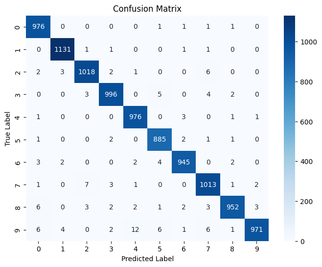

```python
import tensorflow as tf
from tensorflow import keras
import numpy as np
import matplotlib.pyplot as plt
```


```python
from keras.datasets import mnist
```


```python
(x_train, y_train), (x_test, y_test) = mnist.load_data()
x_train.shape, y_train.shape, x_test.shape, y_test.shape
```


    ((60000, 28, 28), (60000,), (10000, 28, 28), (10000,))


```python
# normalize: 0,255 -> 0,1
x_train, x_test = x_train / 255.0, x_test / 255.0
```


```python
from tensorflow.keras.utils import to_categorical
```


```python
train_labels = to_categorical(y_train)
test_labels = to_categorical(y_test)
```


```python
# model
model = keras.models.Sequential([
    keras.layers.Conv2D(32,(3,3), activation='relu', input_shape = (28,28,1)),
    keras.layers.MaxPooling2D((2,2)),
    keras.layers.Flatten(),
    keras.layers.Dense(128, activation='relu'),
    keras.layers.Dense(10, activation= 'softmax'),
])
model.summary()
```

    Model: "sequential_1"
    _________________________________________________________________
     Layer (type)                Output Shape              Param #   
    =================================================================
     conv2d_1 (Conv2D)           (None, 26, 26, 32)        320       
                                                                     
     max_pooling2d_1 (MaxPooling  (None, 13, 13, 32)       0         
     2D)                                                             
                                                                     
     flatten_1 (Flatten)         (None, 5408)              0         
                                                                     
     dense_2 (Dense)             (None, 128)               692352    
                                                                     
     dense_3 (Dense)             (None, 10)                1290      
                                                                     
    =================================================================
    Total params: 693,962
    Trainable params: 693,962
    Non-trainable params: 0
    _________________________________________________________________
    


```python
model.compile(optimizer = 'adam',
             loss = 'categorical_crossentropy',
             metrics = ['accuracy'])
```


```python
history=model.fit(x_train, train_labels, validation_data=(x_test, test_labels), epochs=5, batch_size = 1024)
```

    Epoch 1/5
    59/59 [==============================] - 10s 22ms/step - loss: 0.5679 - accuracy: 0.8526 - val_loss: 0.2400 - val_accuracy: 0.9303
    Epoch 2/5
    59/59 [==============================] - 1s 14ms/step - loss: 0.1992 - accuracy: 0.9428 - val_loss: 0.1505 - val_accuracy: 0.9559
    Epoch 3/5
    59/59 [==============================] - 1s 13ms/step - loss: 0.1309 - accuracy: 0.9627 - val_loss: 0.1073 - val_accuracy: 0.9685
    Epoch 4/5
    59/59 [==============================] - 1s 13ms/step - loss: 0.0933 - accuracy: 0.9737 - val_loss: 0.0783 - val_accuracy: 0.9765
    Epoch 5/5
    59/59 [==============================] - 1s 13ms/step - loss: 0.0718 - accuracy: 0.9804 - val_loss: 0.0674 - val_accuracy: 0.9786
    


```python
# model
model = keras.models.Sequential([
    keras.layers.Conv2D(64,(3,3), activation='relu', input_shape = (28,28,1)),
    keras.layers.MaxPooling2D((2,2)),
    keras.layers.Conv2D(64,(3,3), activation='relu'),
    keras.layers.MaxPooling2D((2,2)),
    keras.layers.Flatten(),
    keras.layers.Dense(128, activation='relu'),
    keras.layers.Dense(10, activation= 'softmax'),
])
model.summary()
```

    Model: "sequential_3"
    _________________________________________________________________
     Layer (type)                Output Shape              Param #   
    =================================================================
     conv2d_4 (Conv2D)           (None, 26, 26, 64)        640       
                                                                     
     max_pooling2d_4 (MaxPooling  (None, 13, 13, 64)       0         
     2D)                                                             
                                                                     
     conv2d_5 (Conv2D)           (None, 11, 11, 64)        36928     
                                                                     
     max_pooling2d_5 (MaxPooling  (None, 5, 5, 64)         0         
     2D)                                                             
                                                                     
     flatten_3 (Flatten)         (None, 1600)              0         
                                                                     
     dense_6 (Dense)             (None, 128)               204928    
                                                                     
     dense_7 (Dense)             (None, 10)                1290      
                                                                     
    =================================================================
    Total params: 243,786
    Trainable params: 243,786
    Non-trainable params: 0
    _________________________________________________________________
    


```python
model.compile(optimizer = 'adam',
             loss = 'categorical_crossentropy',
             metrics = ['accuracy'])
```


```python
history=model.fit(x_train, train_labels, validation_data=(x_test, test_labels), epochs=5, batch_size = 1024)
```

    Epoch 1/5
    59/59 [==============================] - 2s 27ms/step - loss: 0.6149 - accuracy: 0.8377 - val_loss: 0.1607 - val_accuracy: 0.9534
    Epoch 2/5
    59/59 [==============================] - 1s 24ms/step - loss: 0.1209 - accuracy: 0.9636 - val_loss: 0.0785 - val_accuracy: 0.9764
    Epoch 3/5
    59/59 [==============================] - 1s 23ms/step - loss: 0.0790 - accuracy: 0.9763 - val_loss: 0.0605 - val_accuracy: 0.9823
    Epoch 4/5
    59/59 [==============================] - 1s 23ms/step - loss: 0.0636 - accuracy: 0.9809 - val_loss: 0.0449 - val_accuracy: 0.9863
    Epoch 5/5
    59/59 [==============================] - 1s 23ms/step - loss: 0.0520 - accuracy: 0.9846 - val_loss: 0.0413 - val_accuracy: 0.9863
    


```python
import seaborn as sns
from sklearn.metrics import confusion_matrix

# Get model predictions
y_pred = model.predict(x_test)
y_pred_classes = np.argmax(y_pred, axis=1)  # Convert one-hot encoding to labels
```

    313/313 [==============================] - 1s 2ms/step
    


```python
# Compute confusion matrix
cm = confusion_matrix(y_test, y_pred_classes)

# Plot the confusion matrix
plt.figure(figsize=(8, 6))
sns.heatmap(cm, annot=True, fmt='d', cmap='Blues', xticklabels=range(10), yticklabels=range(10))
plt.xlabel("Predicted Label")
plt.ylabel("True Label")
plt.title("Confusion Matrix")
plt.show()
```


    

    


```python
from sklearn.metrics import classification_report

print(classification_report(y_true, y_pred_classes))

```

                  precision    recall  f1-score   support
    
               0       0.98      1.00      0.99       980
               1       0.99      1.00      0.99      1135
               2       0.99      0.99      0.99      1032
               3       0.99      0.99      0.99      1010
               4       0.98      0.99      0.99       982
               5       0.98      0.99      0.99       892
               6       0.99      0.99      0.99       958
               7       0.98      0.99      0.98      1028
               8       0.99      0.98      0.98       974
               9       0.99      0.96      0.98      1009
    
        accuracy                           0.99     10000
       macro avg       0.99      0.99      0.99     10000
    weighted avg       0.99      0.99      0.99     10000
    
    
