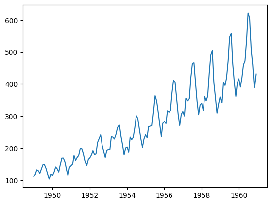

Ders sunumu için [tıklayınız](images/06_slayt.pptx).


Veri setini indirmek için [tıklayınız](images/06_AirPassengers.csv).


```python
import numpy as np
import matplotlib.pyplot as plt
import pandas as pd
from sklearn.preprocessing import MinMaxScaler
import tensorflow as tf
from tensorflow import keras
```


```python
# Veri Yükleme
df = pd.read_csv('06_AirPassengers.csv')

# Sütun isimlerini kontrol et
print(df.columns)
```

    Index(['Month', '#Passengers'], dtype='object')
    


```python
df['Month'] = pd.to_datetime(df['Month'])
df.set_index('Month', inplace=True) 
plt.plot(df['#Passengers'])
plt.show()
```


    

    


```python
# Veriyi numpy array'e çevirme
dataset=df["#Passengers"].to_numpy()
dataset
```


    array([112, 118, 132, 129, 121, 135, 148, 148, 136, 119, 104, 118, 115,
           126, 141, 135, 125, 149, 170, 170, 158, 133, 114, 140, 145, 150,
           178, 163, 172, 178, 199, 199, 184, 162, 146, 166, 171, 180, 193,
           181, 183, 218, 230, 242, 209, 191, 172, 194, 196, 196, 236, 235,
           229, 243, 264, 272, 237, 211, 180, 201, 204, 188, 235, 227, 234,
           264, 302, 293, 259, 229, 203, 229, 242, 233, 267, 269, 270, 315,
           364, 347, 312, 274, 237, 278, 284, 277, 317, 313, 318, 374, 413,
           405, 355, 306, 271, 306, 315, 301, 356, 348, 355, 422, 465, 467,
           404, 347, 305, 336, 340, 318, 362, 348, 363, 435, 491, 505, 404,
           359, 310, 337, 360, 342, 406, 396, 420, 472, 548, 559, 463, 407,
           362, 405, 417, 391, 419, 461, 472, 535, 622, 606, 508, 461, 390,
           432], dtype=int64)


```python
# Eğitim ve test setlerine ayırma
train_size = int(len(dataset) * 0.75)
test_size = len(dataset) - train_size
train = dataset[0:train_size].reshape((-1, 1))
test = dataset[train_size:].reshape((-1, 1))
```


```python

```


```python
# Veriyi ölçeklendirme
scaler = MinMaxScaler()
train_scaled = scaler.fit_transform(train)
```


```python
test_scaled = scaler.transform(test)
```


```python

```


```python

```


```python
# Zaman serisi veri üretme fonksiyonu
def time_series_sequences(data: np.ndarray, window_size: int):
    X, y = [], []
    for i in range(len(data) - window_size):
        X.append(data[i:i + window_size].flatten())  # Tek boyutlu hale getir
        y.append(data[i + window_size].flatten())  # Çıkış değeri
    return np.array(X), np.array(y)
```


```python
# Pencere boyutu
window_size = 10
X_train, y_train = time_series_sequences(train_scaled, window_size)
X_test, y_test = time_series_sequences(test_scaled, window_size)


```


```python
X_train.shape, y_train.shape, X_test.shape, y_test.shape
```


    ((98, 10), (98, 1), (26, 10), (26, 1))


```python
X_train[:3], y_train[:3]
```


    (array([[0.02203857, 0.03856749, 0.07713499, 0.06887052, 0.04683196,
             0.08539945, 0.12121212, 0.12121212, 0.08815427, 0.04132231],
            [0.03856749, 0.07713499, 0.06887052, 0.04683196, 0.08539945,
             0.12121212, 0.12121212, 0.08815427, 0.04132231, 0.        ],
            [0.07713499, 0.06887052, 0.04683196, 0.08539945, 0.12121212,
             0.12121212, 0.08815427, 0.04132231, 0.        , 0.03856749]]),
     array([[0.        ],
            [0.03856749],
            [0.03030303]]))


# Model 1


```python
# Model oluşturma
model = keras.models.Sequential([
    keras.layers.Input(shape=(window_size,)),
    keras.layers.Dense(32, activation='relu'),
    keras.layers.Dense(1)  # Çıkışta lineer aktivasyon
])

model.summary()
```


<pre style="white-space:pre;overflow-x:auto;line-height:normal;font-family:Menlo,'DejaVu Sans Mono',consolas,'Courier New',monospace"><span style="font-weight: bold">Model: "sequential_28"</span>
</pre>


<pre style="white-space:pre;overflow-x:auto;line-height:normal;font-family:Menlo,'DejaVu Sans Mono',consolas,'Courier New',monospace">┏━━━━━━━━━━━━━━━━━━━━━━━━━━━━━━━━━━━━━━┳━━━━━━━━━━━━━━━━━━━━━━━━━━━━━┳━━━━━━━━━━━━━━━━━┓
┃<span style="font-weight: bold"> Layer (type)                         </span>┃<span style="font-weight: bold"> Output Shape                </span>┃<span style="font-weight: bold">         Param # </span>┃
┡━━━━━━━━━━━━━━━━━━━━━━━━━━━━━━━━━━━━━━╇━━━━━━━━━━━━━━━━━━━━━━━━━━━━━╇━━━━━━━━━━━━━━━━━┩
│ dense_56 (<span style="color: #0087ff; text-decoration-color: #0087ff">Dense</span>)                     │ (<span style="color: #00d7ff; text-decoration-color: #00d7ff">None</span>, <span style="color: #00af00; text-decoration-color: #00af00">32</span>)                  │             <span style="color: #00af00; text-decoration-color: #00af00">352</span> │
├──────────────────────────────────────┼─────────────────────────────┼─────────────────┤
│ dense_57 (<span style="color: #0087ff; text-decoration-color: #0087ff">Dense</span>)                     │ (<span style="color: #00d7ff; text-decoration-color: #00d7ff">None</span>, <span style="color: #00af00; text-decoration-color: #00af00">1</span>)                   │              <span style="color: #00af00; text-decoration-color: #00af00">33</span> │
└──────────────────────────────────────┴─────────────────────────────┴─────────────────┘
</pre>


<pre style="white-space:pre;overflow-x:auto;line-height:normal;font-family:Menlo,'DejaVu Sans Mono',consolas,'Courier New',monospace"><span style="font-weight: bold"> Total params: </span><span style="color: #00af00; text-decoration-color: #00af00">385</span> (1.50 KB)
</pre>


<pre style="white-space:pre;overflow-x:auto;line-height:normal;font-family:Menlo,'DejaVu Sans Mono',consolas,'Courier New',monospace"><span style="font-weight: bold"> Trainable params: </span><span style="color: #00af00; text-decoration-color: #00af00">385</span> (1.50 KB)
</pre>


<pre style="white-space:pre;overflow-x:auto;line-height:normal;font-family:Menlo,'DejaVu Sans Mono',consolas,'Courier New',monospace"><span style="font-weight: bold"> Non-trainable params: </span><span style="color: #00af00; text-decoration-color: #00af00">0</span> (0.00 B)
</pre>


```python
model.compile(optimizer = 'adam',
             loss = 'mse',
             metrics = ['accuracy'])
```


```python
# Modeli eğitme
history = model.fit(X_train, y_train, validation_data=(X_test, y_test), epochs=100)
```

    Epoch 1/100
    4/4 ━━━━━━━━━━━━━━━━━━━━ 1s 60ms/step - accuracy: 0.0062 - loss: 0.4614 - val_accuracy: 0.0000e+00 - val_loss: 1.8424
    Epoch 2/100
    4/4 ━━━━━━━━━━━━━━━━━━━━ 0s 13ms/step - accuracy: 0.0093 - loss: 0.3823 - val_accuracy: 0.0000e+00 - val_loss: 1.5468
    Epoch 3/100
    4/4 ━━━━━━━━━━━━━━━━━━━━ 0s 13ms/step - accuracy: 0.0093 - loss: 0.3065 - val_accuracy: 0.0000e+00 - val_loss: 1.2941
    Epoch 4/100
    4/4 ━━━━━━━━━━━━━━━━━━━━ 0s 13ms/step - accuracy: 0.0062 - loss: 0.2648 - val_accuracy: 0.0000e+00 - val_loss: 1.0852
    Epoch 5/100
    4/4 ━━━━━━━━━━━━━━━━━━━━ 0s 13ms/step - accuracy: 0.0093 - loss: 0.2096 - val_accuracy: 0.0000e+00 - val_loss: 0.9075
    Epoch 6/100
    4/4 ━━━━━━━━━━━━━━━━━━━━ 0s 15ms/step - accuracy: 0.0062 - loss: 0.1911 - val_accuracy: 0.0000e+00 - val_loss: 0.7508
    Epoch 7/100
    4/4 ━━━━━━━━━━━━━━━━━━━━ 0s 13ms/step - accuracy: 0.0062 - loss: 0.1357 - val_accuracy: 0.0000e+00 - val_loss: 0.6140
    Epoch 8/100
    4/4 ━━━━━━━━━━━━━━━━━━━━ 0s 12ms/step - accuracy: 0.0093 - loss: 0.1100 - val_accuracy: 0.0000e+00 - val_loss: 0.4911
    Epoch 9/100
    4/4 ━━━━━━━━━━━━━━━━━━━━ 0s 13ms/step - accuracy: 0.0062 - loss: 0.0790 - val_accuracy: 0.0000e+00 - val_loss: 0.3849
    Epoch 10/100
    4/4 ━━━━━━━━━━━━━━━━━━━━ 0s 13ms/step - accuracy: 0.0155 - loss: 0.0710 - val_accuracy: 0.0000e+00 - val_loss: 0.3000
    Epoch 11/100
    4/4 ━━━━━━━━━━━━━━━━━━━━ 0s 13ms/step - accuracy: 0.0155 - loss: 0.0493 - val_accuracy: 0.0000e+00 - val_loss: 0.2295
    Epoch 12/100
    4/4 ━━━━━━━━━━━━━━━━━━━━ 0s 13ms/step - accuracy: 0.0062 - loss: 0.0389 - val_accuracy: 0.0000e+00 - val_loss: 0.1707
    Epoch 13/100
    4/4 ━━━━━━━━━━━━━━━━━━━━ 0s 12ms/step - accuracy: 0.0062 - loss: 0.0260 - val_accuracy: 0.0000e+00 - val_loss: 0.1297
    Epoch 14/100
    4/4 ━━━━━━━━━━━━━━━━━━━━ 0s 13ms/step - accuracy: 0.0217 - loss: 0.0234 - val_accuracy: 0.0000e+00 - val_loss: 0.1036
    Epoch 15/100
    4/4 ━━━━━━━━━━━━━━━━━━━━ 0s 14ms/step - accuracy: 0.0311 - loss: 0.0213 - val_accuracy: 0.0000e+00 - val_loss: 0.0888
    Epoch 16/100
    4/4 ━━━━━━━━━━━━━━━━━━━━ 0s 13ms/step - accuracy: 0.0311 - loss: 0.0227 - val_accuracy: 0.0000e+00 - val_loss: 0.0797
    Epoch 17/100
    4/4 ━━━━━━━━━━━━━━━━━━━━ 0s 12ms/step - accuracy: 0.0186 - loss: 0.0216 - val_accuracy: 0.0000e+00 - val_loss: 0.0755
    Epoch 18/100
    4/4 ━━━━━━━━━━━━━━━━━━━━ 0s 13ms/step - accuracy: 0.0155 - loss: 0.0198 - val_accuracy: 0.0000e+00 - val_loss: 0.0736
    Epoch 19/100
    4/4 ━━━━━━━━━━━━━━━━━━━━ 0s 13ms/step - accuracy: 0.0186 - loss: 0.0206 - val_accuracy: 0.0000e+00 - val_loss: 0.0736
    Epoch 20/100
    4/4 ━━━━━━━━━━━━━━━━━━━━ 0s 13ms/step - accuracy: 0.0155 - loss: 0.0217 - val_accuracy: 0.0000e+00 - val_loss: 0.0755
    Epoch 21/100
    4/4 ━━━━━━━━━━━━━━━━━━━━ 0s 13ms/step - accuracy: 0.0155 - loss: 0.0206 - val_accuracy: 0.0000e+00 - val_loss: 0.0782
    Epoch 22/100
    4/4 ━━━━━━━━━━━━━━━━━━━━ 0s 13ms/step - accuracy: 0.0134 - loss: 0.0182 - val_accuracy: 0.0000e+00 - val_loss: 0.0803
    Epoch 23/100
    4/4 ━━━━━━━━━━━━━━━━━━━━ 0s 12ms/step - accuracy: 0.0248 - loss: 0.0189 - val_accuracy: 0.0000e+00 - val_loss: 0.0768
    Epoch 24/100
    4/4 ━━━━━━━━━━━━━━━━━━━━ 0s 13ms/step - accuracy: 0.0311 - loss: 0.0207 - val_accuracy: 0.0000e+00 - val_loss: 0.0738
    Epoch 25/100
    4/4 ━━━━━━━━━━━━━━━━━━━━ 0s 13ms/step - accuracy: 0.0217 - loss: 0.0201 - val_accuracy: 0.0000e+00 - val_loss: 0.0726
    Epoch 26/100
    4/4 ━━━━━━━━━━━━━━━━━━━━ 0s 13ms/step - accuracy: 0.0217 - loss: 0.0159 - val_accuracy: 0.0000e+00 - val_loss: 0.0725
    Epoch 27/100
    4/4 ━━━━━━━━━━━━━━━━━━━━ 0s 12ms/step - accuracy: 0.0155 - loss: 0.0181 - val_accuracy: 0.0000e+00 - val_loss: 0.0733
    Epoch 28/100
    4/4 ━━━━━━━━━━━━━━━━━━━━ 0s 13ms/step - accuracy: 0.0123 - loss: 0.0171 - val_accuracy: 0.0000e+00 - val_loss: 0.0748
    Epoch 29/100
    4/4 ━━━━━━━━━━━━━━━━━━━━ 0s 12ms/step - accuracy: 0.0123 - loss: 0.0170 - val_accuracy: 0.0000e+00 - val_loss: 0.0774
    Epoch 30/100
    4/4 ━━━━━━━━━━━━━━━━━━━━ 0s 12ms/step - accuracy: 0.0155 - loss: 0.0176 - val_accuracy: 0.0000e+00 - val_loss: 0.0814
    Epoch 31/100
    4/4 ━━━━━━━━━━━━━━━━━━━━ 0s 12ms/step - accuracy: 0.0155 - loss: 0.0179 - val_accuracy: 0.0000e+00 - val_loss: 0.0837
    Epoch 32/100
    4/4 ━━━━━━━━━━━━━━━━━━━━ 0s 13ms/step - accuracy: 0.0248 - loss: 0.0190 - val_accuracy: 0.0000e+00 - val_loss: 0.0835
    Epoch 33/100
    4/4 ━━━━━━━━━━━━━━━━━━━━ 0s 12ms/step - accuracy: 0.0217 - loss: 0.0171 - val_accuracy: 0.0000e+00 - val_loss: 0.0817
    Epoch 34/100
    4/4 ━━━━━━━━━━━━━━━━━━━━ 0s 13ms/step - accuracy: 0.0217 - loss: 0.0162 - val_accuracy: 0.0000e+00 - val_loss: 0.0798
    Epoch 35/100
    4/4 ━━━━━━━━━━━━━━━━━━━━ 0s 12ms/step - accuracy: 0.0217 - loss: 0.0178 - val_accuracy: 0.0000e+00 - val_loss: 0.0773
    Epoch 36/100
    4/4 ━━━━━━━━━━━━━━━━━━━━ 0s 13ms/step - accuracy: 0.0248 - loss: 0.0157 - val_accuracy: 0.0000e+00 - val_loss: 0.0752
    Epoch 37/100
    4/4 ━━━━━━━━━━━━━━━━━━━━ 0s 13ms/step - accuracy: 0.0217 - loss: 0.0156 - val_accuracy: 0.0000e+00 - val_loss: 0.0745
    Epoch 38/100
    4/4 ━━━━━━━━━━━━━━━━━━━━ 0s 13ms/step - accuracy: 0.0155 - loss: 0.0163 - val_accuracy: 0.0000e+00 - val_loss: 0.0730
    Epoch 39/100
    4/4 ━━━━━━━━━━━━━━━━━━━━ 0s 12ms/step - accuracy: 0.0248 - loss: 0.0157 - val_accuracy: 0.0000e+00 - val_loss: 0.0716
    Epoch 40/100
    4/4 ━━━━━━━━━━━━━━━━━━━━ 0s 13ms/step - accuracy: 0.0248 - loss: 0.0151 - val_accuracy: 0.0000e+00 - val_loss: 0.0698
    Epoch 41/100
    4/4 ━━━━━━━━━━━━━━━━━━━━ 0s 13ms/step - accuracy: 0.0248 - loss: 0.0150 - val_accuracy: 0.0000e+00 - val_loss: 0.0667
    Epoch 42/100
    4/4 ━━━━━━━━━━━━━━━━━━━━ 0s 12ms/step - accuracy: 0.0311 - loss: 0.0158 - val_accuracy: 0.0000e+00 - val_loss: 0.0635
    Epoch 43/100
    4/4 ━━━━━━━━━━━━━━━━━━━━ 0s 12ms/step - accuracy: 0.0155 - loss: 0.0148 - val_accuracy: 0.0000e+00 - val_loss: 0.0595
    Epoch 44/100
    4/4 ━━━━━━━━━━━━━━━━━━━━ 0s 13ms/step - accuracy: 0.0248 - loss: 0.0145 - val_accuracy: 0.0000e+00 - val_loss: 0.0564
    Epoch 45/100
    4/4 ━━━━━━━━━━━━━━━━━━━━ 0s 13ms/step - accuracy: 0.0248 - loss: 0.0126 - val_accuracy: 0.0000e+00 - val_loss: 0.0548
    Epoch 46/100
    4/4 ━━━━━━━━━━━━━━━━━━━━ 0s 13ms/step - accuracy: 0.0248 - loss: 0.0150 - val_accuracy: 0.0000e+00 - val_loss: 0.0536
    Epoch 47/100
    4/4 ━━━━━━━━━━━━━━━━━━━━ 0s 12ms/step - accuracy: 0.0248 - loss: 0.0143 - val_accuracy: 0.0000e+00 - val_loss: 0.0529
    Epoch 48/100
    4/4 ━━━━━━━━━━━━━━━━━━━━ 0s 12ms/step - accuracy: 0.0217 - loss: 0.0146 - val_accuracy: 0.0000e+00 - val_loss: 0.0524
    Epoch 49/100
    4/4 ━━━━━━━━━━━━━━━━━━━━ 0s 12ms/step - accuracy: 0.0155 - loss: 0.0137 - val_accuracy: 0.0000e+00 - val_loss: 0.0525
    Epoch 50/100
    4/4 ━━━━━━━━━━━━━━━━━━━━ 0s 12ms/step - accuracy: 0.0134 - loss: 0.0119 - val_accuracy: 0.0000e+00 - val_loss: 0.0530
    Epoch 51/100
    4/4 ━━━━━━━━━━━━━━━━━━━━ 0s 12ms/step - accuracy: 0.0248 - loss: 0.0131 - val_accuracy: 0.0000e+00 - val_loss: 0.0520
    Epoch 52/100
    4/4 ━━━━━━━━━━━━━━━━━━━━ 0s 13ms/step - accuracy: 0.0102 - loss: 0.0117 - val_accuracy: 0.0000e+00 - val_loss: 0.0514
    Epoch 53/100
    4/4 ━━━━━━━━━━━━━━━━━━━━ 0s 11ms/step - accuracy: 0.0155 - loss: 0.0121 - val_accuracy: 0.0000e+00 - val_loss: 0.0504
    Epoch 54/100
    4/4 ━━━━━━━━━━━━━━━━━━━━ 0s 12ms/step - accuracy: 0.0123 - loss: 0.0118 - val_accuracy: 0.0000e+00 - val_loss: 0.0496
    Epoch 55/100
    4/4 ━━━━━━━━━━━━━━━━━━━━ 0s 12ms/step - accuracy: 0.0248 - loss: 0.0138 - val_accuracy: 0.0000e+00 - val_loss: 0.0491
    Epoch 56/100
    4/4 ━━━━━━━━━━━━━━━━━━━━ 0s 12ms/step - accuracy: 0.0155 - loss: 0.0106 - val_accuracy: 0.0000e+00 - val_loss: 0.0498
    Epoch 57/100
    4/4 ━━━━━━━━━━━━━━━━━━━━ 0s 12ms/step - accuracy: 0.0311 - loss: 0.0118 - val_accuracy: 0.0000e+00 - val_loss: 0.0522
    Epoch 58/100
    4/4 ━━━━━━━━━━━━━━━━━━━━ 0s 12ms/step - accuracy: 0.0311 - loss: 0.0129 - val_accuracy: 0.0000e+00 - val_loss: 0.0566
    Epoch 59/100
    4/4 ━━━━━━━━━━━━━━━━━━━━ 0s 13ms/step - accuracy: 0.0155 - loss: 0.0137 - val_accuracy: 0.0000e+00 - val_loss: 0.0577
    Epoch 60/100
    4/4 ━━━━━━━━━━━━━━━━━━━━ 0s 12ms/step - accuracy: 0.0248 - loss: 0.0128 - val_accuracy: 0.0000e+00 - val_loss: 0.0543
    Epoch 61/100
    4/4 ━━━━━━━━━━━━━━━━━━━━ 0s 12ms/step - accuracy: 0.0155 - loss: 0.0118 - val_accuracy: 0.0000e+00 - val_loss: 0.0491
    Epoch 62/100
    4/4 ━━━━━━━━━━━━━━━━━━━━ 0s 12ms/step - accuracy: 0.0248 - loss: 0.0115 - val_accuracy: 0.0000e+00 - val_loss: 0.0455
    Epoch 63/100
    4/4 ━━━━━━━━━━━━━━━━━━━━ 0s 13ms/step - accuracy: 0.0155 - loss: 0.0115 - val_accuracy: 0.0000e+00 - val_loss: 0.0441
    Epoch 64/100
    4/4 ━━━━━━━━━━━━━━━━━━━━ 0s 12ms/step - accuracy: 0.0186 - loss: 0.0109 - val_accuracy: 0.0000e+00 - val_loss: 0.0435
    Epoch 65/100
    4/4 ━━━━━━━━━━━━━━━━━━━━ 0s 12ms/step - accuracy: 0.0217 - loss: 0.0099 - val_accuracy: 0.0000e+00 - val_loss: 0.0430
    Epoch 66/100
    4/4 ━━━━━━━━━━━━━━━━━━━━ 0s 12ms/step - accuracy: 0.0155 - loss: 0.0109 - val_accuracy: 0.0000e+00 - val_loss: 0.0425
    Epoch 67/100
    4/4 ━━━━━━━━━━━━━━━━━━━━ 0s 12ms/step - accuracy: 0.0123 - loss: 0.0107 - val_accuracy: 0.0000e+00 - val_loss: 0.0426
    Epoch 68/100
    4/4 ━━━━━━━━━━━━━━━━━━━━ 0s 12ms/step - accuracy: 0.0217 - loss: 0.0106 - val_accuracy: 0.0000e+00 - val_loss: 0.0421
    Epoch 69/100
    4/4 ━━━━━━━━━━━━━━━━━━━━ 0s 12ms/step - accuracy: 0.0123 - loss: 0.0105 - val_accuracy: 0.0000e+00 - val_loss: 0.0414
    Epoch 70/100
    4/4 ━━━━━━━━━━━━━━━━━━━━ 0s 12ms/step - accuracy: 0.0155 - loss: 0.0109 - val_accuracy: 0.0000e+00 - val_loss: 0.0416
    Epoch 71/100
    4/4 ━━━━━━━━━━━━━━━━━━━━ 0s 12ms/step - accuracy: 0.0248 - loss: 0.0091 - val_accuracy: 0.0000e+00 - val_loss: 0.0427
    Epoch 72/100
    4/4 ━━━━━━━━━━━━━━━━━━━━ 0s 12ms/step - accuracy: 0.0248 - loss: 0.0099 - val_accuracy: 0.0000e+00 - val_loss: 0.0447
    Epoch 73/100
    4/4 ━━━━━━━━━━━━━━━━━━━━ 0s 12ms/step - accuracy: 0.0217 - loss: 0.0090 - val_accuracy: 0.0000e+00 - val_loss: 0.0461
    Epoch 74/100
    4/4 ━━━━━━━━━━━━━━━━━━━━ 0s 12ms/step - accuracy: 0.0217 - loss: 0.0094 - val_accuracy: 0.0000e+00 - val_loss: 0.0453
    Epoch 75/100
    4/4 ━━━━━━━━━━━━━━━━━━━━ 0s 12ms/step - accuracy: 0.0155 - loss: 0.0109 - val_accuracy: 0.0000e+00 - val_loss: 0.0424
    Epoch 76/100
    4/4 ━━━━━━━━━━━━━━━━━━━━ 0s 12ms/step - accuracy: 0.0217 - loss: 0.0110 - val_accuracy: 0.0000e+00 - val_loss: 0.0397
    Epoch 77/100
    4/4 ━━━━━━━━━━━━━━━━━━━━ 0s 12ms/step - accuracy: 0.0248 - loss: 0.0097 - val_accuracy: 0.0000e+00 - val_loss: 0.0384
    Epoch 78/100
    4/4 ━━━━━━━━━━━━━━━━━━━━ 0s 13ms/step - accuracy: 0.0217 - loss: 0.0093 - val_accuracy: 0.0000e+00 - val_loss: 0.0380
    Epoch 79/100
    4/4 ━━━━━━━━━━━━━━━━━━━━ 0s 12ms/step - accuracy: 0.0248 - loss: 0.0092 - val_accuracy: 0.0000e+00 - val_loss: 0.0374
    Epoch 80/100
    4/4 ━━━━━━━━━━━━━━━━━━━━ 0s 13ms/step - accuracy: 0.0217 - loss: 0.0094 - val_accuracy: 0.0000e+00 - val_loss: 0.0382
    Epoch 81/100
    4/4 ━━━━━━━━━━━━━━━━━━━━ 0s 12ms/step - accuracy: 0.0248 - loss: 0.0087 - val_accuracy: 0.0000e+00 - val_loss: 0.0391
    Epoch 82/100
    4/4 ━━━━━━━━━━━━━━━━━━━━ 0s 12ms/step - accuracy: 0.0248 - loss: 0.0090 - val_accuracy: 0.0000e+00 - val_loss: 0.0387
    Epoch 83/100
    4/4 ━━━━━━━━━━━━━━━━━━━━ 0s 12ms/step - accuracy: 0.0186 - loss: 0.0089 - val_accuracy: 0.0000e+00 - val_loss: 0.0375
    Epoch 84/100
    4/4 ━━━━━━━━━━━━━━━━━━━━ 0s 13ms/step - accuracy: 0.0217 - loss: 0.0109 - val_accuracy: 0.0000e+00 - val_loss: 0.0359
    Epoch 85/100
    4/4 ━━━━━━━━━━━━━━━━━━━━ 0s 13ms/step - accuracy: 0.0186 - loss: 0.0087 - val_accuracy: 0.0000e+00 - val_loss: 0.0352
    Epoch 86/100
    4/4 ━━━━━━━━━━━━━━━━━━━━ 0s 13ms/step - accuracy: 0.0217 - loss: 0.0084 - val_accuracy: 0.0000e+00 - val_loss: 0.0348
    Epoch 87/100
    4/4 ━━━━━━━━━━━━━━━━━━━━ 0s 13ms/step - accuracy: 0.0217 - loss: 0.0078 - val_accuracy: 0.0000e+00 - val_loss: 0.0349
    Epoch 88/100
    4/4 ━━━━━━━━━━━━━━━━━━━━ 0s 13ms/step - accuracy: 0.0311 - loss: 0.0091 - val_accuracy: 0.0000e+00 - val_loss: 0.0356
    Epoch 89/100
    4/4 ━━━━━━━━━━━━━━━━━━━━ 0s 12ms/step - accuracy: 0.0217 - loss: 0.0088 - val_accuracy: 0.0000e+00 - val_loss: 0.0359
    Epoch 90/100
    4/4 ━━━━━━━━━━━━━━━━━━━━ 0s 13ms/step - accuracy: 0.0155 - loss: 0.0088 - val_accuracy: 0.0000e+00 - val_loss: 0.0357
    Epoch 91/100
    4/4 ━━━━━━━━━━━━━━━━━━━━ 0s 13ms/step - accuracy: 0.0311 - loss: 0.0086 - val_accuracy: 0.0000e+00 - val_loss: 0.0347
    Epoch 92/100
    4/4 ━━━━━━━━━━━━━━━━━━━━ 0s 12ms/step - accuracy: 0.0248 - loss: 0.0081 - val_accuracy: 0.0000e+00 - val_loss: 0.0331
    Epoch 93/100
    4/4 ━━━━━━━━━━━━━━━━━━━━ 0s 13ms/step - accuracy: 0.0248 - loss: 0.0087 - val_accuracy: 0.0000e+00 - val_loss: 0.0324
    Epoch 94/100
    4/4 ━━━━━━━━━━━━━━━━━━━━ 0s 12ms/step - accuracy: 0.0155 - loss: 0.0086 - val_accuracy: 0.0000e+00 - val_loss: 0.0321
    Epoch 95/100
    4/4 ━━━━━━━━━━━━━━━━━━━━ 0s 13ms/step - accuracy: 0.0311 - loss: 0.0076 - val_accuracy: 0.0000e+00 - val_loss: 0.0319
    Epoch 96/100
    4/4 ━━━━━━━━━━━━━━━━━━━━ 0s 13ms/step - accuracy: 0.0186 - loss: 0.0083 - val_accuracy: 0.0000e+00 - val_loss: 0.0317
    Epoch 97/100
    4/4 ━━━━━━━━━━━━━━━━━━━━ 0s 13ms/step - accuracy: 0.0311 - loss: 0.0086 - val_accuracy: 0.0000e+00 - val_loss: 0.0314
    Epoch 98/100
    4/4 ━━━━━━━━━━━━━━━━━━━━ 0s 13ms/step - accuracy: 0.0123 - loss: 0.0081 - val_accuracy: 0.0000e+00 - val_loss: 0.0310
    Epoch 99/100
    4/4 ━━━━━━━━━━━━━━━━━━━━ 0s 13ms/step - accuracy: 0.0123 - loss: 0.0072 - val_accuracy: 0.0000e+00 - val_loss: 0.0309
    Epoch 100/100
    4/4 ━━━━━━━━━━━━━━━━━━━━ 0s 13ms/step - accuracy: 0.0155 - loss: 0.0079 - val_accuracy: 0.0000e+00 - val_loss: 0.0309
    


```python
# Tahmin yapma
trainPredict = model.predict(X_train)
testPredict = model.predict(X_test)
```

    4/4 ━━━━━━━━━━━━━━━━━━━━ 0s 10ms/step
    1/1 ━━━━━━━━━━━━━━━━━━━━ 0s 25ms/step
    


```python
# Ters ölçeklendirme
trainPredict_unscaled = scaler.inverse_transform(trainPredict.reshape((-1, 1)))
testPredict_unscaled = scaler.inverse_transform(testPredict.reshape((-1, 1)))
```


```python
# Grafik için boş arrayler oluşturma
trainPredictPlot = np.empty_like(dataset, dtype=float)
trainPredictPlot[:] = np.nan
trainPredictPlot[window_size:len(trainPredict) + window_size] = trainPredict_unscaled.flatten()
```


```python

```


```python
testPredict_unscaled.shape
```


    (26, 1)


```python
testPredictPlot = np.empty_like(dataset, dtype=float)
testPredictPlot[:] = np.nan
testPredictPlot[len(trainPredict) + (window_size * 2):] = testPredict_unscaled.flatten()
```


```python
# Gerçek veri ve tahminleri çizdirme
plt.plot(dataset, label="Gerçek Veri")
plt.plot(trainPredictPlot, label="Eğitim Tahminleri")
plt.plot(testPredictPlot, label="Test Tahminleri")
plt.legend()
plt.show()
```


    

    


# Model 2


```python
# Model oluşturma
model = keras.models.Sequential([
    keras.layers.Input(shape=(window_size,)),
    keras.layers.Dense(64, activation='relu'),
    keras.layers.Dense(1)  # Çıkışta lineer aktivasyon
])

model.summary()
```


<pre style="white-space:pre;overflow-x:auto;line-height:normal;font-family:Menlo,'DejaVu Sans Mono',consolas,'Courier New',monospace"><span style="font-weight: bold">Model: "sequential_30"</span>
</pre>


<pre style="white-space:pre;overflow-x:auto;line-height:normal;font-family:Menlo,'DejaVu Sans Mono',consolas,'Courier New',monospace">┏━━━━━━━━━━━━━━━━━━━━━━━━━━━━━━━━━━━━━━┳━━━━━━━━━━━━━━━━━━━━━━━━━━━━━┳━━━━━━━━━━━━━━━━━┓
┃<span style="font-weight: bold"> Layer (type)                         </span>┃<span style="font-weight: bold"> Output Shape                </span>┃<span style="font-weight: bold">         Param # </span>┃
┡━━━━━━━━━━━━━━━━━━━━━━━━━━━━━━━━━━━━━━╇━━━━━━━━━━━━━━━━━━━━━━━━━━━━━╇━━━━━━━━━━━━━━━━━┩
│ dense_60 (<span style="color: #0087ff; text-decoration-color: #0087ff">Dense</span>)                     │ (<span style="color: #00d7ff; text-decoration-color: #00d7ff">None</span>, <span style="color: #00af00; text-decoration-color: #00af00">64</span>)                  │             <span style="color: #00af00; text-decoration-color: #00af00">704</span> │
├──────────────────────────────────────┼─────────────────────────────┼─────────────────┤
│ dense_61 (<span style="color: #0087ff; text-decoration-color: #0087ff">Dense</span>)                     │ (<span style="color: #00d7ff; text-decoration-color: #00d7ff">None</span>, <span style="color: #00af00; text-decoration-color: #00af00">1</span>)                   │              <span style="color: #00af00; text-decoration-color: #00af00">65</span> │
└──────────────────────────────────────┴─────────────────────────────┴─────────────────┘
</pre>


<pre style="white-space:pre;overflow-x:auto;line-height:normal;font-family:Menlo,'DejaVu Sans Mono',consolas,'Courier New',monospace"><span style="font-weight: bold"> Total params: </span><span style="color: #00af00; text-decoration-color: #00af00">769</span> (3.00 KB)
</pre>


<pre style="white-space:pre;overflow-x:auto;line-height:normal;font-family:Menlo,'DejaVu Sans Mono',consolas,'Courier New',monospace"><span style="font-weight: bold"> Trainable params: </span><span style="color: #00af00; text-decoration-color: #00af00">769</span> (3.00 KB)
</pre>


<pre style="white-space:pre;overflow-x:auto;line-height:normal;font-family:Menlo,'DejaVu Sans Mono',consolas,'Courier New',monospace"><span style="font-weight: bold"> Non-trainable params: </span><span style="color: #00af00; text-decoration-color: #00af00">0</span> (0.00 B)
</pre>


```python
model.compile(optimizer = 'adam',
             loss = 'mse',
             metrics = ['accuracy'])
```


```python
# Modeli eğitme
history = model.fit(X_train, y_train, validation_data=(X_test, y_test), epochs=100)
```

    Epoch 1/100
    4/4 ━━━━━━━━━━━━━━━━━━━━ 1s 60ms/step - accuracy: 0.0155 - loss: 0.4215 - val_accuracy: 0.0000e+00 - val_loss: 1.5323
    Epoch 2/100
    4/4 ━━━━━━━━━━━━━━━━━━━━ 0s 13ms/step - accuracy: 0.0093 - loss: 0.3008 - val_accuracy: 0.0000e+00 - val_loss: 0.9910
    Epoch 3/100
    4/4 ━━━━━━━━━━━━━━━━━━━━ 0s 12ms/step - accuracy: 0.0093 - loss: 0.1800 - val_accuracy: 0.0000e+00 - val_loss: 0.6011
    Epoch 4/100
    4/4 ━━━━━━━━━━━━━━━━━━━━ 0s 13ms/step - accuracy: 0.0093 - loss: 0.1085 - val_accuracy: 0.0000e+00 - val_loss: 0.3284
    Epoch 5/100
    4/4 ━━━━━━━━━━━━━━━━━━━━ 0s 13ms/step - accuracy: 0.0155 - loss: 0.0437 - val_accuracy: 0.0000e+00 - val_loss: 0.1666
    Epoch 6/100
    4/4 ━━━━━━━━━━━━━━━━━━━━ 0s 12ms/step - accuracy: 0.0155 - loss: 0.0294 - val_accuracy: 0.0000e+00 - val_loss: 0.0790
    Epoch 7/100
    4/4 ━━━━━━━━━━━━━━━━━━━━ 0s 12ms/step - accuracy: 0.0217 - loss: 0.0138 - val_accuracy: 0.0000e+00 - val_loss: 0.0516
    Epoch 8/100
    4/4 ━━━━━━━━━━━━━━━━━━━━ 0s 12ms/step - accuracy: 0.0155 - loss: 0.0167 - val_accuracy: 0.0000e+00 - val_loss: 0.0507
    Epoch 9/100
    4/4 ━━━━━━━━━━━━━━━━━━━━ 0s 12ms/step - accuracy: 0.0186 - loss: 0.0190 - val_accuracy: 0.0000e+00 - val_loss: 0.0547
    Epoch 10/100
    4/4 ━━━━━━━━━━━━━━━━━━━━ 0s 12ms/step - accuracy: 0.0155 - loss: 0.0201 - val_accuracy: 0.0000e+00 - val_loss: 0.0535
    Epoch 11/100
    4/4 ━━━━━━━━━━━━━━━━━━━━ 0s 13ms/step - accuracy: 0.0311 - loss: 0.0194 - val_accuracy: 0.0000e+00 - val_loss: 0.0474
    Epoch 12/100
    4/4 ━━━━━━━━━━━━━━━━━━━━ 0s 12ms/step - accuracy: 0.0155 - loss: 0.0150 - val_accuracy: 0.0000e+00 - val_loss: 0.0448
    Epoch 13/100
    4/4 ━━━━━━━━━━━━━━━━━━━━ 0s 13ms/step - accuracy: 0.0155 - loss: 0.0130 - val_accuracy: 0.0000e+00 - val_loss: 0.0462
    Epoch 14/100
    4/4 ━━━━━━━━━━━━━━━━━━━━ 0s 14ms/step - accuracy: 0.0311 - loss: 0.0131 - val_accuracy: 0.0000e+00 - val_loss: 0.0491
    Epoch 15/100
    4/4 ━━━━━━━━━━━━━━━━━━━━ 0s 12ms/step - accuracy: 0.0155 - loss: 0.0110 - val_accuracy: 0.0000e+00 - val_loss: 0.0528
    Epoch 16/100
    4/4 ━━━━━━━━━━━━━━━━━━━━ 0s 12ms/step - accuracy: 0.0217 - loss: 0.0114 - val_accuracy: 0.0000e+00 - val_loss: 0.0548
    Epoch 17/100
    4/4 ━━━━━━━━━━━━━━━━━━━━ 0s 12ms/step - accuracy: 0.0186 - loss: 0.0116 - val_accuracy: 0.0000e+00 - val_loss: 0.0535
    Epoch 18/100
    4/4 ━━━━━━━━━━━━━━━━━━━━ 0s 13ms/step - accuracy: 0.0311 - loss: 0.0115 - val_accuracy: 0.0000e+00 - val_loss: 0.0483
    Epoch 19/100
    4/4 ━━━━━━━━━━━━━━━━━━━━ 0s 15ms/step - accuracy: 0.0155 - loss: 0.0087 - val_accuracy: 0.0000e+00 - val_loss: 0.0392
    Epoch 20/100
    4/4 ━━━━━━━━━━━━━━━━━━━━ 0s 13ms/step - accuracy: 0.0248 - loss: 0.0091 - val_accuracy: 0.0000e+00 - val_loss: 0.0335
    Epoch 21/100
    4/4 ━━━━━━━━━━━━━━━━━━━━ 0s 13ms/step - accuracy: 0.0123 - loss: 0.0100 - val_accuracy: 0.0000e+00 - val_loss: 0.0322
    Epoch 22/100
    4/4 ━━━━━━━━━━━━━━━━━━━━ 0s 13ms/step - accuracy: 0.0217 - loss: 0.0094 - val_accuracy: 0.0000e+00 - val_loss: 0.0315
    Epoch 23/100
    4/4 ━━━━━━━━━━━━━━━━━━━━ 0s 13ms/step - accuracy: 0.0155 - loss: 0.0106 - val_accuracy: 0.0000e+00 - val_loss: 0.0307
    Epoch 24/100
    4/4 ━━━━━━━━━━━━━━━━━━━━ 0s 12ms/step - accuracy: 0.0123 - loss: 0.0093 - val_accuracy: 0.0000e+00 - val_loss: 0.0302
    Epoch 25/100
    4/4 ━━━━━━━━━━━━━━━━━━━━ 0s 13ms/step - accuracy: 0.0217 - loss: 0.0084 - val_accuracy: 0.0000e+00 - val_loss: 0.0304
    Epoch 26/100
    4/4 ━━━━━━━━━━━━━━━━━━━━ 0s 13ms/step - accuracy: 0.0155 - loss: 0.0084 - val_accuracy: 0.0000e+00 - val_loss: 0.0319
    Epoch 27/100
    4/4 ━━━━━━━━━━━━━━━━━━━━ 0s 12ms/step - accuracy: 0.0155 - loss: 0.0084 - val_accuracy: 0.0000e+00 - val_loss: 0.0345
    Epoch 28/100
    4/4 ━━━━━━━━━━━━━━━━━━━━ 0s 12ms/step - accuracy: 0.0134 - loss: 0.0071 - val_accuracy: 0.0000e+00 - val_loss: 0.0340
    Epoch 29/100
    4/4 ━━━━━━━━━━━━━━━━━━━━ 0s 12ms/step - accuracy: 0.0248 - loss: 0.0081 - val_accuracy: 0.0000e+00 - val_loss: 0.0283
    Epoch 30/100
    4/4 ━━━━━━━━━━━━━━━━━━━━ 0s 13ms/step - accuracy: 0.0248 - loss: 0.0072 - val_accuracy: 0.0000e+00 - val_loss: 0.0262
    Epoch 31/100
    4/4 ━━━━━━━━━━━━━━━━━━━━ 0s 13ms/step - accuracy: 0.0217 - loss: 0.0074 - val_accuracy: 0.0000e+00 - val_loss: 0.0256
    Epoch 32/100
    4/4 ━━━━━━━━━━━━━━━━━━━━ 0s 13ms/step - accuracy: 0.0217 - loss: 0.0071 - val_accuracy: 0.0000e+00 - val_loss: 0.0253
    Epoch 33/100
    4/4 ━━━━━━━━━━━━━━━━━━━━ 0s 12ms/step - accuracy: 0.0248 - loss: 0.0066 - val_accuracy: 0.0000e+00 - val_loss: 0.0269
    Epoch 34/100
    4/4 ━━━━━━━━━━━━━━━━━━━━ 0s 12ms/step - accuracy: 0.0155 - loss: 0.0070 - val_accuracy: 0.0000e+00 - val_loss: 0.0281
    Epoch 35/100
    4/4 ━━━━━━━━━━━━━━━━━━━━ 0s 12ms/step - accuracy: 0.0217 - loss: 0.0075 - val_accuracy: 0.0000e+00 - val_loss: 0.0277
    Epoch 36/100
    4/4 ━━━━━━━━━━━━━━━━━━━━ 0s 12ms/step - accuracy: 0.0186 - loss: 0.0061 - val_accuracy: 0.0000e+00 - val_loss: 0.0259
    Epoch 37/100
    4/4 ━━━━━━━━━━━━━━━━━━━━ 0s 12ms/step - accuracy: 0.0155 - loss: 0.0059 - val_accuracy: 0.0000e+00 - val_loss: 0.0228
    Epoch 38/100
    4/4 ━━━━━━━━━━━━━━━━━━━━ 0s 13ms/step - accuracy: 0.0217 - loss: 0.0066 - val_accuracy: 0.0000e+00 - val_loss: 0.0216
    Epoch 39/100
    4/4 ━━━━━━━━━━━━━━━━━━━━ 0s 13ms/step - accuracy: 0.0217 - loss: 0.0063 - val_accuracy: 0.0000e+00 - val_loss: 0.0211
    Epoch 40/100
    4/4 ━━━━━━━━━━━━━━━━━━━━ 0s 12ms/step - accuracy: 0.0248 - loss: 0.0064 - val_accuracy: 0.0000e+00 - val_loss: 0.0207
    Epoch 41/100
    4/4 ━━━━━━━━━━━━━━━━━━━━ 0s 13ms/step - accuracy: 0.0311 - loss: 0.0059 - val_accuracy: 0.0000e+00 - val_loss: 0.0208
    Epoch 42/100
    4/4 ━━━━━━━━━━━━━━━━━━━━ 0s 13ms/step - accuracy: 0.0311 - loss: 0.0059 - val_accuracy: 0.0000e+00 - val_loss: 0.0204
    Epoch 43/100
    4/4 ━━━━━━━━━━━━━━━━━━━━ 0s 13ms/step - accuracy: 0.0311 - loss: 0.0053 - val_accuracy: 0.0000e+00 - val_loss: 0.0200
    Epoch 44/100
    4/4 ━━━━━━━━━━━━━━━━━━━━ 0s 13ms/step - accuracy: 0.0248 - loss: 0.0061 - val_accuracy: 0.0000e+00 - val_loss: 0.0207
    Epoch 45/100
    4/4 ━━━━━━━━━━━━━━━━━━━━ 0s 13ms/step - accuracy: 0.0217 - loss: 0.0056 - val_accuracy: 0.0000e+00 - val_loss: 0.0227
    Epoch 46/100
    4/4 ━━━━━━━━━━━━━━━━━━━━ 0s 13ms/step - accuracy: 0.0248 - loss: 0.0059 - val_accuracy: 0.0000e+00 - val_loss: 0.0230
    Epoch 47/100
    4/4 ━━━━━━━━━━━━━━━━━━━━ 0s 13ms/step - accuracy: 0.0248 - loss: 0.0057 - val_accuracy: 0.0000e+00 - val_loss: 0.0226
    Epoch 48/100
    4/4 ━━━━━━━━━━━━━━━━━━━━ 0s 12ms/step - accuracy: 0.0248 - loss: 0.0055 - val_accuracy: 0.0000e+00 - val_loss: 0.0191
    Epoch 49/100
    4/4 ━━━━━━━━━━━━━━━━━━━━ 0s 12ms/step - accuracy: 0.0248 - loss: 0.0050 - val_accuracy: 0.0000e+00 - val_loss: 0.0177
    Epoch 50/100
    4/4 ━━━━━━━━━━━━━━━━━━━━ 0s 13ms/step - accuracy: 0.0123 - loss: 0.0054 - val_accuracy: 0.0000e+00 - val_loss: 0.0177
    Epoch 51/100
    4/4 ━━━━━━━━━━━━━━━━━━━━ 0s 14ms/step - accuracy: 0.0248 - loss: 0.0048 - val_accuracy: 0.0000e+00 - val_loss: 0.0171
    Epoch 52/100
    4/4 ━━━━━━━━━━━━━━━━━━━━ 0s 13ms/step - accuracy: 0.0186 - loss: 0.0046 - val_accuracy: 0.0000e+00 - val_loss: 0.0171
    Epoch 53/100
    4/4 ━━━━━━━━━━━━━━━━━━━━ 0s 13ms/step - accuracy: 0.0248 - loss: 0.0052 - val_accuracy: 0.0000e+00 - val_loss: 0.0172
    Epoch 54/100
    4/4 ━━━━━━━━━━━━━━━━━━━━ 0s 12ms/step - accuracy: 0.0311 - loss: 0.0046 - val_accuracy: 0.0000e+00 - val_loss: 0.0168
    Epoch 55/100
    4/4 ━━━━━━━━━━━━━━━━━━━━ 0s 12ms/step - accuracy: 0.0155 - loss: 0.0051 - val_accuracy: 0.0000e+00 - val_loss: 0.0160
    Epoch 56/100
    4/4 ━━━━━━━━━━━━━━━━━━━━ 0s 12ms/step - accuracy: 0.0311 - loss: 0.0046 - val_accuracy: 0.0000e+00 - val_loss: 0.0160
    Epoch 57/100
    4/4 ━━━━━━━━━━━━━━━━━━━━ 0s 12ms/step - accuracy: 0.0123 - loss: 0.0045 - val_accuracy: 0.0000e+00 - val_loss: 0.0158
    Epoch 58/100
    4/4 ━━━━━━━━━━━━━━━━━━━━ 0s 13ms/step - accuracy: 0.0217 - loss: 0.0045 - val_accuracy: 0.0000e+00 - val_loss: 0.0154
    Epoch 59/100
    4/4 ━━━━━━━━━━━━━━━━━━━━ 0s 13ms/step - accuracy: 0.0123 - loss: 0.0039 - val_accuracy: 0.0000e+00 - val_loss: 0.0153
    Epoch 60/100
    4/4 ━━━━━━━━━━━━━━━━━━━━ 0s 12ms/step - accuracy: 0.0217 - loss: 0.0043 - val_accuracy: 0.0000e+00 - val_loss: 0.0151
    Epoch 61/100
    4/4 ━━━━━━━━━━━━━━━━━━━━ 0s 12ms/step - accuracy: 0.0186 - loss: 0.0045 - val_accuracy: 0.0000e+00 - val_loss: 0.0154
    Epoch 62/100
    4/4 ━━━━━━━━━━━━━━━━━━━━ 0s 12ms/step - accuracy: 0.0217 - loss: 0.0041 - val_accuracy: 0.0000e+00 - val_loss: 0.0154
    Epoch 63/100
    4/4 ━━━━━━━━━━━━━━━━━━━━ 0s 12ms/step - accuracy: 0.0248 - loss: 0.0043 - val_accuracy: 0.0000e+00 - val_loss: 0.0157
    Epoch 64/100
    4/4 ━━━━━━━━━━━━━━━━━━━━ 0s 12ms/step - accuracy: 0.0217 - loss: 0.0044 - val_accuracy: 0.0000e+00 - val_loss: 0.0145
    Epoch 65/100
    4/4 ━━━━━━━━━━━━━━━━━━━━ 0s 12ms/step - accuracy: 0.0217 - loss: 0.0041 - val_accuracy: 0.0000e+00 - val_loss: 0.0140
    Epoch 66/100
    4/4 ━━━━━━━━━━━━━━━━━━━━ 0s 12ms/step - accuracy: 0.0155 - loss: 0.0040 - val_accuracy: 0.0000e+00 - val_loss: 0.0145
    Epoch 67/100
    4/4 ━━━━━━━━━━━━━━━━━━━━ 0s 13ms/step - accuracy: 0.0311 - loss: 0.0042 - val_accuracy: 0.0000e+00 - val_loss: 0.0153
    Epoch 68/100
    4/4 ━━━━━━━━━━━━━━━━━━━━ 0s 13ms/step - accuracy: 0.0155 - loss: 0.0043 - val_accuracy: 0.0000e+00 - val_loss: 0.0145
    Epoch 69/100
    4/4 ━━━━━━━━━━━━━━━━━━━━ 0s 12ms/step - accuracy: 0.0311 - loss: 0.0046 - val_accuracy: 0.0000e+00 - val_loss: 0.0135
    Epoch 70/100
    4/4 ━━━━━━━━━━━━━━━━━━━━ 0s 13ms/step - accuracy: 0.0186 - loss: 0.0036 - val_accuracy: 0.0000e+00 - val_loss: 0.0135
    Epoch 71/100
    4/4 ━━━━━━━━━━━━━━━━━━━━ 0s 12ms/step - accuracy: 0.0155 - loss: 0.0038 - val_accuracy: 0.0000e+00 - val_loss: 0.0135
    Epoch 72/100
    4/4 ━━━━━━━━━━━━━━━━━━━━ 0s 13ms/step - accuracy: 0.0248 - loss: 0.0035 - val_accuracy: 0.0000e+00 - val_loss: 0.0130
    Epoch 73/100
    4/4 ━━━━━━━━━━━━━━━━━━━━ 0s 13ms/step - accuracy: 0.0196 - loss: 0.0037 - val_accuracy: 0.0000e+00 - val_loss: 0.0129
    Epoch 74/100
    4/4 ━━━━━━━━━━━━━━━━━━━━ 0s 12ms/step - accuracy: 0.0155 - loss: 0.0038 - val_accuracy: 0.0000e+00 - val_loss: 0.0130
    Epoch 75/100
    4/4 ━━━━━━━━━━━━━━━━━━━━ 0s 13ms/step - accuracy: 0.0155 - loss: 0.0038 - val_accuracy: 0.0000e+00 - val_loss: 0.0130
    Epoch 76/100
    4/4 ━━━━━━━━━━━━━━━━━━━━ 0s 13ms/step - accuracy: 0.0248 - loss: 0.0039 - val_accuracy: 0.0000e+00 - val_loss: 0.0125
    Epoch 77/100
    4/4 ━━━━━━━━━━━━━━━━━━━━ 0s 13ms/step - accuracy: 0.0196 - loss: 0.0037 - val_accuracy: 0.0000e+00 - val_loss: 0.0128
    Epoch 78/100
    4/4 ━━━━━━━━━━━━━━━━━━━━ 0s 13ms/step - accuracy: 0.0123 - loss: 0.0039 - val_accuracy: 0.0000e+00 - val_loss: 0.0127
    Epoch 79/100
    4/4 ━━━━━━━━━━━━━━━━━━━━ 0s 13ms/step - accuracy: 0.0311 - loss: 0.0041 - val_accuracy: 0.0000e+00 - val_loss: 0.0123
    Epoch 80/100
    4/4 ━━━━━━━━━━━━━━━━━━━━ 0s 13ms/step - accuracy: 0.0155 - loss: 0.0036 - val_accuracy: 0.0000e+00 - val_loss: 0.0125
    Epoch 81/100
    4/4 ━━━━━━━━━━━━━━━━━━━━ 0s 12ms/step - accuracy: 0.0248 - loss: 0.0038 - val_accuracy: 0.0000e+00 - val_loss: 0.0126
    Epoch 82/100
    4/4 ━━━━━━━━━━━━━━━━━━━━ 0s 13ms/step - accuracy: 0.0217 - loss: 0.0038 - val_accuracy: 0.0000e+00 - val_loss: 0.0124
    Epoch 83/100
    4/4 ━━━━━━━━━━━━━━━━━━━━ 0s 12ms/step - accuracy: 0.0155 - loss: 0.0035 - val_accuracy: 0.0000e+00 - val_loss: 0.0121
    Epoch 84/100
    4/4 ━━━━━━━━━━━━━━━━━━━━ 0s 13ms/step - accuracy: 0.0248 - loss: 0.0032 - val_accuracy: 0.0000e+00 - val_loss: 0.0120
    Epoch 85/100
    4/4 ━━━━━━━━━━━━━━━━━━━━ 0s 12ms/step - accuracy: 0.0155 - loss: 0.0034 - val_accuracy: 0.0000e+00 - val_loss: 0.0124
    Epoch 86/100
    4/4 ━━━━━━━━━━━━━━━━━━━━ 0s 13ms/step - accuracy: 0.0196 - loss: 0.0034 - val_accuracy: 0.0000e+00 - val_loss: 0.0118
    Epoch 87/100
    4/4 ━━━━━━━━━━━━━━━━━━━━ 0s 12ms/step - accuracy: 0.0155 - loss: 0.0035 - val_accuracy: 0.0000e+00 - val_loss: 0.0135
    Epoch 88/100
    4/4 ━━━━━━━━━━━━━━━━━━━━ 0s 13ms/step - accuracy: 0.0311 - loss: 0.0040 - val_accuracy: 0.0000e+00 - val_loss: 0.0140
    Epoch 89/100
    4/4 ━━━━━━━━━━━━━━━━━━━━ 0s 13ms/step - accuracy: 0.0217 - loss: 0.0039 - val_accuracy: 0.0000e+00 - val_loss: 0.0129
    Epoch 90/100
    4/4 ━━━━━━━━━━━━━━━━━━━━ 0s 13ms/step - accuracy: 0.0123 - loss: 0.0037 - val_accuracy: 0.0000e+00 - val_loss: 0.0113
    Epoch 91/100
    4/4 ━━━━━━━━━━━━━━━━━━━━ 0s 13ms/step - accuracy: 0.0217 - loss: 0.0032 - val_accuracy: 0.0000e+00 - val_loss: 0.0118
    Epoch 92/100
    4/4 ━━━━━━━━━━━━━━━━━━━━ 0s 12ms/step - accuracy: 0.0217 - loss: 0.0030 - val_accuracy: 0.0000e+00 - val_loss: 0.0112
    Epoch 93/100
    4/4 ━━━━━━━━━━━━━━━━━━━━ 0s 12ms/step - accuracy: 0.0248 - loss: 0.0034 - val_accuracy: 0.0000e+00 - val_loss: 0.0115
    Epoch 94/100
    4/4 ━━━━━━━━━━━━━━━━━━━━ 0s 13ms/step - accuracy: 0.0217 - loss: 0.0033 - val_accuracy: 0.0000e+00 - val_loss: 0.0109
    Epoch 95/100
    4/4 ━━━━━━━━━━━━━━━━━━━━ 0s 12ms/step - accuracy: 0.0248 - loss: 0.0033 - val_accuracy: 0.0000e+00 - val_loss: 0.0107
    Epoch 96/100
    4/4 ━━━━━━━━━━━━━━━━━━━━ 0s 12ms/step - accuracy: 0.0123 - loss: 0.0029 - val_accuracy: 0.0000e+00 - val_loss: 0.0108
    Epoch 97/100
    4/4 ━━━━━━━━━━━━━━━━━━━━ 0s 13ms/step - accuracy: 0.0155 - loss: 0.0030 - val_accuracy: 0.0000e+00 - val_loss: 0.0108
    Epoch 98/100
    4/4 ━━━━━━━━━━━━━━━━━━━━ 0s 12ms/step - accuracy: 0.0186 - loss: 0.0030 - val_accuracy: 0.0000e+00 - val_loss: 0.0109
    Epoch 99/100
    4/4 ━━━━━━━━━━━━━━━━━━━━ 0s 12ms/step - accuracy: 0.0217 - loss: 0.0030 - val_accuracy: 0.0000e+00 - val_loss: 0.0104
    Epoch 100/100
    4/4 ━━━━━━━━━━━━━━━━━━━━ 0s 13ms/step - accuracy: 0.0248 - loss: 0.0029 - val_accuracy: 0.0000e+00 - val_loss: 0.0113
    


```python
# Tahmin yapma
trainPredict = model.predict(X_train)
testPredict = model.predict(X_test)
```

    4/4 ━━━━━━━━━━━━━━━━━━━━ 0s 2ms/step 
    1/1 ━━━━━━━━━━━━━━━━━━━━ 0s 26ms/step
    


```python
# Ters ölçeklendirme
trainPredict_unscaled = scaler.inverse_transform(trainPredict.reshape((-1, 1)))
testPredict_unscaled = scaler.inverse_transform(testPredict.reshape((-1, 1)))
```


```python
# Grafik için boş arrayler oluşturma
trainPredictPlot = np.empty_like(dataset, dtype=float)
trainPredictPlot[:] = np.nan
trainPredictPlot[window_size:len(trainPredict) + window_size] = trainPredict_unscaled.flatten()
```


```python

```


```python
testPredict_unscaled.shape
```


    (26, 1)


```python
testPredictPlot = np.empty_like(dataset, dtype=float)
testPredictPlot[:] = np.nan
testPredictPlot[len(trainPredict) + (window_size * 2):] = testPredict_unscaled.flatten()
```


```python
# Gerçek veri ve tahminleri çizdirme
plt.plot(dataset, label="Gerçek Veri")
plt.plot(trainPredictPlot, label="Eğitim Tahminleri")
plt.plot(testPredictPlot, label="Test Tahminleri")
plt.legend()
plt.show()
```


    

    


```python

```
