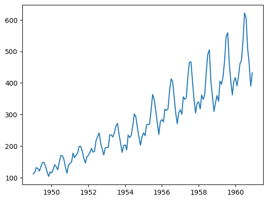
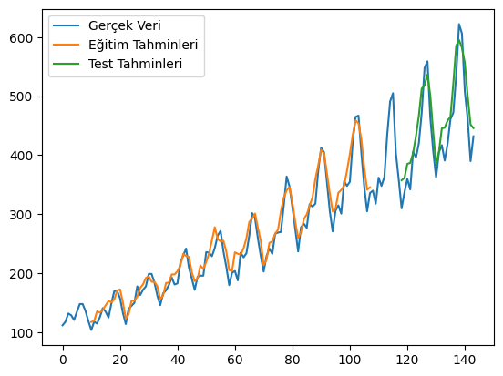
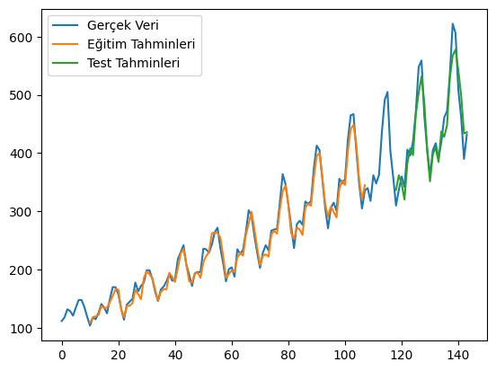
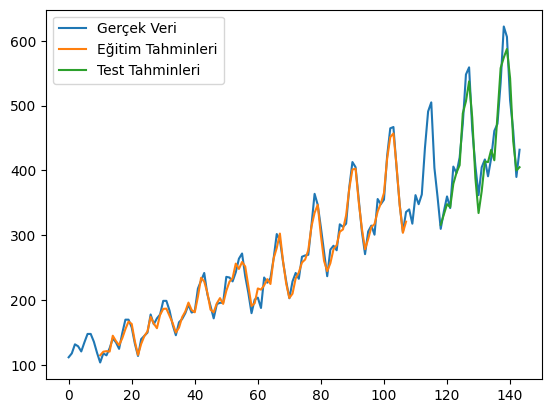

Veri setini indirmek için [tıklayınız](images/06_AirPassengers.csv).


```python
import numpy as np
import matplotlib.pyplot as plt
import pandas as pd
from sklearn.preprocessing import MinMaxScaler
import tensorflow as tf
from tensorflow import keras
```


```python
# Veri Yükleme
df = pd.read_csv('06_AirPassengers.csv')

# Sütun isimlerini kontrol et
print(df.columns)
```

    Index(['Month', '#Passengers'], dtype='object')
    


```python
df['Month'] = pd.to_datetime(df['Month'])
df.set_index('Month', inplace=True) 
plt.plot(df['#Passengers'])
plt.show()
```


    

    


```python
# Veriyi numpy array'e çevirme
dataset=df["#Passengers"].to_numpy()
dataset
```


    array([112, 118, 132, 129, 121, 135, 148, 148, 136, 119, 104, 118, 115,
           126, 141, 135, 125, 149, 170, 170, 158, 133, 114, 140, 145, 150,
           178, 163, 172, 178, 199, 199, 184, 162, 146, 166, 171, 180, 193,
           181, 183, 218, 230, 242, 209, 191, 172, 194, 196, 196, 236, 235,
           229, 243, 264, 272, 237, 211, 180, 201, 204, 188, 235, 227, 234,
           264, 302, 293, 259, 229, 203, 229, 242, 233, 267, 269, 270, 315,
           364, 347, 312, 274, 237, 278, 284, 277, 317, 313, 318, 374, 413,
           405, 355, 306, 271, 306, 315, 301, 356, 348, 355, 422, 465, 467,
           404, 347, 305, 336, 340, 318, 362, 348, 363, 435, 491, 505, 404,
           359, 310, 337, 360, 342, 406, 396, 420, 472, 548, 559, 463, 407,
           362, 405, 417, 391, 419, 461, 472, 535, 622, 606, 508, 461, 390,
           432], dtype=int64)


```python
# Eğitim ve test setlerine ayırma
train_size = int(len(dataset) * 0.75)
test_size = len(dataset) - train_size
train = dataset[0:train_size].reshape((-1, 1))
test = dataset[train_size:].reshape((-1, 1))
```


```python
# Veriyi ölçeklendirme
scaler = MinMaxScaler()
train_scaled = scaler.fit_transform(train)
```


```python
test_scaled = scaler.transform(test)
```


```python
# Zaman serisi veri üretme fonksiyonu
def time_series_sequences(data: np.ndarray, window_size: int):
    X, y = [], []
    for i in range(len(data) - window_size):
        X.append(data[i:i + window_size].flatten())  # Tek boyutlu hale getir
        y.append(data[i + window_size].flatten())  # Çıkış değeri
    return np.array(X), np.array(y)
```


```python
# Pencere boyutu
window_size = 10
X_train, y_train = time_series_sequences(train_scaled, window_size)
X_test, y_test = time_series_sequences(test_scaled, window_size)


```


```python
X_train.shape, y_train.shape, X_test.shape, y_test.shape
```


    ((98, 10), (98, 1), (26, 10), (26, 1))


```python
X_train[:3], y_train[:3]
```


    (array([[0.02203857, 0.03856749, 0.07713499, 0.06887052, 0.04683196,
             0.08539945, 0.12121212, 0.12121212, 0.08815427, 0.04132231],
            [0.03856749, 0.07713499, 0.06887052, 0.04683196, 0.08539945,
             0.12121212, 0.12121212, 0.08815427, 0.04132231, 0.        ],
            [0.07713499, 0.06887052, 0.04683196, 0.08539945, 0.12121212,
             0.12121212, 0.08815427, 0.04132231, 0.        , 0.03856749]]),
     array([[0.        ],
            [0.03856749],
            [0.03030303]]))


# Model 1


```python
# Model oluşturma
model = keras.models.Sequential([
    keras.layers.Input(shape=(window_size,1)),
    keras.layers.SimpleRNN(32, activation='relu'),
    keras.layers.Dense(1)  # Çıkışta lineer aktivasyon
])

model.summary()
```


<pre style="white-space:pre;overflow-x:auto;line-height:normal;font-family:Menlo,'DejaVu Sans Mono',consolas,'Courier New',monospace"><span style="font-weight: bold">Model: "sequential_2"</span>
</pre>


<pre style="white-space:pre;overflow-x:auto;line-height:normal;font-family:Menlo,'DejaVu Sans Mono',consolas,'Courier New',monospace">┏━━━━━━━━━━━━━━━━━━━━━━━━━━━━━━━━━━━━━━┳━━━━━━━━━━━━━━━━━━━━━━━━━━━━━┳━━━━━━━━━━━━━━━━━┓
┃<span style="font-weight: bold"> Layer (type)                         </span>┃<span style="font-weight: bold"> Output Shape                </span>┃<span style="font-weight: bold">         Param # </span>┃
┡━━━━━━━━━━━━━━━━━━━━━━━━━━━━━━━━━━━━━━╇━━━━━━━━━━━━━━━━━━━━━━━━━━━━━╇━━━━━━━━━━━━━━━━━┩
│ simple_rnn_2 (<span style="color: #0087ff; text-decoration-color: #0087ff">SimpleRNN</span>)             │ (<span style="color: #00d7ff; text-decoration-color: #00d7ff">None</span>, <span style="color: #00af00; text-decoration-color: #00af00">32</span>)                  │           <span style="color: #00af00; text-decoration-color: #00af00">1,088</span> │
├──────────────────────────────────────┼─────────────────────────────┼─────────────────┤
│ dense_2 (<span style="color: #0087ff; text-decoration-color: #0087ff">Dense</span>)                      │ (<span style="color: #00d7ff; text-decoration-color: #00d7ff">None</span>, <span style="color: #00af00; text-decoration-color: #00af00">1</span>)                   │              <span style="color: #00af00; text-decoration-color: #00af00">33</span> │
└──────────────────────────────────────┴─────────────────────────────┴─────────────────┘
</pre>


<pre style="white-space:pre;overflow-x:auto;line-height:normal;font-family:Menlo,'DejaVu Sans Mono',consolas,'Courier New',monospace"><span style="font-weight: bold"> Total params: </span><span style="color: #00af00; text-decoration-color: #00af00">1,121</span> (4.38 KB)
</pre>


<pre style="white-space:pre;overflow-x:auto;line-height:normal;font-family:Menlo,'DejaVu Sans Mono',consolas,'Courier New',monospace"><span style="font-weight: bold"> Trainable params: </span><span style="color: #00af00; text-decoration-color: #00af00">1,121</span> (4.38 KB)
</pre>


<pre style="white-space:pre;overflow-x:auto;line-height:normal;font-family:Menlo,'DejaVu Sans Mono',consolas,'Courier New',monospace"><span style="font-weight: bold"> Non-trainable params: </span><span style="color: #00af00; text-decoration-color: #00af00">0</span> (0.00 B)
</pre>


```python
model.compile(optimizer = 'adam',
             loss = 'mse',
             metrics = ['accuracy'])
```


```python
# Modeli eğitme
history = model.fit(X_train, y_train, validation_data=(X_test, y_test), epochs=100)
```

    Epoch 1/100
    4/4 ━━━━━━━━━━━━━━━━━━━━ 2s 98ms/step - accuracy: 0.0041 - loss: 0.2497 - val_accuracy: 0.0000e+00 - val_loss: 0.8502
    Epoch 2/100
    4/4 ━━━━━━━━━━━━━━━━━━━━ 0s 14ms/step - accuracy: 0.0062 - loss: 0.1548 - val_accuracy: 0.0000e+00 - val_loss: 0.5817
    Epoch 3/100
    4/4 ━━━━━━━━━━━━━━━━━━━━ 0s 14ms/step - accuracy: 0.0155 - loss: 0.0983 - val_accuracy: 0.0000e+00 - val_loss: 0.3677
    Epoch 4/100
    4/4 ━━━━━━━━━━━━━━━━━━━━ 0s 14ms/step - accuracy: 0.0062 - loss: 0.0591 - val_accuracy: 0.0000e+00 - val_loss: 0.1980
    Epoch 5/100
    4/4 ━━━━━━━━━━━━━━━━━━━━ 0s 13ms/step - accuracy: 0.0093 - loss: 0.0335 - val_accuracy: 0.0000e+00 - val_loss: 0.0736
    Epoch 6/100
    4/4 ━━━━━━━━━━━━━━━━━━━━ 0s 13ms/step - accuracy: 0.0186 - loss: 0.0135 - val_accuracy: 0.0000e+00 - val_loss: 0.0438
    Epoch 7/100
    4/4 ━━━━━━━━━━━━━━━━━━━━ 0s 14ms/step - accuracy: 0.0186 - loss: 0.0178 - val_accuracy: 0.0000e+00 - val_loss: 0.0446
    Epoch 8/100
    4/4 ━━━━━━━━━━━━━━━━━━━━ 0s 14ms/step - accuracy: 0.0217 - loss: 0.0169 - val_accuracy: 0.0000e+00 - val_loss: 0.0330
    Epoch 9/100
    4/4 ━━━━━━━━━━━━━━━━━━━━ 0s 14ms/step - accuracy: 0.0186 - loss: 0.0094 - val_accuracy: 0.0000e+00 - val_loss: 0.0444
    Epoch 10/100
    4/4 ━━━━━━━━━━━━━━━━━━━━ 0s 14ms/step - accuracy: 0.0217 - loss: 0.0091 - val_accuracy: 0.0000e+00 - val_loss: 0.0548
    Epoch 11/100
    4/4 ━━━━━━━━━━━━━━━━━━━━ 0s 14ms/step - accuracy: 0.0196 - loss: 0.0116 - val_accuracy: 0.0000e+00 - val_loss: 0.0534
    Epoch 12/100
    4/4 ━━━━━━━━━━━━━━━━━━━━ 0s 14ms/step - accuracy: 0.0155 - loss: 0.0091 - val_accuracy: 0.0000e+00 - val_loss: 0.0410
    Epoch 13/100
    4/4 ━━━━━━━━━━━━━━━━━━━━ 0s 14ms/step - accuracy: 0.0217 - loss: 0.0090 - val_accuracy: 0.0000e+00 - val_loss: 0.0271
    Epoch 14/100
    4/4 ━━━━━━━━━━━━━━━━━━━━ 0s 13ms/step - accuracy: 0.0155 - loss: 0.0072 - val_accuracy: 0.0000e+00 - val_loss: 0.0253
    Epoch 15/100
    4/4 ━━━━━━━━━━━━━━━━━━━━ 0s 15ms/step - accuracy: 0.0217 - loss: 0.0070 - val_accuracy: 0.0000e+00 - val_loss: 0.0260
    Epoch 16/100
    4/4 ━━━━━━━━━━━━━━━━━━━━ 0s 14ms/step - accuracy: 0.0217 - loss: 0.0074 - val_accuracy: 0.0000e+00 - val_loss: 0.0266
    Epoch 17/100
    4/4 ━━━━━━━━━━━━━━━━━━━━ 0s 13ms/step - accuracy: 0.0123 - loss: 0.0071 - val_accuracy: 0.0000e+00 - val_loss: 0.0293
    Epoch 18/100
    4/4 ━━━━━━━━━━━━━━━━━━━━ 0s 14ms/step - accuracy: 0.0248 - loss: 0.0072 - val_accuracy: 0.0000e+00 - val_loss: 0.0319
    Epoch 19/100
    4/4 ━━━━━━━━━━━━━━━━━━━━ 0s 14ms/step - accuracy: 0.0186 - loss: 0.0069 - val_accuracy: 0.0000e+00 - val_loss: 0.0294
    Epoch 20/100
    4/4 ━━━━━━━━━━━━━━━━━━━━ 0s 14ms/step - accuracy: 0.0217 - loss: 0.0067 - val_accuracy: 0.0000e+00 - val_loss: 0.0247
    Epoch 21/100
    4/4 ━━━━━━━━━━━━━━━━━━━━ 0s 14ms/step - accuracy: 0.0155 - loss: 0.0069 - val_accuracy: 0.0000e+00 - val_loss: 0.0226
    Epoch 22/100
    4/4 ━━━━━━━━━━━━━━━━━━━━ 0s 14ms/step - accuracy: 0.0311 - loss: 0.0068 - val_accuracy: 0.0000e+00 - val_loss: 0.0223
    Epoch 23/100
    4/4 ━━━━━━━━━━━━━━━━━━━━ 0s 13ms/step - accuracy: 0.0134 - loss: 0.0070 - val_accuracy: 0.0000e+00 - val_loss: 0.0237
    Epoch 24/100
    4/4 ━━━━━━━━━━━━━━━━━━━━ 0s 14ms/step - accuracy: 0.0217 - loss: 0.0056 - val_accuracy: 0.0000e+00 - val_loss: 0.0285
    Epoch 25/100
    4/4 ━━━━━━━━━━━━━━━━━━━━ 0s 14ms/step - accuracy: 0.0155 - loss: 0.0073 - val_accuracy: 0.0000e+00 - val_loss: 0.0281
    Epoch 26/100
    4/4 ━━━━━━━━━━━━━━━━━━━━ 0s 14ms/step - accuracy: 0.0123 - loss: 0.0052 - val_accuracy: 0.0000e+00 - val_loss: 0.0249
    Epoch 27/100
    4/4 ━━━━━━━━━━━━━━━━━━━━ 0s 13ms/step - accuracy: 0.0155 - loss: 0.0059 - val_accuracy: 0.0000e+00 - val_loss: 0.0219
    Epoch 28/100
    4/4 ━━━━━━━━━━━━━━━━━━━━ 0s 13ms/step - accuracy: 0.0217 - loss: 0.0061 - val_accuracy: 0.0000e+00 - val_loss: 0.0205
    Epoch 29/100
    4/4 ━━━━━━━━━━━━━━━━━━━━ 0s 14ms/step - accuracy: 0.0123 - loss: 0.0061 - val_accuracy: 0.0000e+00 - val_loss: 0.0203
    Epoch 30/100
    4/4 ━━━━━━━━━━━━━━━━━━━━ 0s 13ms/step - accuracy: 0.0248 - loss: 0.0055 - val_accuracy: 0.0000e+00 - val_loss: 0.0202
    Epoch 31/100
    4/4 ━━━━━━━━━━━━━━━━━━━━ 0s 14ms/step - accuracy: 0.0248 - loss: 0.0054 - val_accuracy: 0.0000e+00 - val_loss: 0.0201
    Epoch 32/100
    4/4 ━━━━━━━━━━━━━━━━━━━━ 0s 13ms/step - accuracy: 0.0217 - loss: 0.0058 - val_accuracy: 0.0000e+00 - val_loss: 0.0202
    Epoch 33/100
    4/4 ━━━━━━━━━━━━━━━━━━━━ 0s 14ms/step - accuracy: 0.0123 - loss: 0.0051 - val_accuracy: 0.0000e+00 - val_loss: 0.0188
    Epoch 34/100
    4/4 ━━━━━━━━━━━━━━━━━━━━ 0s 14ms/step - accuracy: 0.0134 - loss: 0.0053 - val_accuracy: 0.0000e+00 - val_loss: 0.0225
    Epoch 35/100
    4/4 ━━━━━━━━━━━━━━━━━━━━ 0s 13ms/step - accuracy: 0.0123 - loss: 0.0064 - val_accuracy: 0.0000e+00 - val_loss: 0.0177
    Epoch 36/100
    4/4 ━━━━━━━━━━━━━━━━━━━━ 0s 13ms/step - accuracy: 0.0248 - loss: 0.0049 - val_accuracy: 0.0000e+00 - val_loss: 0.0185
    Epoch 37/100
    4/4 ━━━━━━━━━━━━━━━━━━━━ 0s 13ms/step - accuracy: 0.0311 - loss: 0.0061 - val_accuracy: 0.0000e+00 - val_loss: 0.0176
    Epoch 38/100
    4/4 ━━━━━━━━━━━━━━━━━━━━ 0s 13ms/step - accuracy: 0.0123 - loss: 0.0051 - val_accuracy: 0.0000e+00 - val_loss: 0.0165
    Epoch 39/100
    4/4 ━━━━━━━━━━━━━━━━━━━━ 0s 14ms/step - accuracy: 0.0155 - loss: 0.0047 - val_accuracy: 0.0000e+00 - val_loss: 0.0168
    Epoch 40/100
    4/4 ━━━━━━━━━━━━━━━━━━━━ 0s 14ms/step - accuracy: 0.0155 - loss: 0.0050 - val_accuracy: 0.0000e+00 - val_loss: 0.0163
    Epoch 41/100
    4/4 ━━━━━━━━━━━━━━━━━━━━ 0s 13ms/step - accuracy: 0.0248 - loss: 0.0047 - val_accuracy: 0.0000e+00 - val_loss: 0.0154
    Epoch 42/100
    4/4 ━━━━━━━━━━━━━━━━━━━━ 0s 14ms/step - accuracy: 0.0155 - loss: 0.0043 - val_accuracy: 0.0000e+00 - val_loss: 0.0153
    Epoch 43/100
    4/4 ━━━━━━━━━━━━━━━━━━━━ 0s 14ms/step - accuracy: 0.0155 - loss: 0.0046 - val_accuracy: 0.0000e+00 - val_loss: 0.0145
    Epoch 44/100
    4/4 ━━━━━━━━━━━━━━━━━━━━ 0s 14ms/step - accuracy: 0.0155 - loss: 0.0044 - val_accuracy: 0.0000e+00 - val_loss: 0.0143
    Epoch 45/100
    4/4 ━━━━━━━━━━━━━━━━━━━━ 0s 14ms/step - accuracy: 0.0217 - loss: 0.0048 - val_accuracy: 0.0000e+00 - val_loss: 0.0140
    Epoch 46/100
    4/4 ━━━━━━━━━━━━━━━━━━━━ 0s 14ms/step - accuracy: 0.0123 - loss: 0.0041 - val_accuracy: 0.0000e+00 - val_loss: 0.0155
    Epoch 47/100
    4/4 ━━━━━━━━━━━━━━━━━━━━ 0s 14ms/step - accuracy: 0.0248 - loss: 0.0045 - val_accuracy: 0.0000e+00 - val_loss: 0.0167
    Epoch 48/100
    4/4 ━━━━━━━━━━━━━━━━━━━━ 0s 14ms/step - accuracy: 0.0155 - loss: 0.0045 - val_accuracy: 0.0000e+00 - val_loss: 0.0132
    Epoch 49/100
    4/4 ━━━━━━━━━━━━━━━━━━━━ 0s 14ms/step - accuracy: 0.0123 - loss: 0.0039 - val_accuracy: 0.0000e+00 - val_loss: 0.0133
    Epoch 50/100
    4/4 ━━━━━━━━━━━━━━━━━━━━ 0s 13ms/step - accuracy: 0.0248 - loss: 0.0043 - val_accuracy: 0.0000e+00 - val_loss: 0.0160
    Epoch 51/100
    4/4 ━━━━━━━━━━━━━━━━━━━━ 0s 13ms/step - accuracy: 0.0186 - loss: 0.0048 - val_accuracy: 0.0000e+00 - val_loss: 0.0119
    Epoch 52/100
    4/4 ━━━━━━━━━━━━━━━━━━━━ 0s 13ms/step - accuracy: 0.0155 - loss: 0.0037 - val_accuracy: 0.0000e+00 - val_loss: 0.0124
    Epoch 53/100
    4/4 ━━━━━━━━━━━━━━━━━━━━ 0s 14ms/step - accuracy: 0.0248 - loss: 0.0043 - val_accuracy: 0.0000e+00 - val_loss: 0.0116
    Epoch 54/100
    4/4 ━━━━━━━━━━━━━━━━━━━━ 0s 13ms/step - accuracy: 0.0155 - loss: 0.0036 - val_accuracy: 0.0000e+00 - val_loss: 0.0115
    Epoch 55/100
    4/4 ━━━━━━━━━━━━━━━━━━━━ 0s 14ms/step - accuracy: 0.0102 - loss: 0.0033 - val_accuracy: 0.0000e+00 - val_loss: 0.0112
    Epoch 56/100
    4/4 ━━━━━━━━━━━━━━━━━━━━ 0s 14ms/step - accuracy: 0.0186 - loss: 0.0040 - val_accuracy: 0.0000e+00 - val_loss: 0.0107
    Epoch 57/100
    4/4 ━━━━━━━━━━━━━━━━━━━━ 0s 14ms/step - accuracy: 0.0311 - loss: 0.0034 - val_accuracy: 0.0000e+00 - val_loss: 0.0106
    Epoch 58/100
    4/4 ━━━━━━━━━━━━━━━━━━━━ 0s 14ms/step - accuracy: 0.0155 - loss: 0.0036 - val_accuracy: 0.0000e+00 - val_loss: 0.0102
    Epoch 59/100
    4/4 ━━━━━━━━━━━━━━━━━━━━ 0s 14ms/step - accuracy: 0.0248 - loss: 0.0031 - val_accuracy: 0.0000e+00 - val_loss: 0.0110
    Epoch 60/100
    4/4 ━━━━━━━━━━━━━━━━━━━━ 0s 14ms/step - accuracy: 0.0123 - loss: 0.0036 - val_accuracy: 0.0000e+00 - val_loss: 0.0095
    Epoch 61/100
    4/4 ━━━━━━━━━━━━━━━━━━━━ 0s 14ms/step - accuracy: 0.0217 - loss: 0.0038 - val_accuracy: 0.0000e+00 - val_loss: 0.0243
    Epoch 62/100
    4/4 ━━━━━━━━━━━━━━━━━━━━ 0s 14ms/step - accuracy: 0.0155 - loss: 0.0059 - val_accuracy: 0.0000e+00 - val_loss: 0.0135
    Epoch 63/100
    4/4 ━━━━━━━━━━━━━━━━━━━━ 0s 13ms/step - accuracy: 0.0248 - loss: 0.0033 - val_accuracy: 0.0000e+00 - val_loss: 0.0171
    Epoch 64/100
    4/4 ━━━━━━━━━━━━━━━━━━━━ 0s 13ms/step - accuracy: 0.0248 - loss: 0.0060 - val_accuracy: 0.0000e+00 - val_loss: 0.0169
    Epoch 65/100
    4/4 ━━━━━━━━━━━━━━━━━━━━ 0s 14ms/step - accuracy: 0.0217 - loss: 0.0042 - val_accuracy: 0.0000e+00 - val_loss: 0.0115
    Epoch 66/100
    4/4 ━━━━━━━━━━━━━━━━━━━━ 0s 13ms/step - accuracy: 0.0155 - loss: 0.0037 - val_accuracy: 0.0000e+00 - val_loss: 0.0172
    Epoch 67/100
    4/4 ━━━━━━━━━━━━━━━━━━━━ 0s 13ms/step - accuracy: 0.0217 - loss: 0.0043 - val_accuracy: 0.0000e+00 - val_loss: 0.0098
    Epoch 68/100
    4/4 ━━━━━━━━━━━━━━━━━━━━ 0s 14ms/step - accuracy: 0.0248 - loss: 0.0034 - val_accuracy: 0.0000e+00 - val_loss: 0.0104
    Epoch 69/100
    4/4 ━━━━━━━━━━━━━━━━━━━━ 0s 14ms/step - accuracy: 0.0155 - loss: 0.0032 - val_accuracy: 0.0000e+00 - val_loss: 0.0099
    Epoch 70/100
    4/4 ━━━━━━━━━━━━━━━━━━━━ 0s 14ms/step - accuracy: 0.0311 - loss: 0.0028 - val_accuracy: 0.0000e+00 - val_loss: 0.0095
    Epoch 71/100
    4/4 ━━━━━━━━━━━━━━━━━━━━ 0s 13ms/step - accuracy: 0.0123 - loss: 0.0029 - val_accuracy: 0.0000e+00 - val_loss: 0.0133
    Epoch 72/100
    4/4 ━━━━━━━━━━━━━━━━━━━━ 0s 14ms/step - accuracy: 0.0248 - loss: 0.0037 - val_accuracy: 0.0000e+00 - val_loss: 0.0090
    Epoch 73/100
    4/4 ━━━━━━━━━━━━━━━━━━━━ 0s 14ms/step - accuracy: 0.0248 - loss: 0.0027 - val_accuracy: 0.0000e+00 - val_loss: 0.0170
    Epoch 74/100
    4/4 ━━━━━━━━━━━━━━━━━━━━ 0s 14ms/step - accuracy: 0.0123 - loss: 0.0050 - val_accuracy: 0.0000e+00 - val_loss: 0.0117
    Epoch 75/100
    4/4 ━━━━━━━━━━━━━━━━━━━━ 0s 14ms/step - accuracy: 0.0123 - loss: 0.0031 - val_accuracy: 0.0000e+00 - val_loss: 0.0087
    Epoch 76/100
    4/4 ━━━━━━━━━━━━━━━━━━━━ 0s 13ms/step - accuracy: 0.0123 - loss: 0.0027 - val_accuracy: 0.0000e+00 - val_loss: 0.0106
    Epoch 77/100
    4/4 ━━━━━━━━━━━━━━━━━━━━ 0s 13ms/step - accuracy: 0.0248 - loss: 0.0032 - val_accuracy: 0.0000e+00 - val_loss: 0.0082
    Epoch 78/100
    4/4 ━━━━━━━━━━━━━━━━━━━━ 0s 13ms/step - accuracy: 0.0217 - loss: 0.0026 - val_accuracy: 0.0000e+00 - val_loss: 0.0082
    Epoch 79/100
    4/4 ━━━━━━━━━━━━━━━━━━━━ 0s 14ms/step - accuracy: 0.0123 - loss: 0.0025 - val_accuracy: 0.0000e+00 - val_loss: 0.0092
    Epoch 80/100
    4/4 ━━━━━━━━━━━━━━━━━━━━ 0s 13ms/step - accuracy: 0.0155 - loss: 0.0028 - val_accuracy: 0.0000e+00 - val_loss: 0.0069
    Epoch 81/100
    4/4 ━━━━━━━━━━━━━━━━━━━━ 0s 14ms/step - accuracy: 0.0248 - loss: 0.0024 - val_accuracy: 0.0000e+00 - val_loss: 0.0068
    Epoch 82/100
    4/4 ━━━━━━━━━━━━━━━━━━━━ 0s 14ms/step - accuracy: 0.0248 - loss: 0.0023 - val_accuracy: 0.0000e+00 - val_loss: 0.0067
    Epoch 83/100
    4/4 ━━━━━━━━━━━━━━━━━━━━ 0s 14ms/step - accuracy: 0.0155 - loss: 0.0023 - val_accuracy: 0.0000e+00 - val_loss: 0.0067
    Epoch 84/100
    4/4 ━━━━━━━━━━━━━━━━━━━━ 0s 14ms/step - accuracy: 0.0123 - loss: 0.0024 - val_accuracy: 0.0000e+00 - val_loss: 0.0072
    Epoch 85/100
    4/4 ━━━━━━━━━━━━━━━━━━━━ 0s 13ms/step - accuracy: 0.0248 - loss: 0.0025 - val_accuracy: 0.0000e+00 - val_loss: 0.0064
    Epoch 86/100
    4/4 ━━━━━━━━━━━━━━━━━━━━ 0s 13ms/step - accuracy: 0.0155 - loss: 0.0021 - val_accuracy: 0.0000e+00 - val_loss: 0.0062
    Epoch 87/100
    4/4 ━━━━━━━━━━━━━━━━━━━━ 0s 13ms/step - accuracy: 0.0248 - loss: 0.0021 - val_accuracy: 0.0000e+00 - val_loss: 0.0079
    Epoch 88/100
    4/4 ━━━━━━━━━━━━━━━━━━━━ 0s 13ms/step - accuracy: 0.0248 - loss: 0.0023 - val_accuracy: 0.0000e+00 - val_loss: 0.0056
    Epoch 89/100
    4/4 ━━━━━━━━━━━━━━━━━━━━ 0s 14ms/step - accuracy: 0.0123 - loss: 0.0021 - val_accuracy: 0.0000e+00 - val_loss: 0.0054
    Epoch 90/100
    4/4 ━━━━━━━━━━━━━━━━━━━━ 0s 14ms/step - accuracy: 0.0248 - loss: 0.0019 - val_accuracy: 0.0000e+00 - val_loss: 0.0073
    Epoch 91/100
    4/4 ━━━━━━━━━━━━━━━━━━━━ 0s 14ms/step - accuracy: 0.0248 - loss: 0.0025 - val_accuracy: 0.0000e+00 - val_loss: 0.0060
    Epoch 92/100
    4/4 ━━━━━━━━━━━━━━━━━━━━ 0s 14ms/step - accuracy: 0.0155 - loss: 0.0018 - val_accuracy: 0.0000e+00 - val_loss: 0.0061
    Epoch 93/100
    4/4 ━━━━━━━━━━━━━━━━━━━━ 0s 14ms/step - accuracy: 0.0248 - loss: 0.0022 - val_accuracy: 0.0000e+00 - val_loss: 0.0057
    Epoch 94/100
    4/4 ━━━━━━━━━━━━━━━━━━━━ 0s 14ms/step - accuracy: 0.0102 - loss: 0.0019 - val_accuracy: 0.0000e+00 - val_loss: 0.0062
    Epoch 95/100
    4/4 ━━━━━━━━━━━━━━━━━━━━ 0s 14ms/step - accuracy: 0.0217 - loss: 0.0021 - val_accuracy: 0.0000e+00 - val_loss: 0.0053
    Epoch 96/100
    4/4 ━━━━━━━━━━━━━━━━━━━━ 0s 13ms/step - accuracy: 0.0186 - loss: 0.0018 - val_accuracy: 0.0000e+00 - val_loss: 0.0068
    Epoch 97/100
    4/4 ━━━━━━━━━━━━━━━━━━━━ 0s 14ms/step - accuracy: 0.0311 - loss: 0.0020 - val_accuracy: 0.0000e+00 - val_loss: 0.0056
    Epoch 98/100
    4/4 ━━━━━━━━━━━━━━━━━━━━ 0s 13ms/step - accuracy: 0.0248 - loss: 0.0019 - val_accuracy: 0.0000e+00 - val_loss: 0.0105
    Epoch 99/100
    4/4 ━━━━━━━━━━━━━━━━━━━━ 0s 14ms/step - accuracy: 0.0217 - loss: 0.0026 - val_accuracy: 0.0000e+00 - val_loss: 0.0054
    Epoch 100/100
    4/4 ━━━━━━━━━━━━━━━━━━━━ 0s 14ms/step - accuracy: 0.0155 - loss: 0.0018 - val_accuracy: 0.0000e+00 - val_loss: 0.0101
    


```python
# Tahmin yapma
trainPredict = model.predict(X_train)
testPredict = model.predict(X_test)
```

    4/4 ━━━━━━━━━━━━━━━━━━━━ 0s 43ms/step
    1/1 ━━━━━━━━━━━━━━━━━━━━ 0s 26ms/step
    


```python
# Ters ölçeklendirme
trainPredict_unscaled = scaler.inverse_transform(trainPredict.reshape((-1, 1)))
testPredict_unscaled = scaler.inverse_transform(testPredict.reshape((-1, 1)))
```


```python
# Grafik için boş arrayler oluşturma
trainPredictPlot = np.empty_like(dataset, dtype=float)
trainPredictPlot[:] = np.nan
trainPredictPlot[window_size:len(trainPredict) + window_size] = trainPredict_unscaled.flatten()
```


```python
testPredict_unscaled.shape
```


    (26, 1)


```python
testPredictPlot = np.empty_like(dataset, dtype=float)
testPredictPlot[:] = np.nan
testPredictPlot[len(trainPredict) + (window_size * 2):] = testPredict_unscaled.flatten()
```


```python
# Gerçek veri ve tahminleri çizdirme
plt.plot(dataset, label="Gerçek Veri")
plt.plot(trainPredictPlot, label="Eğitim Tahminleri")
plt.plot(testPredictPlot, label="Test Tahminleri")
plt.legend()
plt.show()
```


    

    


# Model 2


```python
# Model oluşturma
model = keras.models.Sequential([
    keras.layers.Input(shape=(window_size,1)),
    keras.layers.SimpleRNN(64, activation='relu'),
    keras.layers.Dense(1)  # Çıkışta lineer aktivasyon
])

model.summary()
```


<pre style="white-space:pre;overflow-x:auto;line-height:normal;font-family:Menlo,'DejaVu Sans Mono',consolas,'Courier New',monospace"><span style="font-weight: bold">Model: "sequential_5"</span>
</pre>


<pre style="white-space:pre;overflow-x:auto;line-height:normal;font-family:Menlo,'DejaVu Sans Mono',consolas,'Courier New',monospace">┏━━━━━━━━━━━━━━━━━━━━━━━━━━━━━━━━━━━━━━┳━━━━━━━━━━━━━━━━━━━━━━━━━━━━━┳━━━━━━━━━━━━━━━━━┓
┃<span style="font-weight: bold"> Layer (type)                         </span>┃<span style="font-weight: bold"> Output Shape                </span>┃<span style="font-weight: bold">         Param # </span>┃
┡━━━━━━━━━━━━━━━━━━━━━━━━━━━━━━━━━━━━━━╇━━━━━━━━━━━━━━━━━━━━━━━━━━━━━╇━━━━━━━━━━━━━━━━━┩
│ simple_rnn_5 (<span style="color: #0087ff; text-decoration-color: #0087ff">SimpleRNN</span>)             │ (<span style="color: #00d7ff; text-decoration-color: #00d7ff">None</span>, <span style="color: #00af00; text-decoration-color: #00af00">64</span>)                  │           <span style="color: #00af00; text-decoration-color: #00af00">4,224</span> │
├──────────────────────────────────────┼─────────────────────────────┼─────────────────┤
│ dense_5 (<span style="color: #0087ff; text-decoration-color: #0087ff">Dense</span>)                      │ (<span style="color: #00d7ff; text-decoration-color: #00d7ff">None</span>, <span style="color: #00af00; text-decoration-color: #00af00">1</span>)                   │              <span style="color: #00af00; text-decoration-color: #00af00">65</span> │
└──────────────────────────────────────┴─────────────────────────────┴─────────────────┘
</pre>


<pre style="white-space:pre;overflow-x:auto;line-height:normal;font-family:Menlo,'DejaVu Sans Mono',consolas,'Courier New',monospace"><span style="font-weight: bold"> Total params: </span><span style="color: #00af00; text-decoration-color: #00af00">4,289</span> (16.75 KB)
</pre>


<pre style="white-space:pre;overflow-x:auto;line-height:normal;font-family:Menlo,'DejaVu Sans Mono',consolas,'Courier New',monospace"><span style="font-weight: bold"> Trainable params: </span><span style="color: #00af00; text-decoration-color: #00af00">4,289</span> (16.75 KB)
</pre>


<pre style="white-space:pre;overflow-x:auto;line-height:normal;font-family:Menlo,'DejaVu Sans Mono',consolas,'Courier New',monospace"><span style="font-weight: bold"> Non-trainable params: </span><span style="color: #00af00; text-decoration-color: #00af00">0</span> (0.00 B)
</pre>


```python
model.compile(optimizer = 'adam',
             loss = 'mse',
             metrics = ['accuracy'])
```


```python
# Modeli eğitme
history = model.fit(X_train, y_train, validation_data=(X_test, y_test), epochs=100)
```

    Epoch 1/100
    4/4 ━━━━━━━━━━━━━━━━━━━━ 2s 98ms/step - accuracy: 0.0155 - loss: 0.1827 - val_accuracy: 0.0000e+00 - val_loss: 0.6060
    Epoch 2/100
    4/4 ━━━━━━━━━━━━━━━━━━━━ 0s 14ms/step - accuracy: 0.0155 - loss: 0.1131 - val_accuracy: 0.0000e+00 - val_loss: 0.3680
    Epoch 3/100
    4/4 ━━━━━━━━━━━━━━━━━━━━ 0s 14ms/step - accuracy: 0.0062 - loss: 0.0753 - val_accuracy: 0.0000e+00 - val_loss: 0.2187
    Epoch 4/100
    4/4 ━━━━━━━━━━━━━━━━━━━━ 0s 14ms/step - accuracy: 0.0155 - loss: 0.0395 - val_accuracy: 0.0000e+00 - val_loss: 0.1049
    Epoch 5/100
    4/4 ━━━━━━━━━━━━━━━━━━━━ 0s 14ms/step - accuracy: 0.0123 - loss: 0.0150 - val_accuracy: 0.0000e+00 - val_loss: 0.0529
    Epoch 6/100
    4/4 ━━━━━━━━━━━━━━━━━━━━ 0s 13ms/step - accuracy: 0.0186 - loss: 0.0152 - val_accuracy: 0.0000e+00 - val_loss: 0.0479
    Epoch 7/100
    4/4 ━━━━━━━━━━━━━━━━━━━━ 0s 13ms/step - accuracy: 0.0217 - loss: 0.0136 - val_accuracy: 0.0000e+00 - val_loss: 0.0441
    Epoch 8/100
    4/4 ━━━━━━━━━━━━━━━━━━━━ 0s 14ms/step - accuracy: 0.0248 - loss: 0.0108 - val_accuracy: 0.0000e+00 - val_loss: 0.0586
    Epoch 9/100
    4/4 ━━━━━━━━━━━━━━━━━━━━ 0s 14ms/step - accuracy: 0.0155 - loss: 0.0115 - val_accuracy: 0.0000e+00 - val_loss: 0.0565
    Epoch 10/100
    4/4 ━━━━━━━━━━━━━━━━━━━━ 0s 15ms/step - accuracy: 0.0155 - loss: 0.0116 - val_accuracy: 0.0000e+00 - val_loss: 0.0397
    Epoch 11/100
    4/4 ━━━━━━━━━━━━━━━━━━━━ 0s 14ms/step - accuracy: 0.0248 - loss: 0.0099 - val_accuracy: 0.0000e+00 - val_loss: 0.0347
    Epoch 12/100
    4/4 ━━━━━━━━━━━━━━━━━━━━ 0s 13ms/step - accuracy: 0.0311 - loss: 0.0104 - val_accuracy: 0.0000e+00 - val_loss: 0.0328
    Epoch 13/100
    4/4 ━━━━━━━━━━━━━━━━━━━━ 0s 14ms/step - accuracy: 0.0155 - loss: 0.0081 - val_accuracy: 0.0000e+00 - val_loss: 0.0339
    Epoch 14/100
    4/4 ━━━━━━━━━━━━━━━━━━━━ 0s 13ms/step - accuracy: 0.0217 - loss: 0.0077 - val_accuracy: 0.0000e+00 - val_loss: 0.0432
    Epoch 15/100
    4/4 ━━━━━━━━━━━━━━━━━━━━ 0s 13ms/step - accuracy: 0.0155 - loss: 0.0091 - val_accuracy: 0.0000e+00 - val_loss: 0.0446
    Epoch 16/100
    4/4 ━━━━━━━━━━━━━━━━━━━━ 0s 13ms/step - accuracy: 0.0155 - loss: 0.0092 - val_accuracy: 0.0000e+00 - val_loss: 0.0341
    Epoch 17/100
    4/4 ━━━━━━━━━━━━━━━━━━━━ 0s 13ms/step - accuracy: 0.0248 - loss: 0.0069 - val_accuracy: 0.0000e+00 - val_loss: 0.0261
    Epoch 18/100
    4/4 ━━━━━━━━━━━━━━━━━━━━ 0s 14ms/step - accuracy: 0.0248 - loss: 0.0081 - val_accuracy: 0.0000e+00 - val_loss: 0.0273
    Epoch 19/100
    4/4 ━━━━━━━━━━━━━━━━━━━━ 0s 13ms/step - accuracy: 0.0248 - loss: 0.0088 - val_accuracy: 0.0000e+00 - val_loss: 0.0272
    Epoch 20/100
    4/4 ━━━━━━━━━━━━━━━━━━━━ 0s 14ms/step - accuracy: 0.0155 - loss: 0.0069 - val_accuracy: 0.0000e+00 - val_loss: 0.0391
    Epoch 21/100
    4/4 ━━━━━━━━━━━━━━━━━━━━ 0s 13ms/step - accuracy: 0.0186 - loss: 0.0073 - val_accuracy: 0.0000e+00 - val_loss: 0.0355
    Epoch 22/100
    4/4 ━━━━━━━━━━━━━━━━━━━━ 0s 14ms/step - accuracy: 0.0311 - loss: 0.0075 - val_accuracy: 0.0000e+00 - val_loss: 0.0287
    Epoch 23/100
    4/4 ━━━━━━━━━━━━━━━━━━━━ 0s 14ms/step - accuracy: 0.0248 - loss: 0.0068 - val_accuracy: 0.0000e+00 - val_loss: 0.0243
    Epoch 24/100
    4/4 ━━━━━━━━━━━━━━━━━━━━ 0s 13ms/step - accuracy: 0.0155 - loss: 0.0065 - val_accuracy: 0.0000e+00 - val_loss: 0.0238
    Epoch 25/100
    4/4 ━━━━━━━━━━━━━━━━━━━━ 0s 14ms/step - accuracy: 0.0248 - loss: 0.0075 - val_accuracy: 0.0000e+00 - val_loss: 0.0230
    Epoch 26/100
    4/4 ━━━━━━━━━━━━━━━━━━━━ 0s 13ms/step - accuracy: 0.0155 - loss: 0.0067 - val_accuracy: 0.0000e+00 - val_loss: 0.0237
    Epoch 27/100
    4/4 ━━━━━━━━━━━━━━━━━━━━ 0s 13ms/step - accuracy: 0.0123 - loss: 0.0059 - val_accuracy: 0.0000e+00 - val_loss: 0.0253
    Epoch 28/100
    4/4 ━━━━━━━━━━━━━━━━━━━━ 0s 13ms/step - accuracy: 0.0217 - loss: 0.0056 - val_accuracy: 0.0000e+00 - val_loss: 0.0293
    Epoch 29/100
    4/4 ━━━━━━━━━━━━━━━━━━━━ 0s 14ms/step - accuracy: 0.0248 - loss: 0.0063 - val_accuracy: 0.0000e+00 - val_loss: 0.0241
    Epoch 30/100
    4/4 ━━━━━━━━━━━━━━━━━━━━ 0s 13ms/step - accuracy: 0.0155 - loss: 0.0063 - val_accuracy: 0.0000e+00 - val_loss: 0.0219
    Epoch 31/100
    4/4 ━━━━━━━━━━━━━━━━━━━━ 0s 14ms/step - accuracy: 0.0248 - loss: 0.0070 - val_accuracy: 0.0000e+00 - val_loss: 0.0197
    Epoch 32/100
    4/4 ━━━━━━━━━━━━━━━━━━━━ 0s 13ms/step - accuracy: 0.0155 - loss: 0.0055 - val_accuracy: 0.0000e+00 - val_loss: 0.0243
    Epoch 33/100
    4/4 ━━━━━━━━━━━━━━━━━━━━ 0s 13ms/step - accuracy: 0.0155 - loss: 0.0056 - val_accuracy: 0.0000e+00 - val_loss: 0.0205
    Epoch 34/100
    4/4 ━━━━━━━━━━━━━━━━━━━━ 0s 13ms/step - accuracy: 0.0123 - loss: 0.0055 - val_accuracy: 0.0000e+00 - val_loss: 0.0197
    Epoch 35/100
    4/4 ━━━━━━━━━━━━━━━━━━━━ 0s 14ms/step - accuracy: 0.0248 - loss: 0.0061 - val_accuracy: 0.0000e+00 - val_loss: 0.0199
    Epoch 36/100
    4/4 ━━━━━━━━━━━━━━━━━━━━ 0s 14ms/step - accuracy: 0.0155 - loss: 0.0054 - val_accuracy: 0.0000e+00 - val_loss: 0.0202
    Epoch 37/100
    4/4 ━━━━━━━━━━━━━━━━━━━━ 0s 13ms/step - accuracy: 0.0186 - loss: 0.0049 - val_accuracy: 0.0000e+00 - val_loss: 0.0192
    Epoch 38/100
    4/4 ━━━━━━━━━━━━━━━━━━━━ 0s 13ms/step - accuracy: 0.0311 - loss: 0.0058 - val_accuracy: 0.0000e+00 - val_loss: 0.0199
    Epoch 39/100
    4/4 ━━━━━━━━━━━━━━━━━━━━ 0s 13ms/step - accuracy: 0.0311 - loss: 0.0057 - val_accuracy: 0.0000e+00 - val_loss: 0.0178
    Epoch 40/100
    4/4 ━━━━━━━━━━━━━━━━━━━━ 0s 13ms/step - accuracy: 0.0248 - loss: 0.0052 - val_accuracy: 0.0000e+00 - val_loss: 0.0174
    Epoch 41/100
    4/4 ━━━━━━━━━━━━━━━━━━━━ 0s 13ms/step - accuracy: 0.0186 - loss: 0.0053 - val_accuracy: 0.0000e+00 - val_loss: 0.0205
    Epoch 42/100
    4/4 ━━━━━━━━━━━━━━━━━━━━ 0s 13ms/step - accuracy: 0.0248 - loss: 0.0059 - val_accuracy: 0.0000e+00 - val_loss: 0.0186
    Epoch 43/100
    4/4 ━━━━━━━━━━━━━━━━━━━━ 0s 14ms/step - accuracy: 0.0155 - loss: 0.0044 - val_accuracy: 0.0000e+00 - val_loss: 0.0175
    Epoch 44/100
    4/4 ━━━━━━━━━━━━━━━━━━━━ 0s 14ms/step - accuracy: 0.0311 - loss: 0.0050 - val_accuracy: 0.0000e+00 - val_loss: 0.0180
    Epoch 45/100
    4/4 ━━━━━━━━━━━━━━━━━━━━ 0s 13ms/step - accuracy: 0.0248 - loss: 0.0047 - val_accuracy: 0.0000e+00 - val_loss: 0.0160
    Epoch 46/100
    4/4 ━━━━━━━━━━━━━━━━━━━━ 0s 13ms/step - accuracy: 0.0311 - loss: 0.0041 - val_accuracy: 0.0000e+00 - val_loss: 0.0151
    Epoch 47/100
    4/4 ━━━━━━━━━━━━━━━━━━━━ 0s 14ms/step - accuracy: 0.0134 - loss: 0.0042 - val_accuracy: 0.0000e+00 - val_loss: 0.0147
    Epoch 48/100
    4/4 ━━━━━━━━━━━━━━━━━━━━ 0s 14ms/step - accuracy: 0.0248 - loss: 0.0041 - val_accuracy: 0.0000e+00 - val_loss: 0.0144
    Epoch 49/100
    4/4 ━━━━━━━━━━━━━━━━━━━━ 0s 14ms/step - accuracy: 0.0186 - loss: 0.0038 - val_accuracy: 0.0000e+00 - val_loss: 0.0137
    Epoch 50/100
    4/4 ━━━━━━━━━━━━━━━━━━━━ 0s 13ms/step - accuracy: 0.0311 - loss: 0.0040 - val_accuracy: 0.0000e+00 - val_loss: 0.0121
    Epoch 51/100
    4/4 ━━━━━━━━━━━━━━━━━━━━ 0s 14ms/step - accuracy: 0.0155 - loss: 0.0040 - val_accuracy: 0.0000e+00 - val_loss: 0.0114
    Epoch 52/100
    4/4 ━━━━━━━━━━━━━━━━━━━━ 0s 13ms/step - accuracy: 0.0186 - loss: 0.0036 - val_accuracy: 0.0000e+00 - val_loss: 0.0104
    Epoch 53/100
    4/4 ━━━━━━━━━━━━━━━━━━━━ 0s 13ms/step - accuracy: 0.0311 - loss: 0.0029 - val_accuracy: 0.0000e+00 - val_loss: 0.0126
    Epoch 54/100
    4/4 ━━━━━━━━━━━━━━━━━━━━ 0s 13ms/step - accuracy: 0.0248 - loss: 0.0036 - val_accuracy: 0.0000e+00 - val_loss: 0.0126
    Epoch 55/100
    4/4 ━━━━━━━━━━━━━━━━━━━━ 0s 13ms/step - accuracy: 0.0155 - loss: 0.0033 - val_accuracy: 0.0000e+00 - val_loss: 0.0114
    Epoch 56/100
    4/4 ━━━━━━━━━━━━━━━━━━━━ 0s 14ms/step - accuracy: 0.0155 - loss: 0.0028 - val_accuracy: 0.0000e+00 - val_loss: 0.0112
    Epoch 57/100
    4/4 ━━━━━━━━━━━━━━━━━━━━ 0s 14ms/step - accuracy: 0.0217 - loss: 0.0029 - val_accuracy: 0.0000e+00 - val_loss: 0.0108
    Epoch 58/100
    4/4 ━━━━━━━━━━━━━━━━━━━━ 0s 13ms/step - accuracy: 0.0123 - loss: 0.0031 - val_accuracy: 0.0000e+00 - val_loss: 0.0107
    Epoch 59/100
    4/4 ━━━━━━━━━━━━━━━━━━━━ 0s 14ms/step - accuracy: 0.0186 - loss: 0.0030 - val_accuracy: 0.0000e+00 - val_loss: 0.0234
    Epoch 60/100
    4/4 ━━━━━━━━━━━━━━━━━━━━ 0s 14ms/step - accuracy: 0.0186 - loss: 0.0047 - val_accuracy: 0.0000e+00 - val_loss: 0.0163
    Epoch 61/100
    4/4 ━━━━━━━━━━━━━━━━━━━━ 0s 14ms/step - accuracy: 0.0123 - loss: 0.0029 - val_accuracy: 0.0000e+00 - val_loss: 0.0100
    Epoch 62/100
    4/4 ━━━━━━━━━━━━━━━━━━━━ 0s 14ms/step - accuracy: 0.0311 - loss: 0.0030 - val_accuracy: 0.0000e+00 - val_loss: 0.0104
    Epoch 63/100
    4/4 ━━━━━━━━━━━━━━━━━━━━ 0s 14ms/step - accuracy: 0.0217 - loss: 0.0027 - val_accuracy: 0.0000e+00 - val_loss: 0.0145
    Epoch 64/100
    4/4 ━━━━━━━━━━━━━━━━━━━━ 0s 14ms/step - accuracy: 0.0186 - loss: 0.0028 - val_accuracy: 0.0000e+00 - val_loss: 0.0105
    Epoch 65/100
    4/4 ━━━━━━━━━━━━━━━━━━━━ 0s 13ms/step - accuracy: 0.0155 - loss: 0.0023 - val_accuracy: 0.0000e+00 - val_loss: 0.0095
    Epoch 66/100
    4/4 ━━━━━━━━━━━━━━━━━━━━ 0s 13ms/step - accuracy: 0.0217 - loss: 0.0022 - val_accuracy: 0.0000e+00 - val_loss: 0.0091
    Epoch 67/100
    4/4 ━━━━━━━━━━━━━━━━━━━━ 0s 13ms/step - accuracy: 0.0217 - loss: 0.0026 - val_accuracy: 0.0000e+00 - val_loss: 0.0142
    Epoch 68/100
    4/4 ━━━━━━━━━━━━━━━━━━━━ 0s 14ms/step - accuracy: 0.0186 - loss: 0.0036 - val_accuracy: 0.0000e+00 - val_loss: 0.0097
    Epoch 69/100
    4/4 ━━━━━━━━━━━━━━━━━━━━ 0s 14ms/step - accuracy: 0.0217 - loss: 0.0020 - val_accuracy: 0.0000e+00 - val_loss: 0.0114
    Epoch 70/100
    4/4 ━━━━━━━━━━━━━━━━━━━━ 0s 14ms/step - accuracy: 0.0217 - loss: 0.0027 - val_accuracy: 0.0000e+00 - val_loss: 0.0091
    Epoch 71/100
    4/4 ━━━━━━━━━━━━━━━━━━━━ 0s 13ms/step - accuracy: 0.0217 - loss: 0.0019 - val_accuracy: 0.0000e+00 - val_loss: 0.0104
    Epoch 72/100
    4/4 ━━━━━━━━━━━━━━━━━━━━ 0s 14ms/step - accuracy: 0.0248 - loss: 0.0021 - val_accuracy: 0.0000e+00 - val_loss: 0.0074
    Epoch 73/100
    4/4 ━━━━━━━━━━━━━━━━━━━━ 0s 14ms/step - accuracy: 0.0123 - loss: 0.0018 - val_accuracy: 0.0000e+00 - val_loss: 0.0078
    Epoch 74/100
    4/4 ━━━━━━━━━━━━━━━━━━━━ 0s 14ms/step - accuracy: 0.0123 - loss: 0.0019 - val_accuracy: 0.0000e+00 - val_loss: 0.0087
    Epoch 75/100
    4/4 ━━━━━━━━━━━━━━━━━━━━ 0s 14ms/step - accuracy: 0.0123 - loss: 0.0018 - val_accuracy: 0.0000e+00 - val_loss: 0.0065
    Epoch 76/100
    4/4 ━━━━━━━━━━━━━━━━━━━━ 0s 13ms/step - accuracy: 0.0217 - loss: 0.0017 - val_accuracy: 0.0000e+00 - val_loss: 0.0066
    Epoch 77/100
    4/4 ━━━━━━━━━━━━━━━━━━━━ 0s 14ms/step - accuracy: 0.0123 - loss: 0.0015 - val_accuracy: 0.0000e+00 - val_loss: 0.0067
    Epoch 78/100
    4/4 ━━━━━━━━━━━━━━━━━━━━ 0s 13ms/step - accuracy: 0.0217 - loss: 0.0017 - val_accuracy: 0.0000e+00 - val_loss: 0.0077
    Epoch 79/100
    4/4 ━━━━━━━━━━━━━━━━━━━━ 0s 14ms/step - accuracy: 0.0248 - loss: 0.0015 - val_accuracy: 0.0000e+00 - val_loss: 0.0051
    Epoch 80/100
    4/4 ━━━━━━━━━━━━━━━━━━━━ 0s 14ms/step - accuracy: 0.0217 - loss: 0.0016 - val_accuracy: 0.0000e+00 - val_loss: 0.0051
    Epoch 81/100
    4/4 ━━━━━━━━━━━━━━━━━━━━ 0s 14ms/step - accuracy: 0.0217 - loss: 0.0012 - val_accuracy: 0.0000e+00 - val_loss: 0.0062
    Epoch 82/100
    4/4 ━━━━━━━━━━━━━━━━━━━━ 0s 14ms/step - accuracy: 0.0186 - loss: 0.0010 - val_accuracy: 0.0000e+00 - val_loss: 0.0044
    Epoch 83/100
    4/4 ━━━━━━━━━━━━━━━━━━━━ 0s 13ms/step - accuracy: 0.0155 - loss: 0.0010 - val_accuracy: 0.0000e+00 - val_loss: 0.0041
    Epoch 84/100
    4/4 ━━━━━━━━━━━━━━━━━━━━ 0s 14ms/step - accuracy: 0.0217 - loss: 9.5874e-04 - val_accuracy: 0.0000e+00 - val_loss: 0.0042
    Epoch 85/100
    4/4 ━━━━━━━━━━━━━━━━━━━━ 0s 14ms/step - accuracy: 0.0155 - loss: 8.3109e-04 - val_accuracy: 0.0000e+00 - val_loss: 0.0042
    Epoch 86/100
    4/4 ━━━━━━━━━━━━━━━━━━━━ 0s 20ms/step - accuracy: 0.0123 - loss: 8.9809e-04 - val_accuracy: 0.0000e+00 - val_loss: 0.0040
    Epoch 87/100
    4/4 ━━━━━━━━━━━━━━━━━━━━ 0s 14ms/step - accuracy: 0.0248 - loss: 8.6984e-04 - val_accuracy: 0.0000e+00 - val_loss: 0.0037
    Epoch 88/100
    4/4 ━━━━━━━━━━━━━━━━━━━━ 0s 13ms/step - accuracy: 0.0155 - loss: 8.3560e-04 - val_accuracy: 0.0000e+00 - val_loss: 0.0036
    Epoch 89/100
    4/4 ━━━━━━━━━━━━━━━━━━━━ 0s 14ms/step - accuracy: 0.0186 - loss: 6.9463e-04 - val_accuracy: 0.0000e+00 - val_loss: 0.0039
    Epoch 90/100
    4/4 ━━━━━━━━━━━━━━━━━━━━ 0s 13ms/step - accuracy: 0.0248 - loss: 6.0597e-04 - val_accuracy: 0.0000e+00 - val_loss: 0.0035
    Epoch 91/100
    4/4 ━━━━━━━━━━━━━━━━━━━━ 0s 13ms/step - accuracy: 0.0248 - loss: 6.8947e-04 - val_accuracy: 0.0000e+00 - val_loss: 0.0038
    Epoch 92/100
    4/4 ━━━━━━━━━━━━━━━━━━━━ 0s 14ms/step - accuracy: 0.0217 - loss: 6.8708e-04 - val_accuracy: 0.0000e+00 - val_loss: 0.0054
    Epoch 93/100
    4/4 ━━━━━━━━━━━━━━━━━━━━ 0s 13ms/step - accuracy: 0.0311 - loss: 8.8344e-04 - val_accuracy: 0.0000e+00 - val_loss: 0.0039
    Epoch 94/100
    4/4 ━━━━━━━━━━━━━━━━━━━━ 0s 14ms/step - accuracy: 0.0123 - loss: 7.0213e-04 - val_accuracy: 0.0000e+00 - val_loss: 0.0055
    Epoch 95/100
    4/4 ━━━━━━━━━━━━━━━━━━━━ 0s 14ms/step - accuracy: 0.0248 - loss: 0.0010 - val_accuracy: 0.0000e+00 - val_loss: 0.0045
    Epoch 96/100
    4/4 ━━━━━━━━━━━━━━━━━━━━ 0s 14ms/step - accuracy: 0.0155 - loss: 6.7127e-04 - val_accuracy: 0.0000e+00 - val_loss: 0.0042
    Epoch 97/100
    4/4 ━━━━━━━━━━━━━━━━━━━━ 0s 14ms/step - accuracy: 0.0217 - loss: 6.6740e-04 - val_accuracy: 0.0000e+00 - val_loss: 0.0041
    Epoch 98/100
    4/4 ━━━━━━━━━━━━━━━━━━━━ 0s 13ms/step - accuracy: 0.0217 - loss: 5.8730e-04 - val_accuracy: 0.0000e+00 - val_loss: 0.0036
    Epoch 99/100
    4/4 ━━━━━━━━━━━━━━━━━━━━ 0s 13ms/step - accuracy: 0.0155 - loss: 5.4916e-04 - val_accuracy: 0.0000e+00 - val_loss: 0.0041
    Epoch 100/100
    4/4 ━━━━━━━━━━━━━━━━━━━━ 0s 13ms/step - accuracy: 0.0311 - loss: 6.8634e-04 - val_accuracy: 0.0000e+00 - val_loss: 0.0050
    


```python
# Tahmin yapma
trainPredict = model.predict(X_train)
testPredict = model.predict(X_test)
```

    4/4 ━━━━━━━━━━━━━━━━━━━━ 0s 43ms/step
    1/1 ━━━━━━━━━━━━━━━━━━━━ 0s 22ms/step
    


```python
# Ters ölçeklendirme
trainPredict_unscaled = scaler.inverse_transform(trainPredict.reshape((-1, 1)))
testPredict_unscaled = scaler.inverse_transform(testPredict.reshape((-1, 1)))
```


```python
# Grafik için boş arrayler oluşturma
trainPredictPlot = np.empty_like(dataset, dtype=float)
trainPredictPlot[:] = np.nan
trainPredictPlot[window_size:len(trainPredict) + window_size] = trainPredict_unscaled.flatten()
```


```python
testPredict_unscaled.shape
```


    (26, 1)


```python
testPredictPlot = np.empty_like(dataset, dtype=float)
testPredictPlot[:] = np.nan
testPredictPlot[len(trainPredict) + (window_size * 2):] = testPredict_unscaled.flatten()
```


```python
# Gerçek veri ve tahminleri çizdirme
plt.plot(dataset, label="Gerçek Veri")
plt.plot(trainPredictPlot, label="Eğitim Tahminleri")
plt.plot(testPredictPlot, label="Test Tahminleri")
plt.legend()
plt.show()
```


    

    


# Model 3


```python
# Model oluşturma
model = keras.models.Sequential([
    keras.layers.Input(shape=(window_size,1)),
    keras.layers.SimpleRNN(32, activation='relu', return_sequences=True),
    keras.layers.SimpleRNN(32, activation='relu'),
    keras.layers.Dense(1)  # Çıkışta lineer aktivasyon
])

model.summary()
```


<pre style="white-space:pre;overflow-x:auto;line-height:normal;font-family:Menlo,'DejaVu Sans Mono',consolas,'Courier New',monospace"><span style="font-weight: bold">Model: "sequential_7"</span>
</pre>


<pre style="white-space:pre;overflow-x:auto;line-height:normal;font-family:Menlo,'DejaVu Sans Mono',consolas,'Courier New',monospace">┏━━━━━━━━━━━━━━━━━━━━━━━━━━━━━━━━━━━━━━┳━━━━━━━━━━━━━━━━━━━━━━━━━━━━━┳━━━━━━━━━━━━━━━━━┓
┃<span style="font-weight: bold"> Layer (type)                         </span>┃<span style="font-weight: bold"> Output Shape                </span>┃<span style="font-weight: bold">         Param # </span>┃
┡━━━━━━━━━━━━━━━━━━━━━━━━━━━━━━━━━━━━━━╇━━━━━━━━━━━━━━━━━━━━━━━━━━━━━╇━━━━━━━━━━━━━━━━━┩
│ simple_rnn_8 (<span style="color: #0087ff; text-decoration-color: #0087ff">SimpleRNN</span>)             │ (<span style="color: #00d7ff; text-decoration-color: #00d7ff">None</span>, <span style="color: #00af00; text-decoration-color: #00af00">10</span>, <span style="color: #00af00; text-decoration-color: #00af00">32</span>)              │           <span style="color: #00af00; text-decoration-color: #00af00">1,088</span> │
├──────────────────────────────────────┼─────────────────────────────┼─────────────────┤
│ simple_rnn_9 (<span style="color: #0087ff; text-decoration-color: #0087ff">SimpleRNN</span>)             │ (<span style="color: #00d7ff; text-decoration-color: #00d7ff">None</span>, <span style="color: #00af00; text-decoration-color: #00af00">32</span>)                  │           <span style="color: #00af00; text-decoration-color: #00af00">2,080</span> │
├──────────────────────────────────────┼─────────────────────────────┼─────────────────┤
│ dense_7 (<span style="color: #0087ff; text-decoration-color: #0087ff">Dense</span>)                      │ (<span style="color: #00d7ff; text-decoration-color: #00d7ff">None</span>, <span style="color: #00af00; text-decoration-color: #00af00">1</span>)                   │              <span style="color: #00af00; text-decoration-color: #00af00">33</span> │
└──────────────────────────────────────┴─────────────────────────────┴─────────────────┘
</pre>


<pre style="white-space:pre;overflow-x:auto;line-height:normal;font-family:Menlo,'DejaVu Sans Mono',consolas,'Courier New',monospace"><span style="font-weight: bold"> Total params: </span><span style="color: #00af00; text-decoration-color: #00af00">3,201</span> (12.50 KB)
</pre>


<pre style="white-space:pre;overflow-x:auto;line-height:normal;font-family:Menlo,'DejaVu Sans Mono',consolas,'Courier New',monospace"><span style="font-weight: bold"> Trainable params: </span><span style="color: #00af00; text-decoration-color: #00af00">3,201</span> (12.50 KB)
</pre>


<pre style="white-space:pre;overflow-x:auto;line-height:normal;font-family:Menlo,'DejaVu Sans Mono',consolas,'Courier New',monospace"><span style="font-weight: bold"> Non-trainable params: </span><span style="color: #00af00; text-decoration-color: #00af00">0</span> (0.00 B)
</pre>


```python
model.compile(optimizer = 'adam',
             loss = 'mse',
             metrics = ['accuracy'])
```


```python
# Modeli eğitme
history = model.fit(X_train, y_train, validation_data=(X_test, y_test), epochs=100)
```

    Epoch 1/100
    4/4 ━━━━━━━━━━━━━━━━━━━━ 3s 129ms/step - accuracy: 0.0155 - loss: 0.2326 - val_accuracy: 0.0000e+00 - val_loss: 0.8046
    Epoch 2/100
    4/4 ━━━━━━━━━━━━━━━━━━━━ 0s 14ms/step - accuracy: 0.0155 - loss: 0.1510 - val_accuracy: 0.0000e+00 - val_loss: 0.5141
    Epoch 3/100
    4/4 ━━━━━━━━━━━━━━━━━━━━ 0s 15ms/step - accuracy: 0.0093 - loss: 0.0905 - val_accuracy: 0.0000e+00 - val_loss: 0.2790
    Epoch 4/100
    4/4 ━━━━━━━━━━━━━━━━━━━━ 0s 15ms/step - accuracy: 0.0062 - loss: 0.0417 - val_accuracy: 0.0000e+00 - val_loss: 0.0811
    Epoch 5/100
    4/4 ━━━━━━━━━━━━━━━━━━━━ 0s 14ms/step - accuracy: 0.0311 - loss: 0.0162 - val_accuracy: 0.0000e+00 - val_loss: 0.0676
    Epoch 6/100
    4/4 ━━━━━━━━━━━━━━━━━━━━ 0s 15ms/step - accuracy: 0.0155 - loss: 0.0237 - val_accuracy: 0.0000e+00 - val_loss: 0.0559
    Epoch 7/100
    4/4 ━━━━━━━━━━━━━━━━━━━━ 0s 15ms/step - accuracy: 0.0217 - loss: 0.0140 - val_accuracy: 0.0000e+00 - val_loss: 0.0454
    Epoch 8/100
    4/4 ━━━━━━━━━━━━━━━━━━━━ 0s 15ms/step - accuracy: 0.0123 - loss: 0.0104 - val_accuracy: 0.0000e+00 - val_loss: 0.0736
    Epoch 9/100
    4/4 ━━━━━━━━━━━━━━━━━━━━ 0s 14ms/step - accuracy: 0.0311 - loss: 0.0153 - val_accuracy: 0.0000e+00 - val_loss: 0.0587
    Epoch 10/100
    4/4 ━━━━━━━━━━━━━━━━━━━━ 0s 15ms/step - accuracy: 0.0155 - loss: 0.0104 - val_accuracy: 0.0000e+00 - val_loss: 0.0341
    Epoch 11/100
    4/4 ━━━━━━━━━━━━━━━━━━━━ 0s 15ms/step - accuracy: 0.0155 - loss: 0.0091 - val_accuracy: 0.0000e+00 - val_loss: 0.0361
    Epoch 12/100
    4/4 ━━━━━━━━━━━━━━━━━━━━ 0s 15ms/step - accuracy: 0.0123 - loss: 0.0121 - val_accuracy: 0.0000e+00 - val_loss: 0.0325
    Epoch 13/100
    4/4 ━━━━━━━━━━━━━━━━━━━━ 0s 15ms/step - accuracy: 0.0248 - loss: 0.0094 - val_accuracy: 0.0000e+00 - val_loss: 0.0385
    Epoch 14/100
    4/4 ━━━━━━━━━━━━━━━━━━━━ 0s 15ms/step - accuracy: 0.0155 - loss: 0.0093 - val_accuracy: 0.0000e+00 - val_loss: 0.0301
    Epoch 15/100
    4/4 ━━━━━━━━━━━━━━━━━━━━ 0s 15ms/step - accuracy: 0.0217 - loss: 0.0086 - val_accuracy: 0.0000e+00 - val_loss: 0.0304
    Epoch 16/100
    4/4 ━━━━━━━━━━━━━━━━━━━━ 0s 15ms/step - accuracy: 0.0155 - loss: 0.0097 - val_accuracy: 0.0000e+00 - val_loss: 0.0303
    Epoch 17/100
    4/4 ━━━━━━━━━━━━━━━━━━━━ 0s 15ms/step - accuracy: 0.0248 - loss: 0.0077 - val_accuracy: 0.0000e+00 - val_loss: 0.0362
    Epoch 18/100
    4/4 ━━━━━━━━━━━━━━━━━━━━ 0s 15ms/step - accuracy: 0.0248 - loss: 0.0088 - val_accuracy: 0.0000e+00 - val_loss: 0.0309
    Epoch 19/100
    4/4 ━━━━━━━━━━━━━━━━━━━━ 0s 15ms/step - accuracy: 0.0311 - loss: 0.0070 - val_accuracy: 0.0000e+00 - val_loss: 0.0264
    Epoch 20/100
    4/4 ━━━━━━━━━━━━━━━━━━━━ 0s 15ms/step - accuracy: 0.0155 - loss: 0.0072 - val_accuracy: 0.0000e+00 - val_loss: 0.0255
    Epoch 21/100
    4/4 ━━━━━━━━━━━━━━━━━━━━ 0s 15ms/step - accuracy: 0.0155 - loss: 0.0063 - val_accuracy: 0.0000e+00 - val_loss: 0.0263
    Epoch 22/100
    4/4 ━━━━━━━━━━━━━━━━━━━━ 0s 15ms/step - accuracy: 0.0196 - loss: 0.0067 - val_accuracy: 0.0000e+00 - val_loss: 0.0254
    Epoch 23/100
    4/4 ━━━━━━━━━━━━━━━━━━━━ 0s 14ms/step - accuracy: 0.0155 - loss: 0.0068 - val_accuracy: 0.0000e+00 - val_loss: 0.0231
    Epoch 24/100
    4/4 ━━━━━━━━━━━━━━━━━━━━ 0s 14ms/step - accuracy: 0.0217 - loss: 0.0066 - val_accuracy: 0.0000e+00 - val_loss: 0.0226
    Epoch 25/100
    4/4 ━━━━━━━━━━━━━━━━━━━━ 0s 14ms/step - accuracy: 0.0155 - loss: 0.0062 - val_accuracy: 0.0000e+00 - val_loss: 0.0212
    Epoch 26/100
    4/4 ━━━━━━━━━━━━━━━━━━━━ 0s 15ms/step - accuracy: 0.0155 - loss: 0.0062 - val_accuracy: 0.0000e+00 - val_loss: 0.0204
    Epoch 27/100
    4/4 ━━━━━━━━━━━━━━━━━━━━ 0s 15ms/step - accuracy: 0.0217 - loss: 0.0053 - val_accuracy: 0.0000e+00 - val_loss: 0.0212
    Epoch 28/100
    4/4 ━━━━━━━━━━━━━━━━━━━━ 0s 15ms/step - accuracy: 0.0217 - loss: 0.0053 - val_accuracy: 0.0000e+00 - val_loss: 0.0190
    Epoch 29/100
    4/4 ━━━━━━━━━━━━━━━━━━━━ 0s 15ms/step - accuracy: 0.0311 - loss: 0.0053 - val_accuracy: 0.0000e+00 - val_loss: 0.0179
    Epoch 30/100
    4/4 ━━━━━━━━━━━━━━━━━━━━ 0s 15ms/step - accuracy: 0.0248 - loss: 0.0054 - val_accuracy: 0.0000e+00 - val_loss: 0.0202
    Epoch 31/100
    4/4 ━━━━━━━━━━━━━━━━━━━━ 0s 15ms/step - accuracy: 0.0217 - loss: 0.0057 - val_accuracy: 0.0000e+00 - val_loss: 0.0221
    Epoch 32/100
    4/4 ━━━━━━━━━━━━━━━━━━━━ 0s 16ms/step - accuracy: 0.0155 - loss: 0.0049 - val_accuracy: 0.0000e+00 - val_loss: 0.0178
    Epoch 33/100
    4/4 ━━━━━━━━━━━━━━━━━━━━ 0s 15ms/step - accuracy: 0.0217 - loss: 0.0069 - val_accuracy: 0.0000e+00 - val_loss: 0.0310
    Epoch 34/100
    4/4 ━━━━━━━━━━━━━━━━━━━━ 0s 15ms/step - accuracy: 0.0217 - loss: 0.0075 - val_accuracy: 0.0000e+00 - val_loss: 0.0177
    Epoch 35/100
    4/4 ━━━━━━━━━━━━━━━━━━━━ 0s 16ms/step - accuracy: 0.0155 - loss: 0.0051 - val_accuracy: 0.0000e+00 - val_loss: 0.0292
    Epoch 36/100
    4/4 ━━━━━━━━━━━━━━━━━━━━ 0s 17ms/step - accuracy: 0.0311 - loss: 0.0071 - val_accuracy: 0.0000e+00 - val_loss: 0.0221
    Epoch 37/100
    4/4 ━━━━━━━━━━━━━━━━━━━━ 0s 15ms/step - accuracy: 0.0248 - loss: 0.0055 - val_accuracy: 0.0000e+00 - val_loss: 0.0159
    Epoch 38/100
    4/4 ━━━━━━━━━━━━━━━━━━━━ 0s 15ms/step - accuracy: 0.0123 - loss: 0.0048 - val_accuracy: 0.0000e+00 - val_loss: 0.0159
    Epoch 39/100
    4/4 ━━━━━━━━━━━━━━━━━━━━ 0s 15ms/step - accuracy: 0.0123 - loss: 0.0046 - val_accuracy: 0.0000e+00 - val_loss: 0.0222
    Epoch 40/100
    4/4 ━━━━━━━━━━━━━━━━━━━━ 0s 15ms/step - accuracy: 0.0217 - loss: 0.0068 - val_accuracy: 0.0000e+00 - val_loss: 0.0233
    Epoch 41/100
    4/4 ━━━━━━━━━━━━━━━━━━━━ 0s 15ms/step - accuracy: 0.0311 - loss: 0.0070 - val_accuracy: 0.0000e+00 - val_loss: 0.0157
    Epoch 42/100
    4/4 ━━━━━━━━━━━━━━━━━━━━ 0s 15ms/step - accuracy: 0.0248 - loss: 0.0044 - val_accuracy: 0.0000e+00 - val_loss: 0.0144
    Epoch 43/100
    4/4 ━━━━━━━━━━━━━━━━━━━━ 0s 16ms/step - accuracy: 0.0186 - loss: 0.0044 - val_accuracy: 0.0000e+00 - val_loss: 0.0144
    Epoch 44/100
    4/4 ━━━━━━━━━━━━━━━━━━━━ 0s 15ms/step - accuracy: 0.0155 - loss: 0.0045 - val_accuracy: 0.0000e+00 - val_loss: 0.0130
    Epoch 45/100
    4/4 ━━━━━━━━━━━━━━━━━━━━ 0s 15ms/step - accuracy: 0.0123 - loss: 0.0038 - val_accuracy: 0.0000e+00 - val_loss: 0.0122
    Epoch 46/100
    4/4 ━━━━━━━━━━━━━━━━━━━━ 0s 15ms/step - accuracy: 0.0217 - loss: 0.0037 - val_accuracy: 0.0000e+00 - val_loss: 0.0113
    Epoch 47/100
    4/4 ━━━━━━━━━━━━━━━━━━━━ 0s 16ms/step - accuracy: 0.0248 - loss: 0.0036 - val_accuracy: 0.0000e+00 - val_loss: 0.0111
    Epoch 48/100
    4/4 ━━━━━━━━━━━━━━━━━━━━ 0s 16ms/step - accuracy: 0.0217 - loss: 0.0036 - val_accuracy: 0.0000e+00 - val_loss: 0.0111
    Epoch 49/100
    4/4 ━━━━━━━━━━━━━━━━━━━━ 0s 15ms/step - accuracy: 0.0248 - loss: 0.0033 - val_accuracy: 0.0000e+00 - val_loss: 0.0119
    Epoch 50/100
    4/4 ━━━━━━━━━━━━━━━━━━━━ 0s 14ms/step - accuracy: 0.0248 - loss: 0.0036 - val_accuracy: 0.0000e+00 - val_loss: 0.0106
    Epoch 51/100
    4/4 ━━━━━━━━━━━━━━━━━━━━ 0s 15ms/step - accuracy: 0.0155 - loss: 0.0033 - val_accuracy: 0.0000e+00 - val_loss: 0.0100
    Epoch 52/100
    4/4 ━━━━━━━━━━━━━━━━━━━━ 0s 15ms/step - accuracy: 0.0123 - loss: 0.0032 - val_accuracy: 0.0000e+00 - val_loss: 0.0100
    Epoch 53/100
    4/4 ━━━━━━━━━━━━━━━━━━━━ 0s 15ms/step - accuracy: 0.0248 - loss: 0.0034 - val_accuracy: 0.0000e+00 - val_loss: 0.0119
    Epoch 54/100
    4/4 ━━━━━━━━━━━━━━━━━━━━ 0s 15ms/step - accuracy: 0.0311 - loss: 0.0033 - val_accuracy: 0.0000e+00 - val_loss: 0.0100
    Epoch 55/100
    4/4 ━━━━━━━━━━━━━━━━━━━━ 0s 15ms/step - accuracy: 0.0217 - loss: 0.0031 - val_accuracy: 0.0000e+00 - val_loss: 0.0140
    Epoch 56/100
    4/4 ━━━━━━━━━━━━━━━━━━━━ 0s 15ms/step - accuracy: 0.0248 - loss: 0.0046 - val_accuracy: 0.0000e+00 - val_loss: 0.0100
    Epoch 57/100
    4/4 ━━━━━━━━━━━━━━━━━━━━ 0s 15ms/step - accuracy: 0.0155 - loss: 0.0027 - val_accuracy: 0.0000e+00 - val_loss: 0.0101
    Epoch 58/100
    4/4 ━━━━━━━━━━━━━━━━━━━━ 0s 15ms/step - accuracy: 0.0155 - loss: 0.0030 - val_accuracy: 0.0000e+00 - val_loss: 0.0091
    Epoch 59/100
    4/4 ━━━━━━━━━━━━━━━━━━━━ 0s 15ms/step - accuracy: 0.0123 - loss: 0.0029 - val_accuracy: 0.0000e+00 - val_loss: 0.0124
    Epoch 60/100
    4/4 ━━━━━━━━━━━━━━━━━━━━ 0s 14ms/step - accuracy: 0.0217 - loss: 0.0036 - val_accuracy: 0.0000e+00 - val_loss: 0.0116
    Epoch 61/100
    4/4 ━━━━━━━━━━━━━━━━━━━━ 0s 15ms/step - accuracy: 0.0248 - loss: 0.0032 - val_accuracy: 0.0000e+00 - val_loss: 0.0095
    Epoch 62/100
    4/4 ━━━━━━━━━━━━━━━━━━━━ 0s 15ms/step - accuracy: 0.0248 - loss: 0.0025 - val_accuracy: 0.0000e+00 - val_loss: 0.0076
    Epoch 63/100
    4/4 ━━━━━━━━━━━━━━━━━━━━ 0s 15ms/step - accuracy: 0.0248 - loss: 0.0025 - val_accuracy: 0.0000e+00 - val_loss: 0.0089
    Epoch 64/100
    4/4 ━━━━━━━━━━━━━━━━━━━━ 0s 15ms/step - accuracy: 0.0123 - loss: 0.0030 - val_accuracy: 0.0000e+00 - val_loss: 0.0086
    Epoch 65/100
    4/4 ━━━━━━━━━━━━━━━━━━━━ 0s 14ms/step - accuracy: 0.0248 - loss: 0.0030 - val_accuracy: 0.0000e+00 - val_loss: 0.0087
    Epoch 66/100
    4/4 ━━━━━━━━━━━━━━━━━━━━ 0s 14ms/step - accuracy: 0.0217 - loss: 0.0025 - val_accuracy: 0.0000e+00 - val_loss: 0.0075
    Epoch 67/100
    4/4 ━━━━━━━━━━━━━━━━━━━━ 0s 15ms/step - accuracy: 0.0155 - loss: 0.0027 - val_accuracy: 0.0000e+00 - val_loss: 0.0076
    Epoch 68/100
    4/4 ━━━━━━━━━━━━━━━━━━━━ 0s 14ms/step - accuracy: 0.0186 - loss: 0.0025 - val_accuracy: 0.0000e+00 - val_loss: 0.0171
    Epoch 69/100
    4/4 ━━━━━━━━━━━━━━━━━━━━ 0s 15ms/step - accuracy: 0.0155 - loss: 0.0045 - val_accuracy: 0.0000e+00 - val_loss: 0.0094
    Epoch 70/100
    4/4 ━━━━━━━━━━━━━━━━━━━━ 0s 15ms/step - accuracy: 0.0217 - loss: 0.0021 - val_accuracy: 0.0000e+00 - val_loss: 0.0107
    Epoch 71/100
    4/4 ━━━━━━━━━━━━━━━━━━━━ 0s 15ms/step - accuracy: 0.0311 - loss: 0.0033 - val_accuracy: 0.0000e+00 - val_loss: 0.0089
    Epoch 72/100
    4/4 ━━━━━━━━━━━━━━━━━━━━ 0s 16ms/step - accuracy: 0.0186 - loss: 0.0027 - val_accuracy: 0.0000e+00 - val_loss: 0.0081
    Epoch 73/100
    4/4 ━━━━━━━━━━━━━━━━━━━━ 0s 14ms/step - accuracy: 0.0155 - loss: 0.0023 - val_accuracy: 0.0000e+00 - val_loss: 0.0101
    Epoch 74/100
    4/4 ━━━━━━━━━━━━━━━━━━━━ 0s 15ms/step - accuracy: 0.0217 - loss: 0.0018 - val_accuracy: 0.0000e+00 - val_loss: 0.0090
    Epoch 75/100
    4/4 ━━━━━━━━━━━━━━━━━━━━ 0s 15ms/step - accuracy: 0.0217 - loss: 0.0033 - val_accuracy: 0.0000e+00 - val_loss: 0.0074
    Epoch 76/100
    4/4 ━━━━━━━━━━━━━━━━━━━━ 0s 15ms/step - accuracy: 0.0217 - loss: 0.0016 - val_accuracy: 0.0000e+00 - val_loss: 0.0133
    Epoch 77/100
    4/4 ━━━━━━━━━━━━━━━━━━━━ 0s 15ms/step - accuracy: 0.0248 - loss: 0.0035 - val_accuracy: 0.0000e+00 - val_loss: 0.0097
    Epoch 78/100
    4/4 ━━━━━━━━━━━━━━━━━━━━ 0s 15ms/step - accuracy: 0.0155 - loss: 0.0023 - val_accuracy: 0.0000e+00 - val_loss: 0.0083
    Epoch 79/100
    4/4 ━━━━━━━━━━━━━━━━━━━━ 0s 15ms/step - accuracy: 0.0155 - loss: 0.0025 - val_accuracy: 0.0000e+00 - val_loss: 0.0069
    Epoch 80/100
    4/4 ━━━━━━━━━━━━━━━━━━━━ 0s 15ms/step - accuracy: 0.0155 - loss: 0.0017 - val_accuracy: 0.0000e+00 - val_loss: 0.0072
    Epoch 81/100
    4/4 ━━━━━━━━━━━━━━━━━━━━ 0s 15ms/step - accuracy: 0.0123 - loss: 0.0022 - val_accuracy: 0.0000e+00 - val_loss: 0.0075
    Epoch 82/100
    4/4 ━━━━━━━━━━━━━━━━━━━━ 0s 15ms/step - accuracy: 0.0155 - loss: 0.0019 - val_accuracy: 0.0000e+00 - val_loss: 0.0055
    Epoch 83/100
    4/4 ━━━━━━━━━━━━━━━━━━━━ 0s 15ms/step - accuracy: 0.0248 - loss: 0.0014 - val_accuracy: 0.0000e+00 - val_loss: 0.0061
    Epoch 84/100
    4/4 ━━━━━━━━━━━━━━━━━━━━ 0s 15ms/step - accuracy: 0.0248 - loss: 0.0017 - val_accuracy: 0.0000e+00 - val_loss: 0.0058
    Epoch 85/100
    4/4 ━━━━━━━━━━━━━━━━━━━━ 0s 16ms/step - accuracy: 0.0155 - loss: 0.0014 - val_accuracy: 0.0000e+00 - val_loss: 0.0051
    Epoch 86/100
    4/4 ━━━━━━━━━━━━━━━━━━━━ 0s 15ms/step - accuracy: 0.0248 - loss: 0.0013 - val_accuracy: 0.0000e+00 - val_loss: 0.0052
    Epoch 87/100
    4/4 ━━━━━━━━━━━━━━━━━━━━ 0s 15ms/step - accuracy: 0.0217 - loss: 0.0014 - val_accuracy: 0.0000e+00 - val_loss: 0.0054
    Epoch 88/100
    4/4 ━━━━━━━━━━━━━━━━━━━━ 0s 16ms/step - accuracy: 0.0134 - loss: 0.0015 - val_accuracy: 0.0000e+00 - val_loss: 0.0052
    Epoch 89/100
    4/4 ━━━━━━━━━━━━━━━━━━━━ 0s 15ms/step - accuracy: 0.0311 - loss: 0.0013 - val_accuracy: 0.0000e+00 - val_loss: 0.0049
    Epoch 90/100
    4/4 ━━━━━━━━━━━━━━━━━━━━ 0s 15ms/step - accuracy: 0.0248 - loss: 0.0014 - val_accuracy: 0.0000e+00 - val_loss: 0.0066
    Epoch 91/100
    4/4 ━━━━━━━━━━━━━━━━━━━━ 0s 15ms/step - accuracy: 0.0123 - loss: 0.0015 - val_accuracy: 0.0000e+00 - val_loss: 0.0047
    Epoch 92/100
    4/4 ━━━━━━━━━━━━━━━━━━━━ 0s 15ms/step - accuracy: 0.0123 - loss: 0.0011 - val_accuracy: 0.0000e+00 - val_loss: 0.0049
    Epoch 93/100
    4/4 ━━━━━━━━━━━━━━━━━━━━ 0s 15ms/step - accuracy: 0.0248 - loss: 0.0011 - val_accuracy: 0.0000e+00 - val_loss: 0.0054
    Epoch 94/100
    4/4 ━━━━━━━━━━━━━━━━━━━━ 0s 15ms/step - accuracy: 0.0155 - loss: 9.7911e-04 - val_accuracy: 0.0000e+00 - val_loss: 0.0050
    Epoch 95/100
    4/4 ━━━━━━━━━━━━━━━━━━━━ 0s 14ms/step - accuracy: 0.0155 - loss: 0.0010 - val_accuracy: 0.0000e+00 - val_loss: 0.0047
    Epoch 96/100
    4/4 ━━━━━━━━━━━━━━━━━━━━ 0s 15ms/step - accuracy: 0.0311 - loss: 9.3276e-04 - val_accuracy: 0.0000e+00 - val_loss: 0.0046
    Epoch 97/100
    4/4 ━━━━━━━━━━━━━━━━━━━━ 0s 16ms/step - accuracy: 0.0311 - loss: 8.3075e-04 - val_accuracy: 0.0000e+00 - val_loss: 0.0043
    Epoch 98/100
    4/4 ━━━━━━━━━━━━━━━━━━━━ 0s 15ms/step - accuracy: 0.0217 - loss: 8.7623e-04 - val_accuracy: 0.0000e+00 - val_loss: 0.0040
    Epoch 99/100
    4/4 ━━━━━━━━━━━━━━━━━━━━ 0s 14ms/step - accuracy: 0.0248 - loss: 8.0767e-04 - val_accuracy: 0.0000e+00 - val_loss: 0.0046
    Epoch 100/100
    4/4 ━━━━━━━━━━━━━━━━━━━━ 0s 14ms/step - accuracy: 0.0248 - loss: 8.3867e-04 - val_accuracy: 0.0000e+00 - val_loss: 0.0043
    


```python
# Tahmin yapma
trainPredict = model.predict(X_train)
testPredict = model.predict(X_test)
```


    


```python
# Ters ölçeklendirme
trainPredict_unscaled = scaler.inverse_transform(trainPredict.reshape((-1, 1)))
testPredict_unscaled = scaler.inverse_transform(testPredict.reshape((-1, 1)))
```


```python
# Grafik için boş arrayler oluşturma
trainPredictPlot = np.empty_like(dataset, dtype=float)
trainPredictPlot[:] = np.nan
trainPredictPlot[window_size:len(trainPredict) + window_size] = trainPredict_unscaled.flatten()
```


```python
testPredict_unscaled.shape
```


    (26, 1)


```python
testPredictPlot = np.empty_like(dataset, dtype=float)
testPredictPlot[:] = np.nan
testPredictPlot[len(trainPredict) + (window_size * 2):] = testPredict_unscaled.flatten()
```


```python
# Gerçek veri ve tahminleri çizdirme
plt.plot(dataset, label="Gerçek Veri")
plt.plot(trainPredictPlot, label="Eğitim Tahminleri")
plt.plot(testPredictPlot, label="Test Tahminleri")
plt.legend()
plt.show()
```


    

    

