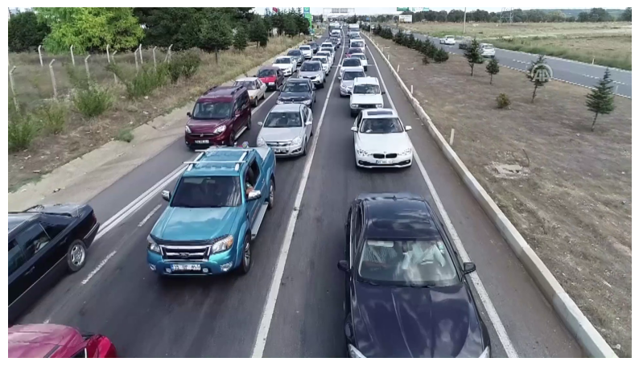

Dersin  slaytı için [tıklayınız](images/07_slayt.pptx).


```python
import cv2
import matplotlib.pyplot as plt
from PIL import Image
import numpy as np
```


```python
from ultralytics import YOLO
```


```python
import ultralytics
ultralytics.checks()
```

    Ultralytics 8.3.103  Python-3.11.11 torch-2.6.0+cpu CPU (Intel Core(TM) i7-4702MQ 2.20GHz)
    Setup complete  (8 CPUs, 31.9 GB RAM, 851.2/931.2 GB disk)
    


```python
model = YOLO("yolo12x.pt")
```


```python
model.names
```


    {0: 'person',
     1: 'bicycle',
     2: 'car',
     3: 'motorcycle',
     4: 'airplane',
     5: 'bus',
     6: 'train',
     7: 'truck',
     8: 'boat',
     9: 'traffic light',
     10: 'fire hydrant',
     11: 'stop sign',
     12: 'parking meter',
     13: 'bench',
     14: 'bird',
     15: 'cat',
     16: 'dog',
     17: 'horse',
     18: 'sheep',
     19: 'cow',
     20: 'elephant',
     21: 'bear',
     22: 'zebra',
     23: 'giraffe',
     24: 'backpack',
     25: 'umbrella',
     26: 'handbag',
     27: 'tie',
     28: 'suitcase',
     29: 'frisbee',
     30: 'skis',
     31: 'snowboard',
     32: 'sports ball',
     33: 'kite',
     34: 'baseball bat',
     35: 'baseball glove',
     36: 'skateboard',
     37: 'surfboard',
     38: 'tennis racket',
     39: 'bottle',
     40: 'wine glass',
     41: 'cup',
     42: 'fork',
     43: 'knife',
     44: 'spoon',
     45: 'bowl',
     46: 'banana',
     47: 'apple',
     48: 'sandwich',
     49: 'orange',
     50: 'broccoli',
     51: 'carrot',
     52: 'hot dog',
     53: 'pizza',
     54: 'donut',
     55: 'cake',
     56: 'chair',
     57: 'couch',
     58: 'potted plant',
     59: 'bed',
     60: 'dining table',
     61: 'toilet',
     62: 'tv',
     63: 'laptop',
     64: 'mouse',
     65: 'remote',
     66: 'keyboard',
     67: 'cell phone',
     68: 'microwave',
     69: 'oven',
     70: 'toaster',
     71: 'sink',
     72: 'refrigerator',
     73: 'book',
     74: 'clock',
     75: 'vase',
     76: 'scissors',
     77: 'teddy bear',
     78: 'hair drier',
     79: 'toothbrush'}


# Örnek 1


```python
image = cv2.imread("zidane.jpg")

# Convert BGR to RGB (Matplotlib expects RGB)
image_rgb = cv2.cvtColor(image, cv2.COLOR_BGR2RGB)

# Display using Matplotlib
plt.figure(figsize=(10, 8))
plt.imshow(image_rgb)
plt.axis('off')  # Hide axes
plt.show()
```


    

    


```python
results = model.predict(source = image, classes=None)
```

    
    0: 384x640 2 persons, 2 ties, 2335.0ms
    Speed: 64.1ms preprocess, 2335.0ms inference, 176.1ms postprocess per image at shape (1, 3, 384, 640)
    


```python
result = results[0]

# Convert the result to a numpy array (with bounding boxes plotted)
result_img = result.plot()  # Returns a BGR numpy array

# Convert BGR to RGB (Matplotlib expects RGB)
result_img_rgb = result_img[..., ::-1]

# Display using Matplotlib
plt.figure(figsize=(10, 8))
plt.imshow(result_img_rgb)
plt.axis('off')  # Hide axes
plt.show()
```


    

    


```python
for box in result.boxes:
    class_id = int(box.cls)
    print(class_id, box.conf)
    print(box.xywh)
```

    0 tensor([0.9143])
    tensor([[945.1121, 375.2975, 396.1606, 667.4927]])
    0 tensor([0.9109])
    tensor([[ 624.9501,  455.1218, 1005.7179,  509.7147]])
    27 tensor([0.6578])
    tensor([[480.0264, 577.1942,  86.1879, 278.4317]])
    27 tensor([0.2715])
    tensor([[1063.6444,  506.4780,  150.4771,  394.8727]])
    

# Örnek 2


```python
image = cv2.imread("bus.jpg")

# Convert BGR to RGB (Matplotlib expects RGB)
image_rgb = cv2.cvtColor(image, cv2.COLOR_BGR2RGB)

# Display using Matplotlib
plt.figure(figsize=(10, 8))
plt.imshow(image_rgb)
plt.axis('off')  # Hide axes
plt.show()
```


    

    


```python
results = model.predict(source = image, classes=None)
```

    
    0: 640x480 4 persons, 1 bus, 1480.9ms
    Speed: 3.6ms preprocess, 1480.9ms inference, 61.8ms postprocess per image at shape (1, 3, 640, 480)
    


```python
result = results[0]

# Convert the result to a numpy array (with bounding boxes plotted)
result_img = result.plot()  # Returns a BGR numpy array

# Convert BGR to RGB (Matplotlib expects RGB)
result_img_rgb = result_img[..., ::-1]

# Display using Matplotlib
plt.figure(figsize=(10, 8))
plt.imshow(result_img_rgb)
plt.axis('off')  # Hide axes
plt.show()
```


    

    


```python
for box in result.boxes:
    class_id = int(box.cls)
    print(f"{model.names[class_id]}", box.conf)
    print("koordinatlar:",box.xywh)
```

    bus tensor([0.9530])
    koordinatlar: tensor([[403.3855, 483.9154, 804.8208, 509.4446]])
    person tensor([0.9104])
    koordinatlar: tensor([[149.3938, 651.5845, 198.0223, 506.2278]])
    person tensor([0.9101])
    koordinatlar: tensor([[739.1487, 636.9462, 140.9246, 487.0843]])
    person tensor([0.8968])
    koordinatlar: tensor([[283.7622, 632.6006, 121.6693, 453.8922]])
    person tensor([0.7726])
    koordinatlar: tensor([[ 39.8363, 710.8444,  79.2513, 321.4905]])
    


```python
result = model.predict(source = "bus.jpg", classes = [0,1], save=True)
```

    
    image 1/1 D:\Drive\Python jupyter\63 makine ogrenmesine giris\08 yolo\bus.jpg: 640x480 4 persons, 1310.8ms
    Speed: 3.2ms preprocess, 1310.8ms inference, 59.6ms postprocess per image at shape (1, 3, 640, 480)
    Results saved to D:\Desktop\mediapipe_yolo\runs\detect\predict2
    

# Örnek 3


```python
image = cv2.imread("trafik.png")

# Convert BGR to RGB (Matplotlib expects RGB)
image_rgb = cv2.cvtColor(image, cv2.COLOR_BGR2RGB)

# Display using Matplotlib
plt.figure(figsize=(10, 8))
plt.imshow(image_rgb)
plt.axis('off')  # Hide axes
plt.show()
```


    

    


```python
results = model.predict(source = image, classes=None)
```

    
    0: 384x640 12 cars, 1 truck, 687.1ms
    Speed: 2.4ms preprocess, 687.1ms inference, 1.1ms postprocess per image at shape (1, 3, 384, 640)
    


```python
result = results[0]

# Convert the result to a numpy array (with bounding boxes plotted)
result_img = result.plot()  # Returns a BGR numpy array

# Convert BGR to RGB (Matplotlib expects RGB)
result_img_rgb = result_img[..., ::-1]

# Display using Matplotlib
plt.figure(figsize=(10, 8))
plt.imshow(result_img_rgb)
plt.axis('off')  # Hide axes
plt.show()
```


    

    


```python
for box in result.boxes:
    class_id = int(box.cls)
    print(f"{model.names[class_id]}", box.conf)
    print("koordinatlar:",box.xywh)
```

    car tensor([0.9552])
    koordinatlar: tensor([[1250.7148,  819.1711,  476.4030,  502.7913]])
    car tensor([0.9107])
    koordinatlar: tensor([[1150.9282,  402.8623,  193.0745,  189.7846]])
    car tensor([0.8962])
    koordinatlar: tensor([[853.3105, 378.6116, 176.7790, 168.6751]])
    car tensor([0.8917])
    koordinatlar: tensor([[142.6972, 778.8400, 284.1820, 357.2256]])
    car tensor([0.8271])
    koordinatlar: tensor([[1103.7988,  273.6544,  107.9731,  122.5540]])
    car tensor([0.8225])
    koordinatlar: tensor([[626.0502, 622.6163, 404.9084, 420.1051]])
    car tensor([0.8196])
    koordinatlar: tensor([[887.0615, 265.1755, 127.0098,  97.6685]])
    truck tensor([0.8191])
    koordinatlar: tensor([[647.8918, 335.5568, 211.6077, 207.6706]])
    car tensor([0.5713])
    koordinatlar: tensor([[744.5760, 259.5199, 104.4468,  96.4187]])
    car tensor([0.4429])
    koordinatlar: tensor([[ 170.1676, 1024.7543,  338.6647,  103.8378]])
    car tensor([0.4180])
    koordinatlar: tensor([[807.8351, 218.9442,  91.4066,  74.4459]])
    car tensor([0.3711])
    koordinatlar: tensor([[1059.0259,  230.3790,   90.1514,   92.7541]])
    car tensor([0.3516])
    koordinatlar: tensor([[935.8292, 206.8743,  88.9178,  90.2407]])
    

# Örnek 4

```python
results = model.predict(source = "video.mp4", save = True)
```

## Kaynaklar:

- https://docs.ultralytics.com/tr
- https://www.youtube.com/@Ultralytics/videos


