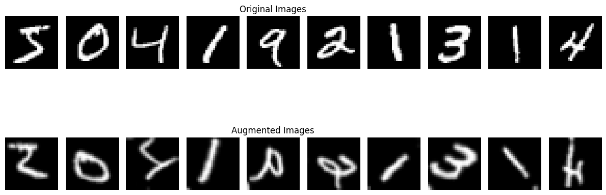

```python
import tensorflow as tf
import matplotlib.pyplot as plt

# 1. MNIST yükle
(x_train, y_train), (_, _) = tf.keras.datasets.mnist.load_data()

# 2. Bir batch seçelim (örnek için ilk 10 görüntü)
x_train = x_train[:10]
y_train = y_train[:10]

# 3. Ön işleme: (28,28) -> (28,28,1) + Normalize
x_train = tf.expand_dims(x_train, -1)  # (batch,28,28,1)
x_train = tf.cast(x_train, tf.float32) / 255.0  # 0-1 arası normalize

# 4. Data augmentation katmanı oluştur
data_augmentation = tf.keras.Sequential([
    tf.keras.layers.RandomRotation(0.2),    # +-20 derece
    tf.keras.layers.RandomTranslation(0.1, 0.1),  # %10 sağ-sol, yukarı-aşağı kaydır
    tf.keras.layers.RandomZoom(0.1),         # %10 yakınlaştır/uzaklaştır
    tf.keras.layers.RandomFlip('horizontal'), # Yatay çevirme (MNIST için çok mantıklı değil ama gösterelim)
])

# 5. Augment edilmiş görüntüler üretelim
augmented_images = data_augmentation(x_train, training=True)

# 6. Orijinal ve augment edilmiş görüntüleri çizelim
plt.figure(figsize=(12, 6))

for i in range(10):
    # Orijinal
    plt.subplot(2, 10, i+1)
    plt.imshow(tf.squeeze(x_train[i]), cmap='gray')
    plt.axis('off')
    if i == 4:
        plt.title('Original Images')
    
    # Augmented
    plt.subplot(2, 10, i+11)
    plt.imshow(tf.squeeze(augmented_images[i]), cmap='gray')
    plt.axis('off')
    if i == 4:
        plt.title('Augmented Images')

plt.tight_layout()
plt.show()

```

    

    


