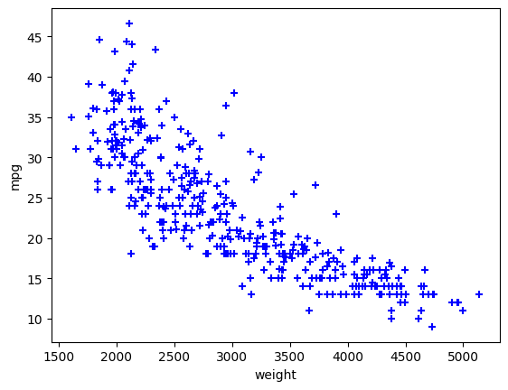
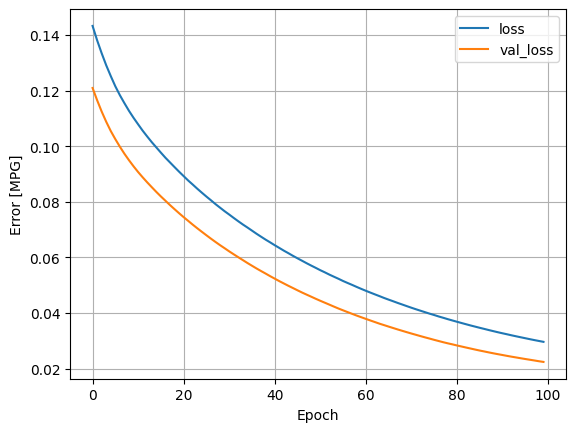
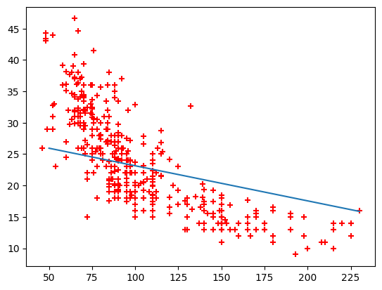
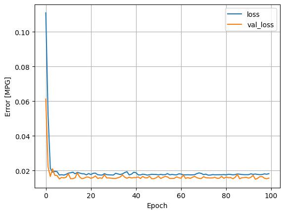
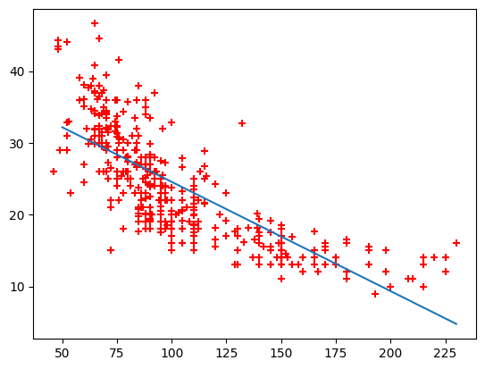
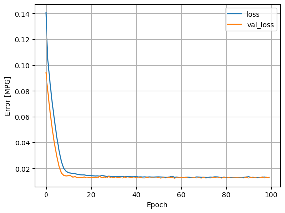
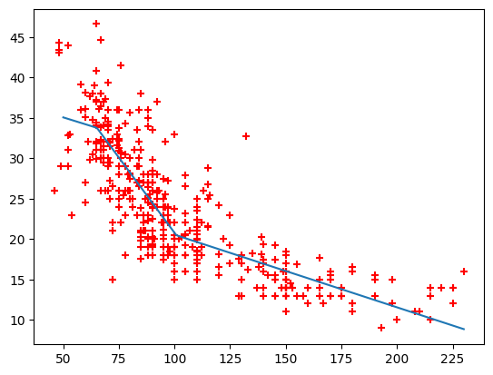
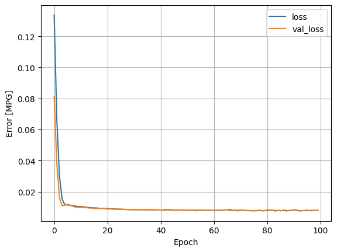
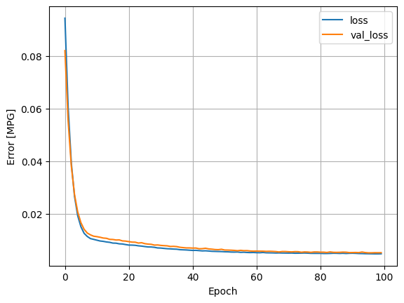
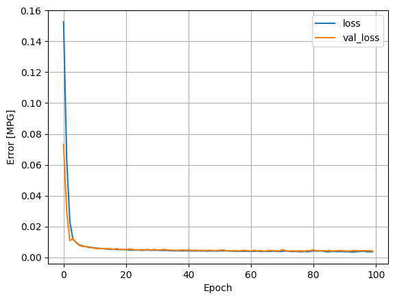

- Yapay sinir ağları ile ilgili slaytı indirmek için [tıklayınız](images/04.pptx).

## Yakıt Verimliliği Çalışması
Bu çalışmada yakıt verimliliği ile aşağıdaki sayfada verilen eğitim üzerine çalışmalar yapılmıştır.

https://www.tensorflow.org/tutorials/keras/regression

Veri setini indirmek için [tıklayınız](images/04_auto-mpg.data).


```python
import matplotlib.pyplot as plt
import numpy as np
import pandas as pd # pip install pandas
```


```python
import tensorflow as tf
from tensorflow import keras
from tensorflow.keras import layers
```


```python
column_names = ['MPG', 'Cylinders', 'Displacement', 'Horsepower', 'Weight',
                'Acceleration', 'Model Year', 'Origin']
dataset=pd.read_csv("04_auto-mpg.data", names=column_names, na_values='?',
                   comment='\t', sep=' ', skipinitialspace=True)
dataset
```


<div>
<style scoped>
    .dataframe tbody tr th:only-of-type {
        vertical-align: middle;
    }

    .dataframe tbody tr th {
        vertical-align: top;
    }

    .dataframe thead th {
        text-align: right;
    }
</style>
<table border="1" class="dataframe">
  <thead>
    <tr style="text-align: right;">
      <th></th>
      <th>MPG</th>
      <th>Cylinders</th>
      <th>Displacement</th>
      <th>Horsepower</th>
      <th>Weight</th>
      <th>Acceleration</th>
      <th>Model Year</th>
      <th>Origin</th>
    </tr>
  </thead>
  <tbody>
    <tr>
      <th>0</th>
      <td>18.0</td>
      <td>8</td>
      <td>307.0</td>
      <td>130.0</td>
      <td>3504.0</td>
      <td>12.0</td>
      <td>70</td>
      <td>1</td>
    </tr>
    <tr>
      <th>1</th>
      <td>15.0</td>
      <td>8</td>
      <td>350.0</td>
      <td>165.0</td>
      <td>3693.0</td>
      <td>11.5</td>
      <td>70</td>
      <td>1</td>
    </tr>
    <tr>
      <th>2</th>
      <td>18.0</td>
      <td>8</td>
      <td>318.0</td>
      <td>150.0</td>
      <td>3436.0</td>
      <td>11.0</td>
      <td>70</td>
      <td>1</td>
    </tr>
    <tr>
      <th>3</th>
      <td>16.0</td>
      <td>8</td>
      <td>304.0</td>
      <td>150.0</td>
      <td>3433.0</td>
      <td>12.0</td>
      <td>70</td>
      <td>1</td>
    </tr>
    <tr>
      <th>4</th>
      <td>17.0</td>
      <td>8</td>
      <td>302.0</td>
      <td>140.0</td>
      <td>3449.0</td>
      <td>10.5</td>
      <td>70</td>
      <td>1</td>
    </tr>
    <tr>
      <th>...</th>
      <td>...</td>
      <td>...</td>
      <td>...</td>
      <td>...</td>
      <td>...</td>
      <td>...</td>
      <td>...</td>
      <td>...</td>
    </tr>
    <tr>
      <th>393</th>
      <td>27.0</td>
      <td>4</td>
      <td>140.0</td>
      <td>86.0</td>
      <td>2790.0</td>
      <td>15.6</td>
      <td>82</td>
      <td>1</td>
    </tr>
    <tr>
      <th>394</th>
      <td>44.0</td>
      <td>4</td>
      <td>97.0</td>
      <td>52.0</td>
      <td>2130.0</td>
      <td>24.6</td>
      <td>82</td>
      <td>2</td>
    </tr>
    <tr>
      <th>395</th>
      <td>32.0</td>
      <td>4</td>
      <td>135.0</td>
      <td>84.0</td>
      <td>2295.0</td>
      <td>11.6</td>
      <td>82</td>
      <td>1</td>
    </tr>
    <tr>
      <th>396</th>
      <td>28.0</td>
      <td>4</td>
      <td>120.0</td>
      <td>79.0</td>
      <td>2625.0</td>
      <td>18.6</td>
      <td>82</td>
      <td>1</td>
    </tr>
    <tr>
      <th>397</th>
      <td>31.0</td>
      <td>4</td>
      <td>119.0</td>
      <td>82.0</td>
      <td>2720.0</td>
      <td>19.4</td>
      <td>82</td>
      <td>1</td>
    </tr>
  </tbody>
</table>
<p>398 rows × 8 columns</p>
</div>


```python
dataset.isna().sum()
```


    MPG             0
    Cylinders       0
    Displacement    0
    Horsepower      6
    Weight          0
    Acceleration    0
    Model Year      0
    Origin          0
    dtype: int64


```python
# clean data
dataset = dataset.dropna()
```


```python
dataset
```


<div>
<style scoped>
    .dataframe tbody tr th:only-of-type {
        vertical-align: middle;
    }

    .dataframe tbody tr th {
        vertical-align: top;
    }

    .dataframe thead th {
        text-align: right;
    }
</style>
<table border="1" class="dataframe">
  <thead>
    <tr style="text-align: right;">
      <th></th>
      <th>MPG</th>
      <th>Cylinders</th>
      <th>Displacement</th>
      <th>Horsepower</th>
      <th>Weight</th>
      <th>Acceleration</th>
      <th>Model Year</th>
      <th>Origin</th>
    </tr>
  </thead>
  <tbody>
    <tr>
      <th>0</th>
      <td>18.0</td>
      <td>8</td>
      <td>307.0</td>
      <td>130.0</td>
      <td>3504.0</td>
      <td>12.0</td>
      <td>70</td>
      <td>1</td>
    </tr>
    <tr>
      <th>1</th>
      <td>15.0</td>
      <td>8</td>
      <td>350.0</td>
      <td>165.0</td>
      <td>3693.0</td>
      <td>11.5</td>
      <td>70</td>
      <td>1</td>
    </tr>
    <tr>
      <th>2</th>
      <td>18.0</td>
      <td>8</td>
      <td>318.0</td>
      <td>150.0</td>
      <td>3436.0</td>
      <td>11.0</td>
      <td>70</td>
      <td>1</td>
    </tr>
    <tr>
      <th>3</th>
      <td>16.0</td>
      <td>8</td>
      <td>304.0</td>
      <td>150.0</td>
      <td>3433.0</td>
      <td>12.0</td>
      <td>70</td>
      <td>1</td>
    </tr>
    <tr>
      <th>4</th>
      <td>17.0</td>
      <td>8</td>
      <td>302.0</td>
      <td>140.0</td>
      <td>3449.0</td>
      <td>10.5</td>
      <td>70</td>
      <td>1</td>
    </tr>
    <tr>
      <th>...</th>
      <td>...</td>
      <td>...</td>
      <td>...</td>
      <td>...</td>
      <td>...</td>
      <td>...</td>
      <td>...</td>
      <td>...</td>
    </tr>
    <tr>
      <th>393</th>
      <td>27.0</td>
      <td>4</td>
      <td>140.0</td>
      <td>86.0</td>
      <td>2790.0</td>
      <td>15.6</td>
      <td>82</td>
      <td>1</td>
    </tr>
    <tr>
      <th>394</th>
      <td>44.0</td>
      <td>4</td>
      <td>97.0</td>
      <td>52.0</td>
      <td>2130.0</td>
      <td>24.6</td>
      <td>82</td>
      <td>2</td>
    </tr>
    <tr>
      <th>395</th>
      <td>32.0</td>
      <td>4</td>
      <td>135.0</td>
      <td>84.0</td>
      <td>2295.0</td>
      <td>11.6</td>
      <td>82</td>
      <td>1</td>
    </tr>
    <tr>
      <th>396</th>
      <td>28.0</td>
      <td>4</td>
      <td>120.0</td>
      <td>79.0</td>
      <td>2625.0</td>
      <td>18.6</td>
      <td>82</td>
      <td>1</td>
    </tr>
    <tr>
      <th>397</th>
      <td>31.0</td>
      <td>4</td>
      <td>119.0</td>
      <td>82.0</td>
      <td>2720.0</td>
      <td>19.4</td>
      <td>82</td>
      <td>1</td>
    </tr>
  </tbody>
</table>
<p>392 rows × 8 columns</p>
</div>


```python
dataset_np= dataset.to_numpy()
dataset_np
```


<pre>
    array([[ 18. ,   8. , 307. , ...,  12. ,  70. ,   1. ],
           [ 15. ,   8. , 350. , ...,  11.5,  70. ,   1. ],
           [ 18. ,   8. , 318. , ...,  11. ,  70. ,   1. ],
           ...,
           [ 32. ,   4. , 135. , ...,  11.6,  82. ,   1. ],
           [ 28. ,   4. , 120. , ...,  18.6,  82. ,   1. ],
           [ 31. ,   4. , 119. , ...,  19.4,  82. ,   1. ]])
</pre>


```python
from sklearn.preprocessing import OneHotEncoder
```


```python
 # Son sütunu seç (kategori sütunu)
categorical_column = dataset_np[:, -1].reshape(-1, 1)

# One-hot encoder oluştur ve uygula
encoder = OneHotEncoder(sparse_output=False)
encoded_column = encoder.fit_transform(categorical_column)

# Sonucu orijinal veriyle birleştir
dataset_encoded = np.hstack((dataset_np[:, :-1], encoded_column))

print(dataset_encoded)
```
<pre>
    [[ 18.   8. 307. ...   1.   0.   0.]
     [ 15.   8. 350. ...   1.   0.   0.]
     [ 18.   8. 318. ...   1.   0.   0.]
     ...
     [ 32.   4. 135. ...   1.   0.   0.]
     [ 28.   4. 120. ...   1.   0.   0.]
     [ 31.   4. 119. ...   1.   0.   0.]]
</pre>    


```python
print(dataset_encoded[-5:,:])
```

    [[2.700e+01 4.000e+00 1.400e+02 8.600e+01 2.790e+03 1.560e+01 8.200e+01
      1.000e+00 0.000e+00 0.000e+00]
     [4.400e+01 4.000e+00 9.700e+01 5.200e+01 2.130e+03 2.460e+01 8.200e+01
      0.000e+00 1.000e+00 0.000e+00]
     [3.200e+01 4.000e+00 1.350e+02 8.400e+01 2.295e+03 1.160e+01 8.200e+01
      1.000e+00 0.000e+00 0.000e+00]
     [2.800e+01 4.000e+00 1.200e+02 7.900e+01 2.625e+03 1.860e+01 8.200e+01
      1.000e+00 0.000e+00 0.000e+00]
     [3.100e+01 4.000e+00 1.190e+02 8.200e+01 2.720e+03 1.940e+01 8.200e+01
      1.000e+00 0.000e+00 0.000e+00]]
    


```python
# Horsepower
hp = dataset_encoded[:,3]
mpg = dataset_encoded[:,0]
plt.scatter(hp, mpg, marker="+", color="red")
plt.xlabel("hp")
plt.ylabel('mpg')
plt.show()
```


    

    


```python
# Horsepower
weight = dataset_encoded[:,4]
mpg = dataset_encoded[:,0]
plt.scatter(weight, mpg, marker="+", color="blue")
plt.xlabel("weight")
plt.ylabel('mpg')
plt.show()
```


    

    


## Tek katman, tek nöron


```python
# input ve output
y = mpg  # İlk sütun (çıktı)
X = hp  # Geri kalan sütunlar (girdi)
```


```python
from sklearn.model_selection import train_test_split
X_train, X_test, y_train, y_test = train_test_split(X, y, test_size=0.2, random_state=42)
```


```python
from sklearn.preprocessing import MinMaxScaler

# X_train için Min-Max ölçekleme
scaler_X = MinMaxScaler()
# hp
X_train_scaled = scaler_X.fit_transform(X_train.reshape((-1,1)))

# X_test'i aynı scaler ile dönüştür
X_test_scaled = scaler_X.transform(X_test.reshape((-1,1)))

# y_train için Min-Max ölçekleme
scaler_y = MinMaxScaler()
y_train_scaled = scaler_y.fit_transform(y_train.reshape(-1, 1))  # y vektör olduğu için reshape gerekli

# y_test'i aynı scaler ile dönüştür
y_test_scaled = scaler_y.transform(y_test.reshape(-1, 1))

```


```python
X_train_scaled.shape
```


<pre>
    (313, 1)
</pre>


```python
model = keras.models.Sequential([
    layers.Dense(units=1, input_shape=(1,)) # Linear Model
])
```


```python
model.summary()
```
<pre>
    Model: "sequential_10"
    _________________________________________________________________
     Layer (type)                Output Shape              Param #   
    =================================================================
     dense_12 (Dense)            (None, 1)                 2         
                                                                     
    =================================================================
    Total params: 2
    Trainable params: 2
    Non-trainable params: 0
    _________________________________________________________________
</pre>    


```python
model.compile(optimizer='adam', loss='mse')
```


```python
history=model.fit(X_train_scaled, y_train_scaled, epochs=100, validation_data=(X_test_scaled, y_test_scaled))
```
 


```python
plt.plot(history.history['loss'], label='loss')
plt.plot(history.history['val_loss'], label='val_loss')
plt.xlabel('Epoch')
plt.ylabel('Error [MPG]')
plt.legend()
plt.grid(True)
plt.show()
```


    

    


```python
y_test_predict_scaled=model.predict(X_test_scaled)
```
<pre>
    3/3 [==============================] - 0s 3ms/step
</pre>    


```python
y_pred = scaler_y.inverse_transform(y_test_predict_scaled)
```


```python
y_test[:10]
```


<pre>
    array([26. , 21.6, 36.1, 26. , 27. , 28. , 13. , 26. , 19. , 29. ])
</pre>


```python
y_pred[:10]
```


<pre>
    array([[24.879032],
           [22.3061  ],
           [25.382433],
           [24.8231  ],
           [23.928167],
           [24.543432],
           [19.229767],
           [24.543432],
           [23.424765],
           [25.997698]], dtype=float32)
</pre>


```python
X_fake = np.linspace(50, 230, 200).reshape((-1,1))
X_fake_scaled = scaler_X.transform(X_fake)

y_fake_pred_scaled = model.predict(X_fake_scaled)

y_fake_pred=scaler_y.inverse_transform(y_fake_pred_scaled)
```
<pre>
    7/7 [==============================] - 0s 3ms/step
</pre>    


```python
plt.plot(X_fake, y_fake_pred)
plt.scatter(hp, mpg, marker="+", color="red")
plt.show()
```


    

    


## Aktivasyonsuz büyük model


```python
# DNN
model = keras.Sequential([
    layers.Dense(64,  input_shape=(1,)),
    layers.Dense(64),
    layers.Dense(1)
])
```


```python
model.compile(loss="mse", optimizer="adam")

model.summary()
```
<pre>
    Model: "sequential_11"
    _________________________________________________________________
     Layer (type)                Output Shape              Param #   
    =================================================================
     dense_13 (Dense)            (None, 64)                128       
                                                                     
     dense_14 (Dense)            (None, 64)                4160      
                                                                     
     dense_15 (Dense)            (None, 1)                 65        
                                                                     
    =================================================================
    Total params: 4,353
    Trainable params: 4,353
    Non-trainable params: 0
    _________________________________________________________________
</pre>    


```python
history=model.fit(X_train_scaled, y_train_scaled, epochs=100, validation_data=(X_test_scaled, y_test_scaled))
```
  


```python
plt.plot(history.history['loss'], label='loss')
plt.plot(history.history['val_loss'], label='val_loss')
plt.xlabel('Epoch')
plt.ylabel('Error [MPG]')
plt.legend()
plt.grid(True)
plt.show()
```


    

    


```python
y_test_predict_scaled=model.predict(X_test_scaled)
```
<pre>
    3/3 [==============================] - 0s 3ms/step
</pre>    


```python
y_pred = scaler_y.inverse_transform(y_test_predict_scaled)
```


```python
y_test[:10]
```


<pre>
    array([26. , 21.6, 36.1, 26. , 27. , 28. , 13. , 26. , 19. , 29. ])
</pre>


```python
y_pred[:10]
```


<pre>
    array([[29.274797],
           [22.273424],
           [30.642967],
           [29.121162],
           [26.68683 ],
           [28.362114],
           [13.90795 ],
           [28.362114],
           [25.316181],
           [32.31797 ]], dtype=float32)
</pre>


```python
X_fake = np.linspace(50, 230, 200).reshape((-1,1))
X_fake_scaled = scaler_X.transform(X_fake)

y_fake_pred_scaled = model.predict(X_fake_scaled)

y_fake_pred=scaler_y.inverse_transform(y_fake_pred_scaled)
```
<pre>
    7/7 [==============================] - 0s 2ms/step
</pre>    


```python
plt.plot(X_fake, y_fake_pred)
plt.scatter(hp, mpg, marker="+", color="red")
plt.show()
```


    

    


# Aktivasyonlu büyük model


```python
# DNN
model = keras.Sequential([
    layers.Dense(64, activation='relu', input_shape=(1,)),
    layers.Dense(64, activation='relu'),
    layers.Dense(1)
])
```


```python
model.compile(loss="mse", optimizer="adam")

model.summary()
```
<pre>
    Model: "sequential_12"
    _________________________________________________________________
     Layer (type)                Output Shape              Param #   
    =================================================================
     dense_16 (Dense)            (None, 64)                128       
                                                                     
     dense_17 (Dense)            (None, 64)                4160      
                                                                     
     dense_18 (Dense)            (None, 1)                 65        
                                                                     
    =================================================================
    Total params: 4,353
    Trainable params: 4,353
    Non-trainable params: 0
    _________________________________________________________________
</pre>    


```python
history=model.fit(X_train_scaled, y_train_scaled, epochs=100, validation_data=(X_test_scaled, y_test_scaled))
```
 


```python
plt.plot(history.history['loss'], label='loss')
plt.plot(history.history['val_loss'], label='val_loss')
plt.xlabel('Epoch')
plt.ylabel('Error [MPG]')
plt.legend()
plt.grid(True)
plt.show()
```


    

    


```python
y_test_predict_scaled=model.predict(X_test_scaled)
```
<pre>
    3/3 [==============================] - 0s 3ms/step
</pre>    


```python
y_pred = scaler_y.inverse_transform(y_test_predict_scaled)
```


```python
y_test[:10]
```


<pre>
    array([26. , 21.6, 36.1, 26. , 27. , 28. , 13. , 26. , 19. , 29. ])
</pre>


```python
y_pred[:10]
```


<pre>
    array([[32.31129 ],
           [19.190641],
           [34.19633 ],
           [31.933548],
           [25.983114],
           [30.077898],
           [14.251822],
           [30.077898],
           [22.63136 ],
           [35.136513]], dtype=float32)
</pre>


```python
X_fake = np.linspace(50, 230, 200).reshape((-1,1))
X_fake_scaled = scaler_X.transform(X_fake)

y_fake_pred_scaled = model.predict(X_fake_scaled)

y_fake_pred=scaler_y.inverse_transform(y_fake_pred_scaled)
```
<pre>
    7/7 [==============================] - 0s 3ms/step
</pre>    


```python
plt.plot(X_fake, y_fake_pred)
plt.scatter(hp, mpg, marker="+", color="red")
plt.show()
```


    

    


## Çoklu veri


```python
X = dataset_encoded[:,1:]
y = dataset_encoded[:,0]
```


```python
X_train, X_test, y_train, y_test = train_test_split(X, y, test_size=0.2, random_state=42)
```


```python
from sklearn.preprocessing import MinMaxScaler

# X_train için Min-Max ölçekleme
scaler_X = MinMaxScaler()
# hp
X_train_scaled = scaler_X.fit_transform(X_train)

# X_test'i aynı scaler ile dönüştür
X_test_scaled = scaler_X.transform(X_test)

# y_train için Min-Max ölçekleme
scaler_y = MinMaxScaler()
y_train_scaled = scaler_y.fit_transform(y_train.reshape(-1, 1))  # y vektör olduğu için reshape gerekli

# y_test'i aynı scaler ile dönüştür
y_test_scaled = scaler_y.transform(y_test.reshape(-1, 1))

```


```python
X_train_scaled.shape, X_test_scaled.shape, y_train.shape
```


<pre>
    ((313, 9), (79, 9), (313,))
</pre>


### Aktivasyon fonksiyonu olmayan model


```python
model = keras.models.Sequential([
    layers.Dense(units=32, input_shape=(9,)), # Linear Model
    layers.Dense(1)
])
```


```python
model.summary()
```
<pre>
    Model: "sequential_13"
    _________________________________________________________________
     Layer (type)                Output Shape              Param #   
    =================================================================
     dense_19 (Dense)            (None, 32)                320       
                                                                     
     dense_20 (Dense)            (None, 1)                 33        
                                                                     
    =================================================================
    Total params: 353
    Trainable params: 353
    Non-trainable params: 0
    _________________________________________________________________
</pre>    


```python
model.compile(optimizer='adam', loss='mse')
```


```python
history=model.fit(X_train_scaled, y_train_scaled, epochs=100, validation_data=(X_test_scaled, y_test_scaled))
```
  


```python
plt.plot(history.history['loss'], label='loss')
plt.plot(history.history['val_loss'], label='val_loss')
plt.xlabel('Epoch')
plt.ylabel('Error [MPG]')
plt.legend()
plt.grid(True)
plt.show()
```


    

    


###  Aktivasyonlu tek katman model


```python
model = keras.models.Sequential([
    layers.Dense(units=32, input_shape=(9,), activation='relu'),
    layers.Dense(1)
])
```


```python
model.summary()
```
<pre>
    Model: "sequential_15"
    _________________________________________________________________
     Layer (type)                Output Shape              Param #   
    =================================================================
     dense_23 (Dense)            (None, 32)                320       
                                                                     
     dense_24 (Dense)            (None, 1)                 33        
                                                                     
    =================================================================
    Total params: 353
    Trainable params: 353
    Non-trainable params: 0
    _________________________________________________________________
</pre>    


```python
model.compile(optimizer='adam', loss='mse')
```


```python
history=model.fit(X_train_scaled, y_train_scaled, epochs=100, validation_data=(X_test_scaled, y_test_scaled))
```
    


```python
plt.plot(history.history['loss'], label='loss')
plt.plot(history.history['val_loss'], label='val_loss')
plt.xlabel('Epoch')
plt.ylabel('Error [MPG]')
plt.legend()
plt.grid(True)
plt.show()
```


    

    


### Aktivasyonlu büyük model


```python
model = keras.models.Sequential([
    layers.Dense(units=64, input_shape=(9,), activation='relu'),
    layers.Dense(units=64, input_shape=(9,), activation='relu'),
    layers.Dense(1)
])
```


```python
model.summary()
```
<pre>
    Model: "sequential_16"
    _________________________________________________________________
     Layer (type)                Output Shape              Param #   
    =================================================================
     dense_25 (Dense)            (None, 64)                640       
                                                                     
     dense_26 (Dense)            (None, 64)                4160      
                                                                     
     dense_27 (Dense)            (None, 1)                 65        
                                                                     
    =================================================================
    Total params: 4,865
    Trainable params: 4,865
    Non-trainable params: 0
    _________________________________________________________________
</pre>    


```python
model.compile(optimizer='adam', loss='mse')
```


```python
history=model.fit(X_train_scaled, y_train_scaled, epochs=100, validation_data=(X_test_scaled, y_test_scaled))
```
  


```python
plt.plot(history.history['loss'], label='loss')
plt.plot(history.history['val_loss'], label='val_loss')
plt.xlabel('Epoch')
plt.ylabel('Error [MPG]')
plt.legend()
plt.grid(True)
plt.show()
```


    

    


```python
y_test_predict_scaled=model.predict(X_test_scaled)
```
<pre>
    3/3 [==============================] - 0s 4ms/step
</pre>    


```python
y_pred = scaler_y.inverse_transform(y_test_predict_scaled)
```


```python
y_test[:10]
```


<pre>
    array([26. , 21.6, 36.1, 26. , 27. , 28. , 13. , 26. , 19. , 29. ])
</pre>


```python
y_pred[:10]
```


<pre>
    array([[25.561352],
           [21.317728],
           [34.021828],
           [21.4228  ],
           [27.892326],
           [28.932383],
           [12.169561],
           [29.77778 ],
           [18.302343],
           [30.233294]], dtype=float32)
</pre>