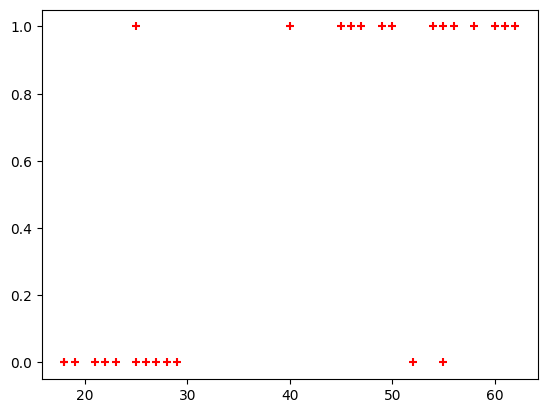

### logistic regression


```python
import pandas as pd
from matplotlib import pyplot as plt
```

Veri dosyasını indirmek için [tıklayınız](./images/03b_insurance_data.csv).


```python
df = pd.read_csv("03b_insurance_data.csv")
df.head()
```


<div>
<style scoped>
    .dataframe tbody tr th:only-of-type {
        vertical-align: middle;
    }

    .dataframe tbody tr th {
        vertical-align: top;
    }

    .dataframe thead th {
        text-align: right;
    }
</style>
<table border="1" class="dataframe">
  <thead>
    <tr style="text-align: right;">
      <th></th>
      <th>age</th>
      <th>bought_insurance</th>
    </tr>
  </thead>
  <tbody>
    <tr>
      <th>0</th>
      <td>22</td>
      <td>0</td>
    </tr>
    <tr>
      <th>1</th>
      <td>25</td>
      <td>0</td>
    </tr>
    <tr>
      <th>2</th>
      <td>47</td>
      <td>1</td>
    </tr>
    <tr>
      <th>3</th>
      <td>52</td>
      <td>0</td>
    </tr>
    <tr>
      <th>4</th>
      <td>46</td>
      <td>1</td>
    </tr>
  </tbody>
</table>
</div>


```python
data=df.to_numpy()
```


```python
age=data[:,0]
bought=data[:,1]
```


```python
plt.scatter(age,bought,marker='+',color='red')
plt.show()
```


    

    


```python
from sklearn.model_selection import train_test_split
```


```python
X_train, X_test, y_train, y_test = train_test_split(age,bought,train_size=0.8)
```


```python
X_test
```


    array([50, 55, 62, 58, 27, 18], dtype=int64)


```python
age.shape,X_train.shape, X_test.shape
```


    ((27,), (21,), (6,))


```python
from sklearn.linear_model import LogisticRegression
model = LogisticRegression()
```


```python
model.fit(X_train.reshape((-1,1)), y_train)
```


```python
X_test
```


    array([50, 55, 62, 58, 27, 18], dtype=int64)


```python
y_predicted = model.predict(X_test.reshape((-1,1)))
y_predicted
```


    array([1, 1, 1, 1, 0, 0], dtype=int64)


```python
# 0 ve 1 durumları için olasılıklar.
model.predict_proba(X_test.reshape((-1,1)))
```


    array([[0.10235238, 0.89764762],
           [0.0489281 , 0.9510719 ],
           [0.0166023 , 0.9833977 ],
           [0.0309253 , 0.9690747 ],
           [0.81603332, 0.18396668],
           [0.94893727, 0.05106273]])


```python
model.score(X_test.reshape((-1,1)),y_test)
```


    0.8333333333333334


```python
y_predicted
```


    array([1, 1, 1, 1, 0, 0], dtype=int64)


```python
X_test
```


    array([50, 55, 62, 58, 27, 18], dtype=int64)


```python
theta0=model.intercept_[0]
```


```python
theta1=model.coef_[0,0]
```


```python
import math
def sigmoid(x):
    return 1/(1+math.exp(-x))
```


```python
def h(x, theta0=theta0, theta1=theta1):
    return sigmoid(theta0+ theta1*x)
```


```python
age=65
h(age)
```


    0.9896360267315567


```python
model.predict([[65]]), model.predict_proba([[65]])
```


    (array([1], dtype=int64), array([[0.01036397, 0.98963603]]))


  ###Kaynak:
    
- https://www.youtube.com/watch?v=gmvvaobm7eQ&list=PLeo1K3hjS3uvCeTYTeyfe0-rN5r8zn9rw	
- https://github.com/codebasics/py/tree/master/ML


